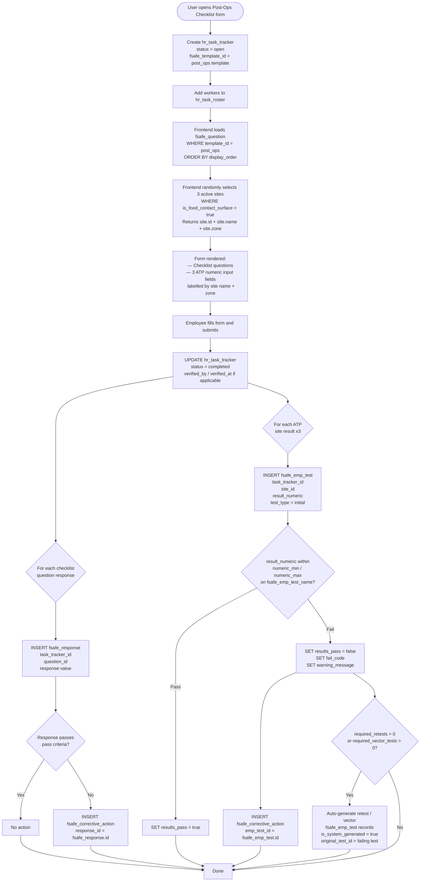

# Process: Post-Ops Checklist with ATP Results

This document describes the end-to-end process for conducting a post-operations food safety checklist that includes 3 randomized ATP site test results.

---

## Flow Diagram



---

## Step-by-Step Description

### 1. Create the Activity
The user creates an `hr_task_tracker` record:
- `task_id` → the post-ops task from `hr_task` catalog
- `fsafe_template_id` → the post-ops checklist template from `fsafe_template`
- `farm_id`, `date`, `start_time`, `status = open`

Workers performing the task are added to `hr_task_roster` linked to this tracker.

---

### 2. Load the Checklist
The frontend queries:
```sql
SELECT * FROM fsafe_question
WHERE template_id = '[post_ops_template_id]'
  AND is_active = true
ORDER BY display_order
```
Each question carries its `response_type` (boolean, numeric, enum), pass criteria, and `warning_message`.

---

### 3. Randomize 3 ATP Sites
The frontend randomly selects 3 active sites eligible for ATP testing:
```sql
SELECT id, name, zone FROM site
WHERE org_id = '[org_id]'
  AND farm_id = '[farm_id]'
  AND is_food_contact_surface = true
  AND is_active = true
ORDER BY random()
LIMIT 3
```
These 3 sites are presented as additional numeric input fields on the form, labelled with the site name and zone.

---

### 4. Employee Fills and Submits
The employee answers all checklist questions and records a numeric ATP reading for each of the 3 sites, then submits the form.

---

### 5. On Submit — What Gets Written

| Data | Table | Key Fields |
|------|-------|------------|
| Activity closed | `hr_task_tracker` | `status = completed`, `stop_time`, `verified_by`, `verified_at` |
| One row per checklist question | `fsafe_response` | `task_tracker_id`, `question_id`, response value |
| One row per ATP site result | `fsafe_emp_test` | `task_tracker_id`, `site_id`, `result_numeric`, `test_type = initial` |

---

### 6. Pass / Fail Evaluation

**Checklist responses** — evaluated against the question's pass criteria:
- Boolean: `response_boolean = fsafe_question.boolean_pass_value`
- Numeric: value within `numeric_minimum_value` and `numeric_maximum_value`
- Enum: `response_enum` is in `fsafe_question.enum_pass_options`

**ATP results** — evaluated against the test name's thresholds:
- `result_numeric` within `fsafe_emp_test_name.numeric_minimum_value` and `numeric_maximum_value`
- Frontend calculates and sets `results_pass`, `warning_message`, and `fail_code` before submission

---

### 7. Corrective Actions

A `fsafe_corrective_action` record is created for every failing item:

| Trigger | Field Set |
|---------|-----------|
| Failing checklist response | `response_id = fsafe_response.id` |
| Failing ATP test result | `emp_test_id = fsafe_emp_test.id` |

The `emp_test_id` / `response_id` fields on `fsafe_corrective_action` are mutually exclusive — exactly one is set per row.

---

### 8. Auto-Generated Retests and Vector Tests

If a failing `fsafe_emp_test` has `required_retests > 0` or `required_vector_tests > 0` defined on its `fsafe_emp_test_name`, the system auto-generates the follow-up test records:

| Field | Value |
|-------|-------|
| `test_type` | `retest` or `vector` |
| `original_test_id` | UUID of the failing test |
| `is_system_generated` | `true` |
| `test_status` | `pending` |

These appear in the user's pending tasks for follow-up sampling.

---

### 9. Reviewing a Submitted Form

To reconstruct the full post-ops form for a given activity, query both tables by `task_tracker_id`:

```sql
-- Checklist responses
SELECT q.question_text, r.response_boolean, r.response_numeric, r.response_enum, r.response_text
FROM fsafe_response r
JOIN fsafe_question q ON q.id = r.question_id
WHERE r.task_tracker_id = '[task_tracker_id]'
ORDER BY q.display_order;

-- ATP results
SELECT s.name AS site_name, s.zone, t.result_numeric, t.results_pass, t.fail_code
FROM fsafe_emp_test t
JOIN site s ON s.id = t.site_id
WHERE t.task_tracker_id = '[task_tracker_id]';
```

---

## Tables Involved

| Table | Role |
|-------|------|
| `hr_task_tracker` | Session header — who, when, which farm, which template |
| `hr_task_roster` | Workers assigned to the task |
| `fsafe_template` | Defines which checklist is used |
| `fsafe_question` | The checklist questions loaded into the form |
| `fsafe_response` | Stores each checklist question answer |
| `fsafe_emp_test_name` | ATP test configuration and pass thresholds |
| `fsafe_emp_test` | Stores each ATP site result |
| `fsafe_corrective_action` | Corrective actions for any failing response or test |
| `site` | Source of the 3 randomized ATP sites |
