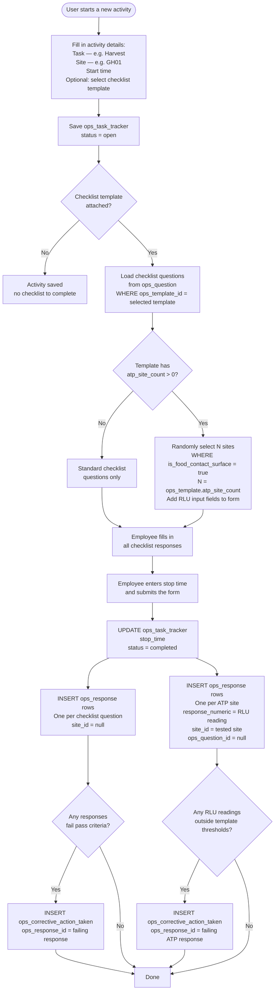

# Process: Task Activity with Checklist

This document describes the end-to-end process for creating a task activity, completing an attached checklist, and reviewing the completed record. The same process applies to any task type — harvesting, pre-ops inspections, house inspections, post-ops, and more.

---

## Overview

When a team performs an activity on the farm, they create a **task tracker** record that captures what was done, where, and when. If the activity requires a checklist (e.g. a food safety inspection), a checklist template is attached and employees fill in their responses as part of the same activity. Everything — the task details, the checklist answers, and any ATP surface test readings — is tied back to a single tracker record so the full picture of that activity can be retrieved at any time.

---

## Quick Fill (No Pre-Created Activity)

In some situations an employee may want to fill out a checklist template directly — without going through the full "start activity → fill checklist → submit" flow. For example, a supervisor completing a daily log at a tablet without first formally opening an activity.

The preferred approach is to handle this at the application layer rather than by loosening the database schema. When a user submits a checklist this way, the frontend silently creates the `ops_task_tracker` record and immediately closes it in the same transaction as the responses:

- `start_time` and `stop_time` are both set to the submission timestamp (or the user is prompted for a single "completed at" time).
- `status` is set to `completed`.
- All `ops_response` rows are written as normal, linked to this auto-created tracker record.

From the user's perspective: open template → fill answers → submit. No separate activity creation step, no stop time prompt. The database still holds a complete, closed tracker record for every set of responses — preserving full audit trail and corrective action traceability.

> **Why not add a `date` field to `ops_response` instead?** A date alone does not capture the context the tracker provides — site, task type, assigned employees, start and stop time, and status. Making the tracker optional by bypassing it results in floating responses with no provenance, which breaks reporting and corrective action linkage. The quick fill approach keeps the schema clean and the process intact.

---

## Flow Diagram



---

## Step-by-Step Description

### 1. Start a New Activity

The employee opens the activity form and fills in the required details before saving:

| Field | Description |
|-------|-------------|
| Task | Selected from the `ops_task` catalog (e.g. Harvest, Pre-Op, House Inspection) |
| Site | The site where the activity is taking place (e.g. GH01) |
| Farm | The farm this activity belongs to |
| Start time | When the activity began — required before the form can be saved |
| Checklist template | Optional — select a checklist from `ops_template` if this activity requires one |

Once saved, an `ops_task_tracker` record is created with `status = open`.

---

### 2. Complete the Checklist

If a checklist template was attached, the form displays all active questions from `ops_question` for that template, ordered by `display_order`. Each question has a defined response type:

| Response Type | How the Employee Answers |
|--------------|--------------------------|
| Boolean | Yes / No toggle |
| Numeric | Number input (e.g. temperature, count) |
| Enum | Select from a predefined list of options |

Each question also carries its pass criteria and an optional `warning_message` shown when the response fails.

---

### 3. ATP Surface Testing (When Required)

Some checklist templates require ATP surface testing in addition to the standard questions. This is configured on the template via `atp_site_count` and RLU thresholds.

When `ops_template.atp_site_count > 0`, the system randomly selects that many active food contact sites within the farm and adds a numeric RLU input field for each one on the form. The employee swabs each surface and enters the RLU reading.

Pass/fail for ATP readings is evaluated against:
- `ops_template.numeric_minimum_rlu_value`
- `ops_template.numeric_maximum_rlu_value`

> **Note:** ATP readings are stored in the same `ops_response` table as checklist answers. The difference is that ATP response rows have `site_id` populated (identifying the surface tested) and `ops_question_id` set to null. Standard checklist rows are the inverse — `ops_question_id` populated, `site_id` null. This keeps all responses for an activity in one place and simplifies retrieval.

---

### 4. Submit the Activity

Before submitting, the employee enters the **stop time**. The form cannot be submitted without it.

On submission the following is written to the database:

| What | Table | Key Fields |
|------|-------|------------|
| Activity closed | `ops_task_tracker` | `stop_time`, `status = completed` |
| One row per checklist question answered | `ops_response` | `ops_task_tracker_id`, `ops_question_id`, response value, `site_id = null` |
| One row per ATP site tested | `ops_response` | `ops_task_tracker_id`, `response_numeric`, `site_id`, `ops_question_id = null` |
| One row per failing response or ATP reading | `ops_corrective_action_taken` | `ops_response_id` |

---

### 5. Corrective Actions

When a response fails its pass criteria (or an ATP reading falls outside the template thresholds), an `ops_corrective_action_taken` record is automatically created. The corrective action tracks:

- What action needs to be taken (selected from `ops_corrective_action_choice` or entered as free text)
- Who is responsible
- Due date
- Resolution status (open → completed)
- Verification once resolved

---

### 6. Viewing a Completed Activity

To retrieve the full picture of an activity, query by `ops_task_tracker_id`:

```sql
-- Activity header
SELECT tt.start_time, tt.stop_time, tt.status,
       t.name AS task, s.name AS site
FROM ops_task_tracker tt
JOIN ops_task t ON t.id = tt.ops_task_id
JOIN site s     ON s.id = tt.site_id
WHERE tt.id = '[ops_task_tracker_id]';

-- Checklist responses
SELECT q.question_text, q.response_type,
       r.response_boolean, r.response_numeric, r.response_enum, r.response_text
FROM ops_response r
JOIN ops_question q ON q.id = r.ops_question_id
WHERE r.ops_task_tracker_id = '[ops_task_tracker_id]'
  AND r.site_id IS NULL
ORDER BY q.display_order;

-- ATP results
SELECT s.name AS site_name, s.zone, r.response_numeric
FROM ops_response r
JOIN site s ON s.id = r.site_id
WHERE r.ops_task_tracker_id = '[ops_task_tracker_id]'
  AND r.site_id IS NOT NULL;
```

---

## Tables Involved

| Table | Role |
|-------|------|
| `ops_task` | Catalog of available tasks (Harvest, Pre-Op, etc.) |
| `ops_task_tracker` | The activity record — one per event; links task, site, farm, timing, and template |
| `ops_task_schedule` | Employees assigned to the activity |
| `ops_template` | The checklist template attached to the activity; holds ATP site count and RLU thresholds |
| `ops_question` | The individual checklist questions within a template |
| `ops_response` | All responses for an activity — both checklist answers and ATP readings |
| `ops_corrective_action_choice` | Predefined corrective action options selectable from a dropdown |
| `ops_corrective_action_taken` | Corrective actions raised against any failing response |
| `site` | Provides site name, zone, and food contact surface flag for ATP site selection |
