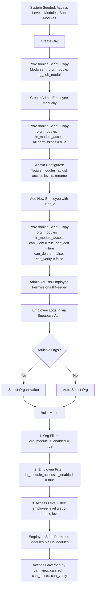

# User Access & Module Visibility Flow

This document describes how users log in, select an organization, and see only the modules and sub-modules they are authorized to access.

### Access Control Model: Multi-Layered Access Control (Hybrid RBAC/ABAC)

This system combines three distinct access control mechanisms:

| Layer | Model | What it controls |
|-------|-------|-----------------|
| **Feature Toggling** | Org-level switches | Organization admins enable or disable entire modules and sub-modules for their org. Disabled features are invisible to all users regardless of role. |
| **Role-Based Access Control (RBAC)** | Hierarchical access levels (1–5) | Each employee is assigned an access level (employee, team_lead, manager, admin, owner). Sub-modules define a minimum access level. Employees can only see sub-modules at or below their level. Higher roles inherit all visibility of lower roles. |
| **Attribute-Based Access Control (ABAC)** | Per-employee, per-module permissions | Each employee has individual permission flags per module (`can_view`, `can_edit`, `can_delete`, `can_verify`) that control what actions they can perform on records within that module. |

---

## 1. Tables Involved

| Table | Type | Purpose |
|-------|------|---------|
| `sys_access_level` | System | Defines the 5 access tiers (employee, team_lead, manager, admin, owner) |
| `sys_module` | System | Master list of application modules |
| `sys_sub_module` | System | Master list of sub-modules with minimum access level |
| `org` | Org | Organization record |
| `org_module` | Org | Org-scoped module toggles with custom display name and order |
| `org_sub_module` | Org | Org-scoped sub-module toggles with custom display name, order, and access level |
| `hr_employee` | HR | Employee record with `sys_access_level_id` and `user_id` for auth |
| `hr_module_access` | HR | Maps employee to modules with permissions (`can_view`, `can_edit`, `can_delete`, `can_verify`) |
| `auth.users` | Auth | Supabase Auth — handles login credentials and session |

---

## 2. System-Level Setup (One-Time)

Before any organization is onboarded, the system is seeded with:

### Access Levels

Five tiers that determine what a user can see. Higher level = more access.

| ID | Name | Level |
|----|------|-------|
| employee | Employee | 1 |
| team_lead | Team Lead | 2 |
| manager | Manager | 3 |
| admin | Admin | 4 |
| owner | Owner | 5 |

### Modules

The main sections of the application.

| ID | Name |
|----|------|
| inventory | Inventory |
| human_resources | Human Resources |
| operations | Operations |
| grow | Grow |
| pack | Pack |
| sales | Sales |
| maintenance | Maintenance |
| food_safety | Food Safety |

### Sub-Modules

Pages or features within each module. Each sub-module has a minimum access level that determines who can see it.

| ID | Module | Name | Min Access Level |
|----|--------|------|-----------------|
| invnt_vendors | Inventory | Vendors | Employee (1) |
| invnt_items | Inventory | Items | Employee (1) |
| invnt_purchase_orders | Inventory | Purchase Orders | Manager (3) |
| hr_employees | Human Resources | Employees | Manager (3) |
| hr_payroll | Human Resources | Payroll | Owner (5) |
| ... | ... | ... | ... |

These system-level records are the master templates. They do not belong to any organization.

---

## 3. New Organization Onboarding

When a new organization is created:

1. An `org` record is created with the organization name and default currency.
2. A **provisioning script** automatically copies all system modules into `org_module` and all system sub-modules into `org_sub_module` for the new organization — all enabled by default, inheriting the access level and display settings from the system templates. This is not done manually.
3. The first `hr_employee` record is created manually for the organization admin with `sys_access_level_id = admin` and a linked `user_id`.
4. A **provisioning script** then copies all `org_module` records into `hr_module_access` for the admin — all permissions set to `true` (`can_view`, `can_edit`, `can_delete`, `can_verify`). The admin now has full access to every module.

The organization admin can then:

- **Toggle modules on/off** — disabling a module hides it from every user in that organization.
- **Toggle sub-modules on/off** — disabling a sub-module hides it from every user, regardless of their access level.
- **Customize display names and ordering** — each organization can rename modules and sub-modules and control the order they appear in the menu.
- **Adjust access levels per sub-module** — if the organization wants a sub-module to require a higher (or lower) access level than the system default, they can change it.

---

## 4. Employee Setup

### New employees without app access

Employees who do not need to log in to the system (e.g. field workers) are added to `hr_employee` without a `user_id`. No `hr_module_access` records are created for them.

### New employees with app access

When an employee is added with a `user_id` (linked to a Supabase Auth account):

1. An `hr_employee` record is created with the appropriate `sys_access_level_id` (e.g. employee, team_lead, manager, admin, or owner).
2. A **provisioning script** automatically copies all `org_module` records into `hr_module_access` for the new employee — inheriting the organization's current module settings. Permissions use column defaults: `can_view = true`, `can_edit = true`, `can_delete = false`, `can_verify = false`.
3. The admin can then toggle individual modules on/off per employee and adjust permissions (`can_edit`, `can_delete`, `can_verify`) if needed.

An employee can belong to **multiple organizations**. Each organization has its own `hr_employee` record for that person, with its own access level and module assignments. The same Supabase Auth account (`auth.users`) is shared across organizations.

---

## 5. Login Flow

### Step 1 — Authentication

The user logs in via Supabase Auth (email/password or Single Sign-On (SSO)). This identifies the user by their `auth.users` account.

### Step 2 — Organization Selection

The system looks up all `hr_employee` records linked to the user's `auth.users.id`. If the user belongs to multiple organizations, they are presented with an **organization selector** to choose which organization they want to work in. If they belong to only one organization, this step is skipped.

The selected `org_id` is stored in the user's session for the duration of their login. All subsequent data queries are filtered by this organization.

### Step 3 — Menu Rendering

The application builds the user's menu by applying three filters in order:

1. **Organization filter** — Only modules where `org_module.is_enabled = true` for this organization.
2. **Employee module filter** — Of those, only modules where `hr_module_access.is_enabled = true` for this employee.
3. **Access level filter** — Within each visible module, only sub-modules where:
   - `org_sub_module.is_enabled = true` for this organization, **AND**
   - The employee's access level number is **greater than or equal to** the sub-module's required access level number.

### Step 4 — Record-Level Permissions

Once inside a module, the employee's actions are governed by their `hr_module_access` permissions:

| Permission | What it allows |
|------------|---------------|
| `can_view` | View records within the module |
| `can_edit` | Create and update records |
| `can_delete` | Soft-delete records |
| `can_verify` | Mark records as verified |

### Example

| Setting | Value |
|---------|-------|
| Organization | Hawaii Farming |
| Employee | Michael (Manager, level 3) |
| Module: Inventory | org enabled, Michael has access (`can_view`, `can_edit` = true; `can_delete`, `can_verify` = false) |
| Sub-module: Vendors (level 1) | Visible — Michael's level 3 ≥ 1 |
| Sub-module: Items (level 1) | Visible — Michael's level 3 ≥ 1 |
| Sub-module: Purchase Orders (level 3) | Visible — Michael's level 3 ≥ 3 |
| Sub-module: Reorder Settings (level 5) | Hidden — Michael's level 3 < 5 (owner only) |
| Module: HR | org enabled, but Michael has no `hr_module_access` record | Hidden entirely |

### Step 5 — Organization Switching

At any point during their session, the user can switch to a different organization (if they belong to more than one). This reloads their menu based on the new organization's module configuration and their access level within that organization.

---

## 6. Summary of Access Control Layers

| Layer | Who controls it | What it does |
|-------|----------------|--------------|
| System modules & sub-modules | System admin (developer) | Defines what exists in the application |
| Org module/sub-module toggles | Organization admin | Controls what is available to the entire organization |
| Employee module access | Organization admin | Controls which modules each employee can see |
| Record-level permissions | Organization admin | Controls what actions (view, edit, delete, verify) each employee can perform per module |
| Access level on sub-modules | Organization admin (inherited from system) | Controls which sub-modules are visible based on the employee's role |
| Employee access level | Organization admin | Assigned per employee; determines sub-module visibility |

---

## 7. Flow Diagram

