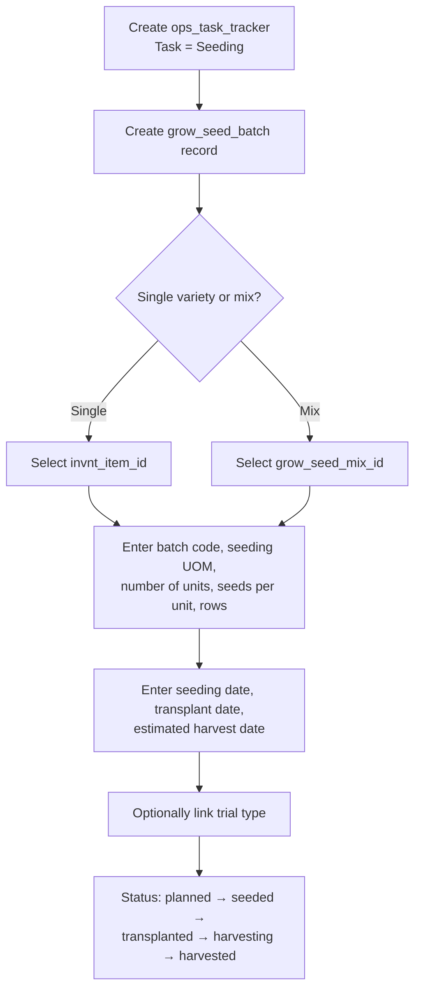

# Grow Seeding Workflow

This document describes the seeding activity flow using `ops_task_tracker` as the activity header and `grow_seed_batch` as the domain-specific record.

> **Prerequisite:** The "Seeding" task must be provisioned in `ops_task`. See [01_org_provisioning.md](20260324_01_org_provisioning.md) for setup steps.

---

## Tables Involved

| Table | Purpose |
|-------|---------|
| `ops_task_tracker` | Activity header — captures who, when, where |
| `grow_seed_batch` | Seeding-specific data — batch code, seed item/mix, UOM, units, dates, status |
| `grow_seed_mix` | Named seed blend recipe (if seeding a mix) |
| `grow_seed_mix_item` | Individual seeds within a mix with percentages |
| `grow_trial_type` | Optional trial classification |

---

## Flow

1. Create an `ops_task_tracker` activity with task = "Seeding"
   - If templates are linked to the "Seeding" task via `ops_task_template`, they are presented for completion
2. Create a `grow_seed_batch` record linked to the activity via `ops_task_tracker_id`
3. Select either a single seed item (`invnt_item_id`) or a seed mix (`grow_seed_mix_id`) — never both (enforced by CHECK constraint)
4. Enter batch code (system-generated, editable), seeding UOM, number of units, seeds per unit, number of rows
5. Enter seeding date, transplant date, and estimated harvest date
6. Optionally link to a trial type (`grow_trial_type_id`)
7. Update status through lifecycle: `planned` → `seeded` → `transplanted` → `harvesting` → `harvested`

---

## Notes

- A seeding activity can produce multiple batches if different varieties or mixes are seeded in the same session. Each batch gets its own `grow_seed_batch` row linked to the same `ops_task_tracker`.
- The `grow_seed_batch` header is required because it carries business fields (batch code, seed item/mix, UOM, units, dates, status) that do not exist on `ops_task_tracker`.

---

## Flow Diagram

