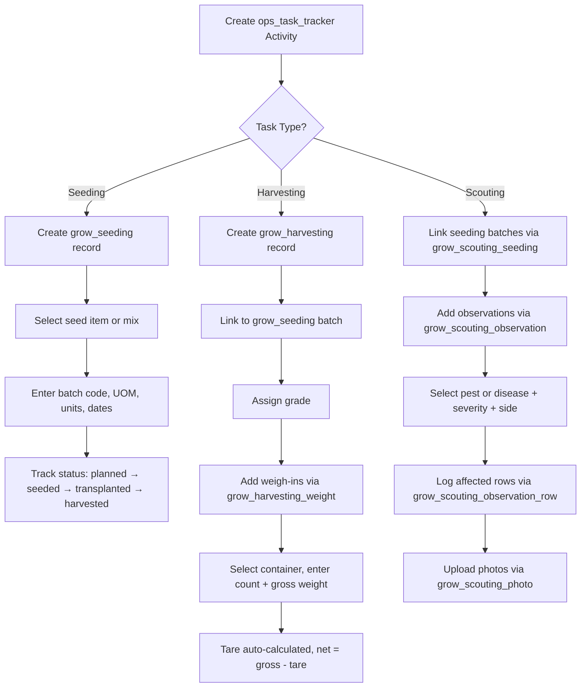

# Grow Module — Activity Workflows

This document describes how the three main grow activities (seeding, harvesting, and scouting) flow through the system using the shared `ops_task_tracker` as the activity header.

---

## 1. Activity Pattern

All grow activities follow the same pattern:

1. Create an **ops_task_tracker** record (select task, farm, site, start time)
2. Fill in the **grow-specific data** in the relevant tables
3. Complete the activity (stop time, status)

The `ops_task_tracker` captures the common activity metadata (who, when, where). The grow tables capture the domain-specific details.

---

## 2. Seeding

**Tables:** `grow_seeding`

**Flow:**
1. Create an ops_task_tracker activity with task = "Seeding"
2. Create a `grow_seeding` record linked to the activity via `ops_task_tracker_id`
3. Select either a single seed item (`invnt_item_id`) or a seed mix (`grow_seed_mix_id`) — never both
4. Enter batch code (system-generated, editable), seeding UOM, number of units, seeds per unit, number of rows
5. Enter seeding date, transplant date, and estimated harvest date
6. Optionally link to a trial type (`grow_trial_type_id`)
7. Update status through lifecycle: `planned` → `seeded` → `transplanted` → `harvesting` → `harvested`

**Note:** A seeding activity can produce multiple batches if different varieties or mixes are seeded in the same session. Each batch gets its own `grow_seeding` row linked to the same `ops_task_tracker`.

---

## 3. Harvesting

**Tables:** `grow_harvesting`, `grow_harvesting_weight`

**Flow:**
1. Create an ops_task_tracker activity with task = "Harvesting"
2. Create a `grow_harvesting` record linked to the activity via `ops_task_tracker_id`
3. Select the seeding batch being harvested (`grow_seeding_id`) — this provides full seed-to-harvest traceability
4. Optionally assign a harvest grade (`grow_grade_id`)
5. Enter the harvest date
6. Add weigh-in records in `grow_harvesting_weight`:
   - Select a container type (`grow_harvest_container_id`)
   - Enter number of containers and gross weight
   - Tare weight is calculated on the fly from `grow_harvest_container.tare_weight × number_of_containers`
   - Net weight = gross weight minus calculated tare
7. Multiple weigh-ins per harvest are supported (e.g. 3 small totes + 2 large baskets)

**Note:** Harvest totals (total gross, total net, total containers) are derived by summing across `grow_harvesting_weight` rows. No totals are stored on the header.

---

## 4. Scouting

**Tables:** `grow_scouting_seeding`, `grow_scouting_observation`, `grow_scouting_observation_row`, `grow_scouting_photo`

**Flow:**
1. Create an ops_task_tracker activity with task = "Scouting" (captures farm, site, date, start/stop time)
2. Link the seeding batches being inspected via `grow_scouting_seeding` (one row per batch)
3. For each pest or disease found, create a `grow_scouting_observation` record:
   - Set `observation_type` to `pest` or `disease`
   - Select the pest (`grow_pest_id`) or disease (`grow_disease_id`) from the lookup
   - Enter which side of the site (e.g. East, West)
   - Set severity level (`low`, `moderate`, `high`, `severe`)
   - For diseases, set infection stage (`early`, `mid`, `late`, `advanced`)
4. For each observation, log which rows are affected via `grow_scouting_observation_row` (one row per growing row number)
5. Upload photos via `grow_scouting_photo` linked to the activity (one row per photo with optional caption)

**Note:** There is no separate scouting header table. The `ops_task_tracker` serves as the header since scouting has no additional header-level business fields beyond what the tracker already captures (org, farm, site, date, notes, start/stop time).

---

## 5. Why Scouting Has No Header

| Activity | Header table | Reason |
|----------|-------------|--------|
| Seeding | `grow_seeding` | Carries batch code, seed item/mix, UOM, units, dates, status — none of these exist on ops_task_tracker |
| Harvesting | `grow_harvesting` | Carries seeding link, grade, harvest date — traceability and grading are harvest-specific |
| Scouting | None (uses `ops_task_tracker` directly) | All header data (site, date, notes) is already on ops_task_tracker — a separate header would just duplicate it |

---

## 6. Flow Diagram

