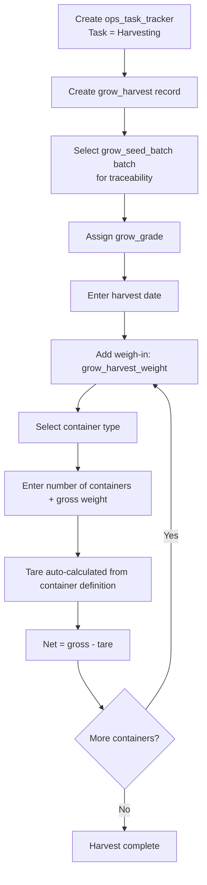

# Grow Harvesting Workflow

This document describes the harvesting activity flow using `ops_task_tracker` as the activity header and `grow_harvest` as the domain-specific record.

> **Prerequisite:** The "Harvesting" task must be provisioned in `ops_task`. See [01_org_provisioning.md](20260324_01_org_provisioning.md) for setup steps.

---

## Tables Involved

| Table | Purpose |
|-------|---------|
| `ops_task_tracker` | Activity header — captures who, when, where |
| `grow_harvest` | Harvesting-specific data — seeding link, grade, harvest date |
| `grow_harvest_weight` | Individual weigh-ins per container type |
| `grow_harvest_container` | Container definitions with tare weight (per variety/grade) |
| `grow_seed_batch` | Source batch being harvested (traceability link) |
| `grow_grade` | Harvest quality grade assignment |

---

## Flow

1. Create an `ops_task_tracker` activity with task = "Harvesting"
   - If templates are linked to the "Harvesting" task via `ops_task_template`, they are presented for completion
2. Create a `grow_harvest` record linked to the activity via `ops_task_tracker_id`
3. Select the seeding batch being harvested (`grow_seed_batch_id`) — only batches with status `transplanted` or `harvesting` are available. This provides full seed-to-harvest traceability
4. Optionally assign a harvest grade (`grow_grade_id`)
5. Enter the harvest date
6. Add weigh-in records in `grow_harvest_weight`:
   - Select a container type (`grow_harvest_container_id`)
   - Enter number of containers and gross weight
   - Tare weight is calculated on the fly from `grow_harvest_container.tare_weight × number_of_containers`
   - Net weight = gross weight minus calculated tare
7. Multiple weigh-ins per harvest are supported (e.g. 20 totes + 2 pallets)

---

## Notes

- Harvest totals (total gross, total net, total containers) are derived by summing across `grow_harvest_weight` rows. No totals are stored on the header.
- The `grow_harvest` header is required because it carries the seeding link and grade assignment — traceability and grading are harvest-specific fields that do not exist on `ops_task_tracker`.
- Container tare weights can be specific to variety and grade via `grow_harvest_container`. The app resolves the most specific match when auto-calculating tare.

---

## Flow Diagram

