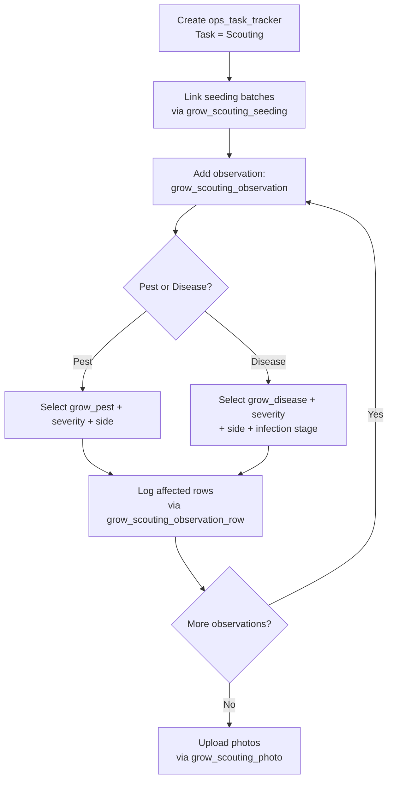

# Grow Scouting Workflow

This document describes the scouting activity flow using `ops_task_tracker` directly as the header — no separate scouting header table is needed since all header data (site, date, notes) is already on the tracker.

---

## Required Pre-Seeded Task

The following task must be seeded in `ops_task` during org provisioning:

| id | name |
|---|---|
| scouting | Scouting |

---

## Tables Involved

| Table | Purpose |
|-------|---------|
| `ops_task_tracker` | Activity header — captures org, farm, site, date, start/stop time, notes |
| `grow_scouting_seeding` | Join table — which seeding batches were inspected |
| `grow_scouting_observation` | Individual pest or disease finding with side, severity, and infection stage |
| `grow_scouting_observation_row` | Rows affected per observation |
| `grow_scouting_photo` | Photos taken during the scouting event with optional captions |
| `grow_pest` | Standardized pest names (lookup) |
| `grow_disease` | Standardized disease names (lookup) |

---

## Flow

1. Create an `ops_task_tracker` activity with task = "Scouting" (captures farm, site, date, start/stop time)
2. Link the seeding batches being inspected via `grow_scouting_seeding` (one row per batch)
3. For each pest or disease found, create a `grow_scouting_observation` record:
   - Set `observation_type` to `pest` or `disease`
   - Select the pest (`grow_pest_id`) or disease (`grow_disease_id`) from the lookup — enforced by CHECK constraint
   - Enter which side of the site (e.g. East, West)
   - Set severity level (`low`, `moderate`, `high`, `severe`)
   - For diseases, set infection stage (`early`, `mid`, `late`, `advanced`)
4. For each observation, log which rows are affected via `grow_scouting_observation_row` (one row per growing row number)
5. Upload photos via `grow_scouting_photo` linked to the activity (one row per photo with optional caption)

---

## Notes

- There is no separate scouting header table. The `ops_task_tracker` serves as the header since scouting has no additional header-level business fields beyond what the tracker already captures.
- A single observation (e.g. "aphids, high severity") can affect multiple rows — the `grow_scouting_observation_row` table captures this one-to-many relationship.
- Photos are stored as individual rows (not JSONB) because each photo can have its own caption.

---

## Flow Diagram

