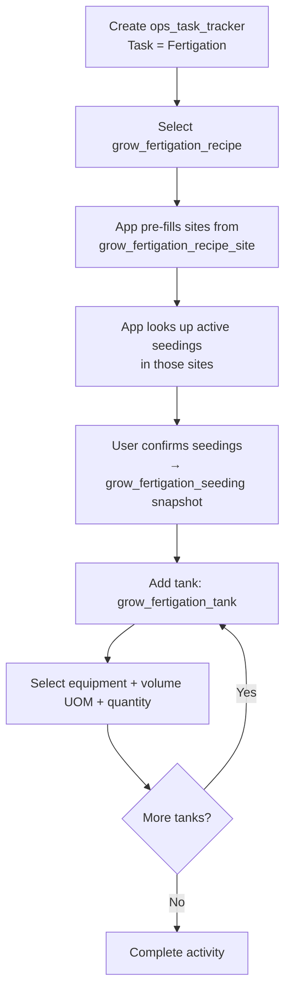

# Grow Fertigation Workflow

This document describes the fertigation activity flow using `ops_task_tracker` directly as the header. Recipes are reusable and define the fertilizer mix, target sites, flush water, and top-up configuration.

> **Prerequisite:** The "Fertigation" task must be provisioned in `ops_task`. See [01_org_provisioning.md](20260324_01_org_provisioning.md) for setup steps.

---

## Tables Involved

| Table | Purpose |
|-------|---------|
| `ops_task_tracker` | Activity header — captures org, farm, date, start/stop time, notes |
| `grow_fertigation_recipe` | Reusable recipe — name, flush water config, top-up hours |
| `grow_fertigation_recipe_item` | Items in the recipe with quantities |
| `grow_fertigation_recipe_site` | Sites that receive this recipe (configuration) |
| `grow_fertigation_seeding` | Snapshot — which seedings were fertigated on this event + recipe link |
| `grow_fertigation_tank` | Tanks used with volume applied per tank |

---

## Flow

1. Create an `ops_task_tracker` activity with task = "Fertigation"
2. Select the recipe (`grow_fertigation_recipe`)
3. App pre-fills sites from `grow_fertigation_recipe_site`
4. App looks up active seedings in those sites (`grow_seeding.status IN ('transplanted', 'harvesting')`)
5. User confirms — seedings are recorded in `grow_fertigation_seeding` as a point-in-time snapshot
6. For each tank used, create a `grow_fertigation_tank` record:
   - Select the equipment (`equipment_id`)
   - Enter volume UOM and quantity applied
7. Complete the activity (stop time)

---

## Design Decision: Recipe ID on Seeding Table

The `grow_fertigation_recipe_id` is stored on `grow_fertigation_seeding` rather than on a separate header table or on `ops_task_tracker`. This decision was made for three reasons:

1. **`ops_task_tracker` stays module-agnostic** — adding grow-specific FKs to a shared ops table would bloat it as every module adds their own fields
2. **No header table needed** — the only header-level business field is the recipe link. Creating a table with just `ops_task_tracker_id` + `grow_fertigation_recipe_id` adds complexity for one column
3. **The recipe ID on the seeding row is semantically correct** — each row says "this recipe was applied to this seeding on this event," which is exactly what we need for historical traceability

To query which recipe was used for a fertigation event:
```sql
SELECT DISTINCT grow_fertigation_recipe_id
FROM grow_fertigation_seeding
WHERE ops_task_tracker_id = ?
```

---

## Notes

- Recipes are reusable across multiple fertigation events. The recipe defines what gets mixed; the event records when and where it was applied.
- `grow_fertigation_recipe_item.invnt_item_id` is nullable for one-off fertilizers not tracked in inventory. `item_name` is always set for display.
- Flush water and top-up hours are stored on the recipe (not per event) since they are configuration, not event-specific.
- Seedings are filtered to `transplanted` or `harvesting` status only.

---

## Flow Diagram


