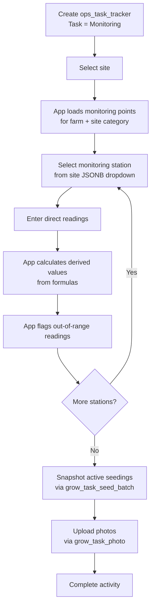

# Grow Monitoring Workflow

This document describes the environmental monitoring activity flow using `ops_task_tracker` directly as the header. Monitoring points are configurable per farm and site category, with support for direct readings and calculated values.

> **Prerequisite:** The "Monitoring" task must be provisioned in `ops_task`. See [01_org_provisioning.md](20260324_01_org_provisioning.md) for setup steps.

---

## Tables Involved

| Table | Purpose |
|-------|---------|
| `ops_task_tracker` | Activity header — captures org, farm, site, date, start/stop time, notes |
| `grow_monitoring_metric` | Defines what to measure per farm + site category with UOM, thresholds, and formulas |
| `grow_monitoring_reading` | Individual measurement per point per station per event |
| `grow_task_seed_batch` | Snapshot of seedings present during the event |
| `grow_task_photo` | Photos taken during monitoring with optional caption |
| `org_site` | Provides `monitoring_stations` JSONB for station selection |

---

## Setup: Monitoring Points

Before monitoring can begin, an admin creates `grow_monitoring_metric` records scoped to farm + site category:

### Example: Cuke Farm — Greenhouse

| Point | Type | UOM | Min | Max |
|-------|------|-----|-----|-----|
| Drip mL | direct | mL | — | — |
| Drain mL | direct | mL | — | — |
| Drippers | direct | count | — | — |
| Drain % | calculated | % | 20 | 40 |
| Drip EC | direct | ppm | 2.0 | 3.5 |
| Drain EC | direct | ppm | — | — |
| Drip pH | direct | pH | 5.5 | 6.5 |
| Drain pH | direct | pH | — | — |

### Example: Cuke Farm — Nursery

| Point | Type | UOM | Min | Max |
|-------|------|-----|-----|-----|
| High EC | direct | ppm | — | — |
| Low EC | direct | ppm | — | — |
| High pH | direct | pH | — | — |
| Low pH | direct | pH | — | — |
| Water EC | direct | ppm | — | — |
| Water pH | direct | pH | — | — |
| Crop Height | direct | inches | — | — |
| Substrate | direct | — | — | — |

### Example: Lettuce Farm — Pond

| Point | Type | UOM | Min | Max |
|-------|------|-----|-----|-----|
| Pond EC | direct | ppm | 1.0 | 2.5 |
| Pond pH | direct | pH | 5.8 | 6.2 |
| Dissolved Oxygen | direct | ppm | 5.0 | — |
| Temperature | direct | °C | 18 | 28 |
| Water Level Gap | direct | inches | — | 2.0 |

### Calculated Points

A calculated point references other points via `input_point_ids` and evaluates a `formula`:

```
Point: Drain %
point_type: calculated
formula: (drain_ml / (drip_ml * drippers)) * 100
input_point_ids: ["drip_ml", "drain_ml", "drippers"]
minimum_value: 20
maximum_value: 40
```

The app evaluates the formula after the input readings are entered and stores the computed result. Out-of-range is checked against the thresholds.

---

## Flow

1. Create an `ops_task_tracker` activity with task = "Monitoring"
   - If templates are linked to the "Monitoring" task via `ops_task_template`, they are presented for completion
2. Select the site — the app loads monitoring points matching `farm_id` + `site.category`
3. Select the monitoring station from `org_site.monitoring_stations` dropdown
4. For each monitoring point, enter the reading based on its `response_type`:
   - **Numeric**: user enters a number (e.g. EC, pH, mL, temperature)
   - **Boolean**: user toggles yes/no (e.g. Is Injection)
   - **Text**: user enters free text (e.g. Substrate type)
   - **Calculated points**: app computes the value from the formula once all input readings are entered
5. The app auto-flags `is_out_of_range = true` for any numeric reading outside the point's `minimum_value` / `maximum_value`
7. App snapshots active seedings in the site via `grow_task_seed_batch` (`status IN ('transplanted', 'harvesting')`)
8. Upload photos via `grow_task_photo` (one row per photo with optional caption)
9. Complete the activity

---

## Notes

- Monitoring snapshots which seedings are present in the site at the time of the event via `grow_task_seed_batch`.
- Monitoring stations are stored as a JSONB array on `org_site.monitoring_stations` and rendered as a dropdown.
- Each reading row stores the computed result for calculated points, providing a historical record even if the formula changes later.
- Out-of-range detection is automatic based on the point's thresholds. The frontend can highlight flagged readings.

---

## Flow Diagram


