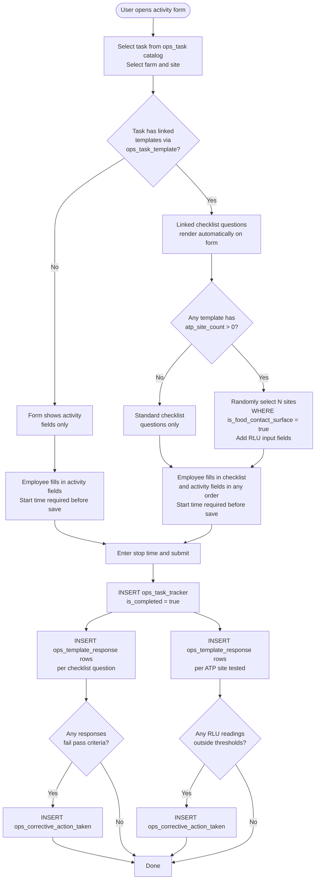

# Ops Task Workflow

This document describes the general ops task workflow — how any task activity flows from creation through checklist completion to corrective actions. This is the foundation that all grow module activities (seeding, harvesting, scouting, spraying, fertigation, monitoring) and non-grow tasks (pre-ops, post-ops, house inspections) build on.

> **Prerequisite:** Tasks must be provisioned in `ops_task` and templates linked via `ops_task_template`. See [01_org_provisioning.md](20260325_01_org_provisioning.md) for setup steps.

---

## Tables Involved

| Table | Role |
|-------|------|
| `ops_task` | Catalog of available tasks (e.g. Seeding, Harvesting, Pre-Op, House Inspection) |
| `ops_task_tracker` | The activity record — one per event; links task, site, farm, and timing |
| `ops_task_template` | Many-to-many link between tasks and templates; determines which checklists auto-load |
| `ops_task_schedule` | Employees assigned to the activity |
| `ops_template` | Checklist template definition; holds ATP site count and RLU thresholds |
| `ops_template_question` | Individual checklist questions within a template |
| `ops_template_response` | All responses for an activity — both checklist answers and ATP readings |
| `ops_corrective_action_choice` | Predefined corrective action options |
| `ops_corrective_action_taken` | Corrective actions raised against any failing response |

---

## Flow

### 1. Create the Activity

The user creates an `ops_task_tracker` record by filling in:

| Field | Description |
|-------|-------------|
| Task | Selected from the `ops_task` catalog |
| Farm | The farm this activity belongs to |
| Site | The site where the activity is taking place |
| Start time | When the activity began — required before the form can be saved |
| Employees | One or more employees assigned to this activity via `ops_task_schedule`; each can have their own start/stop time |

### 2. Auto-Load Linked Templates

When the user selects a task, the app queries `ops_task_template` to find all templates linked to that task:

```sql
SELECT ops_template_id
FROM ops_task_template
WHERE ops_task_id = ?
  AND is_deleted = false
```

If templates are found, their questions render automatically on the same form. Multiple templates can be linked to a single task — all are presented together. If no templates are linked, the form shows activity fields only.

### 3. Complete the Checklist

Questions are loaded from `ops_template_question` for each linked template, ordered by `display_order`. Each question has a defined response type:

| Response Type | How the Employee Answers |
|--------------|--------------------------|
| Boolean | Yes / No toggle |
| Numeric | Number input (e.g. temperature, count) |
| Enum | Select from a predefined list of options |

Each question carries its pass criteria and an optional `warning_message` shown when the response fails.

### 4. ATP Surface Testing (When Required)

Some templates require ATP surface testing. This is configured on the template via `atp_site_count` and RLU thresholds.

When `ops_template.atp_site_count > 0`, the system randomly selects that many active food contact sites within the farm and adds a numeric RLU input field for each one. The employee swabs each surface and enters the RLU reading.

Pass/fail is evaluated against `ops_template.minimum_rlu_value` and `ops_template.maximum_rlu_value`.

> **Note:** ATP readings are stored in `ops_template_response` with `site_id` populated and `ops_template_question_id = null`. Standard checklist rows are the inverse — `ops_template_question_id` populated, `site_id` null.

### 5. Submit the Activity

On submission:

| What | Table | Key Fields |
|------|-------|------------|
| Activity closed | `ops_task_tracker` | `stop_time`, `is_completed = true` |
| One row per checklist question | `ops_template_response` | `ops_task_tracker_id`, `ops_template_question_id`, response value |
| One row per ATP site tested | `ops_template_response` | `ops_task_tracker_id`, `response_numeric`, `site_id` |
| One row per failing response | `ops_corrective_action_taken` | `ops_template_response_id` |

### 6. Corrective Actions

When a response fails its pass criteria (or an ATP reading falls outside thresholds), an `ops_corrective_action_taken` record is automatically created. It tracks:

- What action needs to be taken (from `ops_corrective_action_choice` or free text)
- Who is responsible
- Due date
- Resolution status (open → completed)
- Verification once resolved

---

## Quick Fill (No Pre-Created Activity)

In some situations an employee may want to fill out a checklist directly — without filling in all the activity fields first. For example, a supervisor completing a daily log who just wants to pick a template and start answering questions.

The frontend handles this by silently creating the `ops_task_tracker` record on submission:

- `start_time` and `stop_time` are both set to the submission timestamp
- `status` is set to `completed`
- All `ops_template_response` rows are written as normal

From the user's perspective: select template → answer questions → submit. The database still holds a complete tracker record for every set of responses.

---

## Viewing a Completed Activity

To retrieve the full picture of an activity, query by `ops_task_tracker_id`:

```sql
-- Activity header
SELECT tt.start_time, tt.stop_time, tt.status,
       t.name AS task, s.name AS site
FROM ops_task_tracker tt
JOIN ops_task t ON t.id = tt.ops_task_id
JOIN org_site s ON s.id = tt.site_id
WHERE tt.id = '[tracker_id]';

-- Checklist responses
SELECT q.question_text, q.response_type,
       r.response_boolean, r.response_numeric, r.response_enum, r.response_text
FROM ops_template_response r
JOIN ops_template_question q ON q.id = r.ops_template_question_id
WHERE r.ops_task_tracker_id = '[tracker_id]'
  AND r.site_id IS NULL
ORDER BY q.display_order;

-- ATP results
SELECT s.name AS site_name, s.zone, r.response_numeric
FROM ops_template_response r
JOIN org_site s ON s.id = r.site_id
WHERE r.ops_task_tracker_id = '[tracker_id]'
  AND r.site_id IS NOT NULL;
```

---

## Flow Diagram


