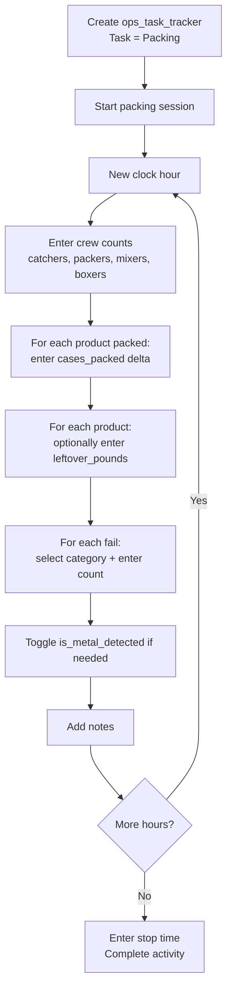

# Pack Productivity Workflow

This document describes how pack line productivity is tracked hourly, including crew assignments, product output, and fail tracking.

> **Prerequisite:** The "Packing" task must be provisioned in `ops_task`. Fail categories must be configured in `pack_fail_category`. See [01_org_provisioning.md](20260326_01_org_provisioning.md).

---

## Tables Involved

| Table | Purpose |
|-------|---------|
| `ops_task_tracker` | Activity header — task = "Packing", captures the pack date and farm |
| `pack_productivity_hour` | One row per clock hour with crew counts by role and metal detection flag |
| `pack_productivity_hour_product` | Cases packed per product per hour (delta) with leftover pounds |
| `pack_productivity_hour_fail` | Fail counts per category per hour |
| `pack_fail_category` | Lookup — defines available fail categories |
| `sales_product` | Referenced for derived metrics (pack_per_case, case_net_weight) |

---

## Flow

1. **Create the activity** — user creates an `ops_task_tracker` with task = "Packing", selects the farm and start time
2. **Log each hour** — for every clock hour during the packing session:
   - Enter crew counts: catchers, packers, mixers, boxers
   - For each product packed that hour, enter the number of cases packed (delta — just this hour, not cumulative)
   - For each product, optionally enter leftover pounds
   - For each fail that occurred, select the fail category and enter the count
   - Toggle metal detected if applicable
   - Add notes (e.g. "Start LW at 10:20", "Fixing Proseal at 2:20-2:30")
3. **Complete the activity** — enter stop time, mark as complete

---

## Derived Metrics

These values are calculated on-the-fly from the stored data, not stored in the database:

| Metric | Formula | Source |
|--------|---------|--------|
| Total trays (per hour) | SUM(cases_packed × sales_product.pack_per_case) | pack_productivity_hour_product + sales_product |
| Trays per packer per minute | total_trays / (packers × 60) | Derived from above + pack_productivity_hour.packers |
| Packed pounds (per hour) | SUM(cases_packed × sales_product.case_net_weight) | pack_productivity_hour_product + sales_product |
| Total fails (per hour) | SUM(fail_count) | pack_productivity_hour_fail |
| Shift totals | SUM across all hours for the ops_task_tracker | Aggregation of hourly rows |

---

## Seeding Status Filter

The "Packing" task should be provisioned as a pre-seeded task during org onboarding. Fail categories (e.g. film, tray, printer, leaves, ridges, unexplained) should also be pre-seeded.

---

## Flow Diagram

