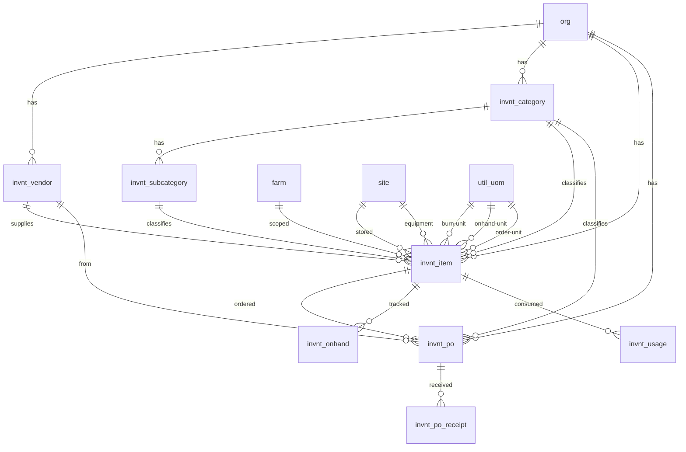

# Inventory Schema

Tables for managing inventory items, categories, and procurement across all farms within an organization. Covers seeds, chemicals, packaging materials, parts, and general supplies.

> **Standard audit fields:** Every table includes `created_at` (TIMESTAMPTZ, default now), `created_by` (TEXT, user email), `updated_at` (TIMESTAMPTZ, default now), and `updated_by` (TEXT, user email). These are omitted from the column listings below for brevity.

## Entity Relationship Diagram

---

## Table Overview

| Table | Purpose |
|-------|---------|
| invnt_vendor | Organization-level suppliers for procurement. Referenced by inventory items and purchase orders. |
| invnt_category | Top-level categories for organizing inventory items (e.g. Fertilizers, Seeds, Packaging Materials). |
| invnt_subcategory | Second-level categories under invnt_category for finer classification (e.g. Nitrogen Fertilizers under Fertilizers). |
| invnt_item | The main inventory record for each item. Tracks units and conversions, burn rates for forecasting, reorder settings, and item details (variety, manufacturer, part number, etc.) as proper columns. Classification is handled by category/subcategory. On-hand and on-order quantities are computed from transaction data, not stored here. |
| invnt_po | Tracks purchase order requests through a workflow: requested → approved/rejected → ordered → partial/received. Snapshots item name, units, and cost at order time. Supports both inventory_item and non_inventory_item purchases. |
| invnt_po_receipt | Individual deliveries received against a purchase order. Captures quantity, lot number, expiry date, and acceptance details. Multiple receipts per order enable partial delivery tracking. |
| invnt_onhand | Records on-hand inventory snapshots per item. Captures quantity in onhand units with burn unit conversion and lot tracking. Source of truth for computed totals like current stock, burn-per-week, and weeks-on-hand. |
| invnt_usage | Tracks inventory consumption linked back to the source module via reference_table and reference_id. Records burn quantity used per event. |

---

## invnt_vendor

Organization-level suppliers used for procurement across all farms. Stores contact details, address, and payment terms.

| Column         | Type         | Constraints            | Description                        |
|----------------|--------------|------------------------|------------------------------------|
| id             | TEXT         | PK                     | Human-readable identifier derived from vendor name (lowercase trimmed) |
| org_id         | TEXT         | NOT NULL, FK → org(id) | Owning organization for RLS filtering |
| name           | TEXT | NOT NULL               | Display name of the vendor, unique within the org |
| contact_person | TEXT | nullable               | Primary contact person at the vendor |
| email          | TEXT | nullable               | Vendor email address               |
| phone          | TEXT  | nullable               | Vendor phone number                |
| address        | TEXT         | nullable               | Vendor physical address            |
| payment_terms  | TEXT  | nullable               | Payment terms (e.g. Net 30, COD, Prepaid) |
| is_active      | BOOLEAN      | NOT NULL, default true | Soft delete flag; false hides the vendor from active use |

Unique constraint on `(org_id, name)` — no duplicate supplier names within an org.

---

## invnt_category

Top-level categories for organizing inventory items (e.g. Fertilizers, Seeds, Packaging Materials).

| Column     | Type         | Constraints                     | Description                              |
|-----------|--------------|--------------------------------|------------------------------------------|
| id        | TEXT         | PK                             | Human-readable identifier derived from category name (lowercase trimmed) |
| org_id    | TEXT         | NOT NULL, FK → org(id)         | Owning organization for RLS filtering    |
| name      | TEXT | NOT NULL                       | Display name of the category, unique within the org |
| is_active | BOOLEAN      | NOT NULL, default true         | Soft delete flag; false hides the category from active use |

Unique constraint on `(org_id, name)`.

## invnt_subcategory

Second-level categories under invnt_category for finer classification (e.g. Nitrogen Fertilizers under Fertilizers).

| Column      | Type         | Constraints                      | Description                              |
|------------|--------------|----------------------------------|------------------------------------------|
| id         | TEXT         | PK                               | Human-readable identifier derived from subcategory name (lowercase trimmed) |
| org_id     | TEXT         | NOT NULL, FK → org(id)           | Owning organization for RLS filtering    |
| category_id| TEXT         | NOT NULL, FK → invnt_category(id)| Parent main category this subcategory belongs to |
| name       | TEXT | NOT NULL                         | Display name of the subcategory, unique within its parent category |
| is_active  | BOOLEAN      | NOT NULL, default true           | Soft delete flag; false hides the subcategory from active use |

Unique constraint on `(category_id, name)`.

## invnt_item

The main inventory record. Items belong to an organization and optionally to a specific farm. Classification is handled by the category/subcategory structure. All item details are proper columns grouped by logical sections.

| Column                    | Type         | Constraints                           | Description                              |
|--------------------------|--------------|---------------------------------------|------------------------------------------|
| id                       | UUID         | PK, auto-generated                    | Unique identifier for the inventory item |
| org_id                   | TEXT         | NOT NULL, FK → org(id)                | Owning organization for RLS filtering    |
| farm_id                  | TEXT         | FK → farm(id), nullable               | Optional farm scope; NULL if item is shared across farms |
| category_id              | TEXT         | FK → invnt_category(id), nullable     | Main category for item classification    |
| subcategory_id           | TEXT         | FK → invnt_subcategory(id), nullable  | Subcategory for finer item classification |
| name                     | TEXT | NOT NULL                              | Display name of the item, unique within the org |
| accounting_id            | TEXT  | nullable                              | Identifier used to link this item to the accounting system |
| description              | TEXT         | nullable                              | Detailed description of the item         |
| burn_uom                 | TEXT  | FK → util_uom(code), nullable         | Smallest consumption unit used for burn rate tracking (e.g. ml, g, seed) |
| onhand_uom               | TEXT  | FK → util_uom(code), nullable         | Unit used for physical stock counts (e.g. bottle, bag, box) |
| order_uom                | TEXT  | FK → util_uom(code), nullable         | Unit used when placing orders with vendors (e.g. case, pallet) |
| burn_per_onhand_uom     | NUMERIC      | nullable                              | Number of burn units in one onhand unit  |
| burn_per_order_uom      | NUMERIC      | nullable                              | Number of burn units in one order unit   |
| is_palletized            | BOOLEAN      | NOT NULL, default false               | Whether this item is received and stored on pallets |
| pallet_order_quantity    | NUMERIC      | nullable                              | Number of order units per pallet         |
| truckload_pallet_quantity| NUMERIC      | nullable                              | Number of pallets per truckload          |
| is_frequently_used       | BOOLEAN      | NOT NULL, default false               | Flag for items that appear frequently in ordering and usage dashboards |
| burn_per_week            | NUMERIC      | nullable                              | Estimated weekly consumption in burn units for reorder calculations |
| cushion_weeks            | NUMERIC      | nullable                              | Safety stock buffer in weeks used in next-order-date calculations |
| is_auto_reorder          | BOOLEAN      | NOT NULL, default false               | Whether automatic reorder requests are generated when stock hits reorder point |
| reorder_point_burn       | NUMERIC      | nullable                              | Stock level in burn units that triggers a reorder |
| reorder_quantity_burn    | NUMERIC      | nullable                              | Quantity in burn units to reorder when reorder point is reached |
| requires_lot_tracking    | BOOLEAN      | NOT NULL, default false               | Whether receipts and transactions must include a lot number |
| requires_expiry_date     | BOOLEAN      | NOT NULL, default false               | Whether receipts must include an expiry date |
| site_id_storage      | TEXT         | FK → site(id), nullable           | Storage site where this item is kept; references site |
| vendor_id                | TEXT         | FK → invnt_vendor(id), nullable       | Primary vendor for procurement           |
| manufacturer             | TEXT | nullable                              | Manufacturer or brand name               |
| variety_id               | TEXT         | FK → grow_variety(id), nullable       | Linked crop variety for seed items       |
| is_pelleted              | BOOLEAN      | NOT NULL, default false               | Whether seed item is pelleted for easier planting |
| site_id_equipment    | TEXT         | FK → site(id), nullable           | Equipment site this part belongs to; references site |
| part_type                | TEXT  | nullable                              | Type classification for parts (e.g. electrical, mechanical, plumbing) |
| part_number              | TEXT  | nullable                              | Manufacturer part number or catalog SKU  |
| photos                   | JSONB        | NOT NULL, default []                  | JSON array of photo URLs for the item    |
| is_active                | BOOLEAN      | NOT NULL, default true                | Soft delete flag; false hides the item from active use |

Unique constraint on `(org_id, name)` — no duplicate item names within an org.

## invnt_po

Tracks purchase order requests through a workflow from request to receipt. Each order snapshots the item name, units, and cost at order time so the record stays accurate even if the item changes later. `request_type` determines whether it's a `non_inventory_item` purchase (classified by `category_id`) or an `inventory_item` purchase (linked via `invnt_item_id`). `item_name` is always populated either way. Uses `requested_at`/`requested_by` in place of the standard `created_at`/`created_by` audit fields.

| Column                | Type         | Constraints                           | Description                              |
|----------------------|--------------|---------------------------------------|------------------------------------------|
| id                   | UUID         | PK, auto-generated                    | Unique identifier for the purchase order |
| org_id               | TEXT         | NOT NULL, FK → org(id)                | Owning organization for RLS filtering    |
| farm_id              | TEXT         | FK → farm(id), nullable               | Optional farm scope for the order        |
| request_type         | TEXT         | NOT NULL, default inventory_item, CHECK | Whether this is a non-inventory purchase or an inventory item purchase: non_inventory_item, inventory_item |
| urgency_level        | TEXT         | nullable                              | Number of days until the item is needed (e.g. 1, 2, 7) |
| category_id          | TEXT         | FK → invnt_category(id), nullable     | Category for non_inventory_item requests (provides classification when there is no linked inventory item) |
| invnt_item_id        | UUID         | FK → invnt_item(id), nullable         | Linked inventory item; NULL for non_inventory_item requests |
| item_name            | TEXT | NOT NULL                              | Snapshot of item name at order time; manually entered for non_inventory_item requests |
| burn_uom             | TEXT  | FK → util_uom(code), nullable         | Unit of measure for burn quantity (snapshot from item at order time) |
| order_uom            | TEXT  | FK → util_uom(code), nullable         | Unit of measure for the order quantity (snapshot from item at order time) |
| order_quantity       | NUMERIC      | NOT NULL                              | Quantity ordered in order units          |
| burn_per_order_uom  | NUMERIC      | nullable                              | Snapshot of burn units per order unit at order time |
| status               | TEXT         | NOT NULL, default requested, CHECK    | Workflow status: requested, approved, rejected, ordered, partial, received, cancelled |
| reviewed_by          | TEXT         | FK → hr_employee(id), nullable        | Employee who approved or rejected the order |
| reviewed_at          | TIMESTAMPTZ  | nullable                              | Timestamp when the order was reviewed    |
| order_placed_by      | TEXT         | FK → hr_employee(id), nullable        | Employee who placed the order with the vendor |
| order_placed_at      | TIMESTAMPTZ  | nullable                              | Timestamp when the order was placed with the vendor |
| vendor_po_number     | TEXT  | nullable                              | PO number assigned by the vendor for this order |
| expected_delivery_date | DATE       | nullable                              | Expected delivery date from the vendor   |
| tracking_number      | TEXT | nullable                              | Shipping or freight tracking number      |
| order_notes          | TEXT         | nullable                              | Free-text notes about the order          |
| rejected_reason      | TEXT         | nullable                              | Reason for rejection when status is rejected |
| request_photos       | JSONB        | NOT NULL, default []                  | JSON array of photo URLs attached to the request |
| is_active            | BOOLEAN      | NOT NULL, default true                | Soft delete flag; false hides the order from active use |
| requested_at         | TIMESTAMPTZ  | NOT NULL, default now                 | Timestamp when the order was requested   |
| requested_by         | TEXT         | NOT NULL, FK → hr_employee(id)        | User who submitted the order request     |
| vendor_id            | TEXT         | FK → invnt_vendor(id), nullable       | Vendor the order is placed with          |
| total_cost           | NUMERIC      | nullable                              | Total cost for the order                 |
| is_freight_included  | BOOLEAN      | NOT NULL, default false               | Whether total_cost includes freight charges |

## invnt_po_receipt

Individual deliveries received against a purchase order. One order can have multiple receipts to handle partial deliveries. Each receipt captures its own lot number, expiry date, quantity, and acceptance details.

| Column                | Type         | Constraints                           | Description                              |
|----------------------|--------------|---------------------------------------|------------------------------------------|
| id                   | UUID         | PK, auto-generated                    | Unique identifier for the receipt        |
| org_id               | TEXT         | NOT NULL, FK → org(id)                | Owning organization for RLS filtering    |
| invnt_po_id          | UUID         | NOT NULL, FK → invnt_po(id)           | Parent purchase order this receipt belongs to |
| receipt_date         | DATE         | NOT NULL                              | Actual date the delivery arrived         |
| receipt_uom          | TEXT  | FK → util_uom(code), nullable         | Unit of measure for the received quantity |
| receipt_quantity     | NUMERIC      | NOT NULL                              | Quantity received in the receipt unit    |
| burn_per_receipt_uom| NUMERIC      | nullable                              | Conversion factor: burn units per receipt unit at time of receipt |
| lot_number           | TEXT  | nullable                              | Lot or batch number from the vendor      |
| lot_expiry_date      | DATE         | nullable                              | Expiry date for this lot                 |
| delivery_truck_clean | BOOLEAN      | nullable                              | Whether the delivery truck was clean upon arrival |
| delivery_acceptable  | BOOLEAN      | nullable                              | Whether the delivery was accepted in acceptable condition |
| receipt_notes        | TEXT         | nullable                              | Free-text notes about the receipt or delivery |
| receipt_photos       | JSONB        | NOT NULL, default []                  | JSON array of photo URLs documenting the delivery |
| is_active            | BOOLEAN      | NOT NULL, default true                | Soft delete flag; false hides the receipt from active use |

## invnt_onhand

Records on-hand inventory snapshots per item. Each record captures the quantity in onhand units with burn unit conversion and optional lot tracking. Source of truth for computed totals like current stock, burn-per-week, and weeks-on-hand.

| Column                | Type         | Constraints                           | Description                              |
|----------------------|--------------|---------------------------------------|------------------------------------------|
| id                   | UUID         | PK, auto-generated                    | Unique identifier for the on-hand record |
| org_id               | TEXT         | NOT NULL, FK → org(id)                | Owning organization for RLS filtering    |
| farm_id              | TEXT         | FK → farm(id), nullable               | Optional farm scope                      |
| invnt_item_id        | UUID         | NOT NULL, FK → invnt_item(id)         | Inventory item this record tracks        |
| onhand_date          | DATE         | NOT NULL                              | Date of the on-hand snapshot             |
| onhand_uom           | TEXT  | FK → util_uom(code), nullable         | Unit of measure for the on-hand quantity |
| onhand_quantity      | NUMERIC      | NOT NULL                              | Quantity on hand in onhand units         |
| burn_per_onhand_uom | NUMERIC      | nullable                              | Burn units per onhand unit at time of record |
| lot_number           | TEXT  | nullable                              | Lot or batch number for lot-tracked items |
| lot_expiry_date      | DATE         | nullable                              | Expiry date for this lot                 |
| additional_notes     | TEXT         | nullable                              | Free-text notes about this on-hand record |
| is_active            | BOOLEAN      | NOT NULL, default true                | Soft delete flag; false hides the record from active use |

## invnt_usage

Tracks inventory consumption linked back to the source module that triggered it. The `reference_table` and `reference_id` columns provide a generic FK to any table (e.g. grow_fertigation_schedule, harvest_batch) so usage can be traced to its origin.

| Column                | Type         | Constraints                           | Description                              |
|----------------------|--------------|---------------------------------------|------------------------------------------|
| id                   | UUID         | PK, auto-generated                    | Unique identifier for the usage record   |
| org_id               | TEXT         | NOT NULL, FK → org(id)                | Owning organization for RLS filtering    |
| farm_id              | TEXT         | FK → farm(id), nullable               | Optional farm scope                      |
| invnt_item_id        | UUID         | NOT NULL, FK → invnt_item(id)         | Inventory item that was consumed         |
| reference_table      | TEXT  | nullable                              | Source table that triggered the usage (e.g. grow_fertigation_schedule, harvest_batch) |
| reference_id         | UUID         | nullable                              | Source record ID in the reference_table  |
| usage_date           | DATE         | NOT NULL                              | Date the consumption occurred            |
| burn_uom             | TEXT  | FK → util_uom(code), nullable         | Unit of measure for the burn quantity    |
| quantity_burn        | NUMERIC      | NOT NULL                              | Quantity consumed in burn units          |
| is_active            | BOOLEAN      | NOT NULL, default true                | Soft delete flag; false hides the record from active use |

## Views

### View Overview

| View | Purpose |
|------|---------|
| invnt_item_summary | Dashboard view combining latest on-hand snapshot, open order totals with receipts, and computed forecasts (weeks-on-hand, next-order-date) per active inventory item. |
| invnt_lot_summary | Latest on-hand snapshot per item and lot number combination. Only includes lots with positive stock. Used for lot traceability, expiry tracking, and FIFO usage. |

---

### invnt_item_summary

Dashboard view combining latest on-hand snapshot, open order totals with receipt progress, and computed forecasts. Joins `invnt_item` with the latest `invnt_onhand` record and aggregated open `invnt_po` orders (factoring in `invnt_po_receipt` deliveries).

| Column                       | Source                              | Description                              |
|------------------------------|-------------------------------------|------------------------------------------|
| org_id                       | invnt_item.org_id                   | The organization                         |
| farm_id                      | invnt_item.farm_id                  | Optional farm scope                      |
| invnt_item_id                | invnt_item.id                       | The item                                 |
| category_id                  | invnt_item.category_id              | Main category                            |
| subcategory_id               | invnt_item.subcategory_id           | Item subcategory                         |
| vendor_id                    | invnt_item.vendor_id                | Primary vendor                           |
| burn_uom                     | invnt_item.burn_uom                 | Burn unit of measure                     |
| onhand_uom                   | invnt_item.onhand_uom               | On-hand unit of measure                  |
| order_uom                    | invnt_item.order_uom                | Order unit of measure                    |
| burn_per_onhand_uom         | invnt_item.burn_per_onhand_uom     | Burn units per onhand unit               |
| burn_per_order_uom          | invnt_item.burn_per_order_uom      | Burn units per order unit                |
| is_frequently_used           | invnt_item                          | Whether item is used regularly            |
| burn_per_week                | invnt_item                          | Configured weekly burn rate              |
| cushion_weeks                | invnt_item                          | Safety stock buffer in weeks             |
| is_auto_reorder              | invnt_item                          | Whether auto-reorder is enabled          |
| reorder_point_burn           | invnt_item                          | Reorder trigger level in burn units      |
| reorder_quantity_burn        | invnt_item                          | Reorder quantity in burn units           |
| onhand_quantity              | Latest invnt_onhand                 | Current on-hand in onhand units          |
| onhand_burn                  | Computed                            | Current on-hand in burn units (onhand_quantity × burn_per_onhand_uom) |
| onhand_date                  | Latest invnt_onhand                 | Date of most recent on-hand record       |
| days_since_onhand            | Computed                            | Days since last on-hand record           |
| ordered_burn                 | invnt_po (aggregated)               | Total burn units on open orders (approved, ordered, partial) |
| received_burn                | invnt_po_receipt (aggregated)       | Total burn units received against open orders |
| remaining_burn               | Computed                            | Outstanding burn units still on order (ordered − received) |
| weeks_on_hand                | Computed                            | Current stock / burn_per_week            |
| next_order_date              | Computed                            | Estimated date to place next order based on burn rate and cushion weeks |

### invnt_lot_summary

Latest on-hand snapshot per unique item and lot number combination. Uses `DISTINCT ON (invnt_item_id, lot_number)` ordered by `onhand_date DESC` to pick the most recent record. Only includes lots with positive stock.

| Column                  | Source                        | Description                              |
|------------------------|-------------------------------|------------------------------------------|
| org_id                 | invnt_onhand.org_id           | The organization                         |
| invnt_item_id          | invnt_onhand.invnt_item_id    | The item                                 |
| lot_number             | invnt_onhand                  | Lot code from vendor                     |
| lot_expiry_date        | invnt_onhand                  | Expiry date for this lot                 |
| onhand_uom             | invnt_onhand                  | Unit for the on-hand quantity            |
| onhand_quantity        | invnt_onhand                  | Latest on-hand quantity for this lot     |
| burn_per_onhand_uom   | invnt_onhand                  | Burn units per onhand unit at time of record |
| onhand_date            | invnt_onhand                  | Date of the on-hand snapshot             |
| created_at             | invnt_onhand                  | When the record was created              |
| created_by             | invnt_onhand                  | Who created the record                   |
| updated_at             | invnt_onhand                  | When the record was last updated         |
| updated_by             | invnt_onhand                  | Who last updated the record              |

---

## Deferred

`invnt_usage` and `invnt_sales_product_item` are designed but deferred from the MVP. See [Future Improvements](future.md) for table definitions and planned features.
