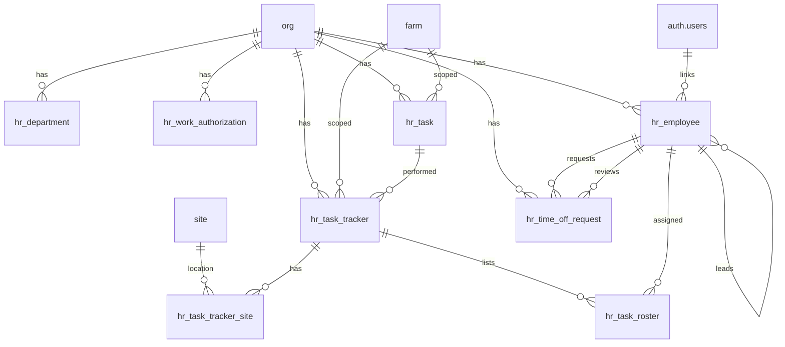

# HR Schema

Tables for managing employees, task definitions, and task tracking across the organization. Includes a pivoted weekly schedule view with OT threshold checking.

> **Standard audit fields:** Every table includes `created_at` (TIMESTAMPTZ, default now), `created_by` (TEXT, user email), `updated_at` (TIMESTAMPTZ, default now), and `updated_by` (TEXT, user email). These are omitted from the column listings below for brevity.

## Entity Relationship Diagram

---

## Table Overview

| Table | Purpose |
|-------|---------|
| hr_department | Org-specific department lookup for classifying employees (e.g. GH, PH, Lettuce). TEXT PK derived from name. |
| hr_work_authorization | Org-specific work authorization type lookup (e.g. Local, FURTE, WFE, H1B). TEXT PK derived from name. |
| hr_task | Flat task catalog for labor tracking. Defines all tasks employees can perform at the org or farm level. |
| hr_employee | Unified employee register and org membership. Every user with org access has a row here. Tracks employment details, management hierarchy, compensation, and access level. A user can have rows in multiple orgs. |
| hr_task_tracker | Header record for a task event. Captures the task, farm, date, start/stop times, and verification status. |
| hr_task_tracker_site | Sites where a task event was performed. One row per site per task tracker; supports tasks across multiple sites. |
| hr_task_roster | Lists the employees who participated in a task event with individual start/stop times and units completed. |
| hr_time_off_request | Employee time off requests with approval workflow (pending → approved/denied). |
| **hr_weekly_schedule** (view) | **Pivoted weekly schedule. One row per employee per task per week with Sun–Sat time columns, total hours, and OT threshold flag.** |

---

## hr_department

Org-specific departments used to classify employees. Each org defines its own set of departments.

| Column      | Type         | Constraints                     | Description                              |
|------------|--------------|--------------------------------|------------------------------------------|
| id         | TEXT         | PK                             | Human-readable identifier derived from name (trimmed lowercase, e.g. gh, ph) |
| org_id     | TEXT         | NOT NULL, FK → org(id)         | Owning organization for RLS filtering    |
| name       | TEXT  | NOT NULL                       | Department name, unique within the org (e.g. GH, PH, Lettuce) |
| description| TEXT         | nullable                       | Optional description of the department   |
| is_active  | BOOLEAN      | NOT NULL, default true         | Soft delete flag; false hides the department from active use |

Unique constraint on `(org_id, name)`.

---

## hr_work_authorization

Org-specific work authorization types used to classify employees. Each org defines its own set of types.

| Column      | Type         | Constraints                     | Description                              |
|------------|--------------|--------------------------------|------------------------------------------|
| id         | TEXT         | PK                             | Human-readable identifier derived from name (trimmed lowercase, e.g. h1b, wfe) |
| org_id     | TEXT         | NOT NULL, FK → org(id)         | Owning organization for RLS filtering    |
| name       | TEXT  | NOT NULL                       | Authorization type name, unique within the org (e.g. Local, FURTE, WFE, H1B) |
| description| TEXT         | nullable                       | Optional description of the authorization type |
| is_active  | BOOLEAN      | NOT NULL, default true         | Soft delete flag; false hides the type from active use |

Unique constraint on `(org_id, name)`.

---

## hr_task

Flat task catalog for labor tracking. Tasks can be org-wide or scoped to a specific farm.

| Column      | Type         | Constraints                     | Description                              |
|------------|--------------|--------------------------------|------------------------------------------|
| id         | TEXT         | PK                             | Human-readable identifier derived from task name (lowercase trimmed) |
| org_id     | TEXT         | NOT NULL, FK → org(id)         | Owning organization for RLS filtering    |
| farm_id    | TEXT         | FK → farm(id), nullable        | Optional farm scope; NULL if task applies to all farms |
| name       | TEXT  | NOT NULL                       | Short name for the task, unique within the org (e.g. HARV, PICK) |
| description| TEXT         | nullable                       | Description of the task                  |
| accounting_id| TEXT | nullable                       | Identifier used to link this task to the accounting system |
| is_active  | BOOLEAN      | NOT NULL, default true         | Soft delete flag; false hides the task from active use |

Unique constraint on `(org_id, name)`.

## hr_employee

Unified employee register and org membership table. Every employee gets a row here with a required `access_level` that defines their role (owner, manager, team_lead, employee). Employees without app access have a null `user_id`. A user can belong to multiple orgs by having one row per org. Tracks employment details, management hierarchy, and compensation.

| Column                       | Type         | Constraints                     | Description                              |
|-----------------------------|--------------|--------------------------------|------------------------------------------|
| id                          | TEXT         | PK                             | Human-readable identifier derived from employee name (e.g. john_smith) |
| org_id                      | TEXT         | NOT NULL, FK → org(id)         | Owning organization for RLS filtering    |
| user_id                     | UUID         | FK → auth.users(id), nullable  | Link to Supabase auth user; nullable for employees without system access |
| payroll_id                  | TEXT         | nullable                       | External payroll system identifier       |
| first_name                  | TEXT         | NOT NULL                       | Employee first name                      |
| last_name                   | TEXT         | NOT NULL                       | Employee last name                       |
| preferred_name              | TEXT         | nullable                       | Preferred or nickname used in day-to-day communication |
| gender                      | TEXT         | nullable                       | Employee gender                          |
| date_of_birth               | DATE         | nullable                       | Employee date of birth                   |
| is_minority                 | BOOLEAN      | NOT NULL, default false        | Whether the employee is classified as a minority for compliance reporting |
| profile_photo_url           | TEXT         | nullable                       | URL to employee profile photo            |
| title                       | TEXT         | nullable                       | Job title or position                    |
| department                  | TEXT         | nullable                       | Department the employee belongs to       |
| work_authorization          | TEXT         | nullable                       | Visa/work authorization type (e.g. LOCAL, WFE, FURTE, H1B). Values driven by frontend dropdown. |
| start_date                  | DATE         | nullable                       | Employment start date                    |
| end_date                    | DATE         | nullable                       | Employment end date; NULL if currently employed |
| is_verifier                 | BOOLEAN      | NOT NULL, default false        | Whether this employee is authorized to verify records |
| is_active                   | BOOLEAN      | NOT NULL, default true         | Soft delete flag; false disables the employee without removing the record |
| access_level                | TEXT         | NOT NULL, CHECK                | System access level: owner, manager, team_lead, or employee. Drives frontend permissions via dropdown selection. |
| team_lead_id                | TEXT         | FK → hr_employee(id), nullable | Self-referencing TEXT FK to direct team_lead; stores readable employee id (e.g. jane_doe) |
| compensation_manager_id     | TEXT         | FK → hr_employee(id), nullable | Self-referencing TEXT FK to compensation manager; stores readable employee id |
| pay_structure               | TEXT         | nullable, CHECK                | Pay structure type: hourly or salary     |
| overtime_threshold          | NUMERIC      | nullable                       | Hours threshold before overtime kicks in |
| wc                          | TEXT         | nullable                       | Workers compensation code identifying the compensation plan or pay grade |
| payroll_admin               | TEXT         | nullable                       | Payroll administrator responsible for employee compensation (e.g. HRB, HF) |
| payslip_delivery_method     | TEXT         | nullable                       | How pay stubs are delivered (e.g. email, print, portal) |
| phone                       | TEXT         | nullable                       | Employee phone number                    |
| email                       | TEXT         | nullable                       | Employee email address                   |
| company_email               | TEXT         | nullable                       | Company-issued email address             |
| site_id_housing             | TEXT         | FK → site(id), nullable        | Reference to the site record used as the employee housing assignment |

Unique constraint on `(org_id, first_name, last_name)` — no duplicate employee names within an org.

---

## hr_task_tracker

Header record for a task event. One record per task session — captures what task was done, where, when, and its verification status.

| Column       | Type         | Constraints                       | Description                              |
|-------------|--------------|-----------------------------------|------------------------------------------|
| id          | UUID         | PK, auto-generated                | Unique identifier for the task event     |
| org_id      | TEXT         | NOT NULL, FK → org(id)            | Owning organization for RLS filtering    |
| farm_id     | TEXT         | FK → farm(id), nullable           | Farm where the task was performed        |
| task_id     | TEXT         | NOT NULL, FK → hr_task(id)        | Task performed, references hr_task catalog |
| date        | DATE         | NOT NULL                          | Date the task was performed              |
| start_time  | TIMESTAMPTZ  | NOT NULL                          | Time the task started; used as the default for roster entries |
| stop_time   | TIMESTAMPTZ  | nullable                          | Time the task ended; used as the default for roster entries |
| status               | TEXT         | NOT NULL, default open, CHECK     | Workflow status: open, in_progress, completed |
| notes                | TEXT         | nullable                          | Free-text notes about the task event     |
| fsafe_template_id    | TEXT         | FK → fsafe_template(id), nullable | Food safety checklist template used for this task event; null if not a food safety task |
| photos               | JSONB        | NOT NULL, default []              | JSON array of photo URLs taken during the task |
| verified_by          | TEXT         | FK → hr_employee(id), nullable    | Employee who verified the task event record |
| verified_at          | TIMESTAMPTZ  | nullable                          | Timestamp when the task event was verified |
| is_active            | BOOLEAN      | NOT NULL, default true            | Soft delete flag; false hides the record from active use |

---

## hr_task_tracker_site

Sites where a task event was performed. One row per site per task tracker record; supports tasks carried out across multiple sites.

| Column           | Type         | Constraints                           | Description                              |
|-----------------|--------------|---------------------------------------|------------------------------------------|
| id              | UUID         | PK, auto-generated                    | Unique identifier for the record         |
| org_id          | TEXT         | NOT NULL, FK → org(id)                | Owning organization for RLS filtering    |
| task_tracker_id | UUID         | NOT NULL, FK → hr_task_tracker(id)    | Task tracker event this site belongs to  |
| site_id         | TEXT         | NOT NULL, FK → site(id)               | Site where the task was performed        |
| is_active       | BOOLEAN      | NOT NULL, default true                | Soft delete flag; false removes the site from the task without deleting the record |

Unique constraint on `(task_tracker_id, site_id)` — one entry per site per task event.

---

## hr_task_roster

One row per employee per task event. Times are pre-filled from the task tracker but can be overridden if an employee started late or left early.

| Column           | Type         | Constraints                           | Description                              |
|-----------------|--------------|---------------------------------------|------------------------------------------|
| id              | UUID         | PK, auto-generated                    | Unique identifier for the roster entry   |
| org_id          | TEXT         | NOT NULL, FK → org(id)                | Owning organization for RLS filtering    |
| task_tracker_id | UUID         | NOT NULL, FK → hr_task_tracker(id)    | Parent task event this roster entry belongs to |
| employee_id     | TEXT         | NOT NULL, FK → hr_employee(id)        | Employee who performed the task          |
| start_time      | TIMESTAMPTZ  | NOT NULL                              | Time this employee started; pre-filled from task tracker, overridable if they started late |
| stop_time       | TIMESTAMPTZ  | nullable                              | Time this employee stopped; pre-filled from task tracker, overridable if they left early |
| units_completed | NUMERIC      | nullable                              | Generic output quantity for this employee (e.g. lbs picked, trays seeded, rows cleaned) |
| is_active       | BOOLEAN      | NOT NULL, default true                | Soft delete flag; false removes the employee from the roster without deleting the record |

Unique constraint on `(task_tracker_id, employee_id)` — one roster entry per employee per task event.

---

## hr_time_off_request

Employee time off requests with PTO and sick leave breakdown and a simple approval workflow. Uses `requested_at` in place of the standard `created_at`/`created_by` audit fields.

| Column           | Type         | Constraints                       | Description                              |
|-----------------|--------------|-----------------------------------|------------------------------------------|
| id              | UUID         | PK, auto-generated                | Unique identifier for the time off request |
| org_id          | TEXT         | NOT NULL, FK → org(id)            | Owning organization for RLS filtering    |
| employee_id     | TEXT         | NOT NULL, FK → hr_employee(id)    | Employee submitting the request          |
| start_date      | DATE         | NOT NULL                          | First day of the requested time off      |
| return_date     | DATE         | nullable                          | First day the employee returns to work   |
| total_days      | NUMERIC      | nullable                          | Total number of days off requested       |
| pto_days        | NUMERIC      | nullable                          | Number of days charged to PTO balance    |
| sick_leave_days | NUMERIC      | nullable                          | Number of days charged to sick leave balance |
| request_reason  | TEXT         | nullable                          | Employee-provided reason for the time off |
| status          | TEXT         | NOT NULL, default pending, CHECK  | Approval status: pending, approved, denied |
| requested_by    | TEXT         | NOT NULL, FK → hr_employee(id)    | Employee who submitted the request       |
| requested_at    | TIMESTAMPTZ  | NOT NULL, default now             | Timestamp when the request was submitted |
| reviewed_by     | TEXT         | FK → hr_employee(id), nullable    | Employee who approved or denied the request |
| reviewed_at     | TIMESTAMPTZ  | nullable                          | Timestamp when the request was reviewed  |
| denial_reason   | TEXT         | nullable                          | Reason provided when the request is denied |
| notes           | TEXT         | nullable                          | Additional notes about the request       |
| is_active       | BOOLEAN      | NOT NULL, default true            | Soft delete flag; false hides the request from active use |

---

## hr_weekly_schedule (view)

Pivoted weekly schedule view. One row per employee per task per week. Day columns are formatted as `HH:MM - HH:MM` strings from the roster start/stop times. Null when the employee did not work that day. Only completed roster entries (with a `stop_time`) contribute to `total_hours`.

| Column              | Type         | Description                                                                 |
|--------------------|--------------|-----------------------------------------------------------------------------|
| week_start_date     | DATE         | Sunday of the scheduled week                                                |
| full_name           | TEXT         | Employee first and last name                                                |
| employee_id         | TEXT         | Employee identifier                                                         |
| org_id              | TEXT         | Organization                                                                |
| department          | TEXT         | Employee department                                                         |
| work_authorization  | TEXT         | Employee work authorization type                                            |
| task                | TEXT         | Task name from hr_task catalog                                              |
| sunday              | TEXT         | Formatted time range for Sunday, or null                                    |
| monday              | TEXT         | Formatted time range for Monday, or null                                    |
| tuesday             | TEXT         | Formatted time range for Tuesday, or null                                   |
| wednesday           | TEXT         | Formatted time range for Wednesday, or null                                 |
| thursday            | TEXT         | Formatted time range for Thursday, or null                                  |
| friday              | TEXT         | Formatted time range for Friday, or null                                    |
| saturday            | TEXT         | Formatted time range for Saturday, or null                                  |
| total_hours         | NUMERIC      | Total hours worked for the week (sum of completed roster entries)           |
| ot_threshold_weekly | NUMERIC      | Weekly OT threshold derived from `hr_employee.overtime_threshold / 2`; null if not set |
| is_over_ot_threshold| BOOLEAN      | True when `total_hours > ot_threshold_weekly`; false if threshold not set   |
