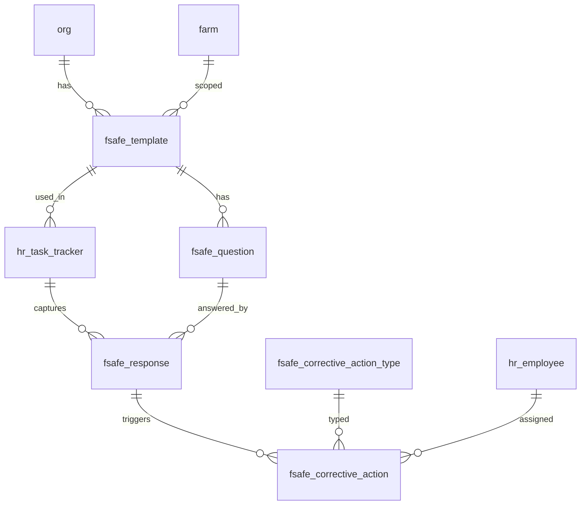

# Food Safety Schema

Tables for managing food safety checklists across the organization. Covers template definitions, checklist questions, employee responses, and corrective actions. Checklist sessions are anchored to `hr_task_tracker` which acts as the header record capturing who, when, and where.

> **Standard audit fields:** Every table includes `created_at` (TIMESTAMPTZ, default now), `created_by` (TEXT, user email), `updated_at` (TIMESTAMPTZ, default now), and `updated_by` (TEXT, user email). These are omitted from the column listings below for brevity.

## Entity Relationship Diagram

---

## Table Overview

| Table | Purpose |
|-------|---------|
| fsafe_template | Master checklist template definition. Defines the checklist name, type, and farm scope. |
| fsafe_question | Questions within a checklist template. Ordered by display_order; each question has a response type (boolean, numeric, enum). |
| fsafe_response | Employee responses to checklist questions. One row per question per task tracker session. |
| fsafe_corrective_action | Corrective actions raised against a failing response. Tracks assignment, due date, and resolution. |
| fsafe_corrective_action_type | Org-defined predefined corrective action types available for dropdown selection when logging a corrective action. |

---

## fsafe_template

Master food safety checklist template. Defines the checklist and the questions employees answer during a task event.

| Column          | Type         | Constraints                     | Description                              |
|----------------|--------------|--------------------------------|------------------------------------------|
| id             | TEXT         | PK                             | Human-readable identifier derived from name (trimmed lowercase) |
| org_id         | TEXT         | NOT NULL, FK → org(id)         | Owning organization for RLS filtering    |
| farm_id        | TEXT         | FK → farm(id), nullable        | Optional farm scope; null if the template applies to all farms |
| name           | TEXT         | NOT NULL                       | Checklist template name, unique within the org (e.g. Pre-Op GH, House Inspection) |
| template_type  | TEXT         | nullable                       | Module or purpose this checklist serves (e.g. food_safety, maintenance) |
| description    | TEXT         | nullable                       | Optional description of the checklist and its purpose |
| is_active      | BOOLEAN      | NOT NULL, default true         | Soft delete flag; false hides the template from active use |

Unique constraint on `(org_id, name)`.

---

## fsafe_question

Questions within a food safety checklist template. Ordered by `display_order` within each template.

| Column             | Type         | Constraints                           | Description                              |
|-------------------|--------------|---------------------------------------|------------------------------------------|
| id                | UUID         | PK, auto-generated                    | Unique identifier for the question       |
| org_id            | TEXT         | NOT NULL, FK → org(id)                | Owning organization for RLS filtering    |
| farm_id           | TEXT         | FK → farm(id), nullable               | Optional farm scope; null if the question applies to all farms |
| template_id       | TEXT         | NOT NULL, FK → fsafe_template(id)     | Checklist template this question belongs to |
| display_order     | INTEGER      | NOT NULL, default 0                   | Display order of this question within the template |
| question_text     | TEXT         | NOT NULL                              | The question or checklist item text shown to the employee |
| response_type     | TEXT         | NOT NULL, CHECK                       | Expected response format: boolean, numeric, or enum |
| is_required       | BOOLEAN      | NOT NULL, default true                | Whether this question must be answered before the checklist can be submitted |
| boolean_pass_value    | BOOLEAN      | nullable                              | The boolean value that constitutes a pass; used when response_type is boolean (e.g. true for Yes/Pass, false for No/Pass) |
| numeric_minimum_value | NUMERIC      | nullable                              | Minimum acceptable numeric value; a response below this triggers a corrective action warning |
| numeric_maximum_value | NUMERIC      | nullable                              | Maximum acceptable numeric value; a response above this triggers a corrective action warning |
| enum_options      | JSONB        | nullable                              | JSON array of all available options for this question; used when response_type is enum (e.g. ["Pass", "Fail", "N/A"]) |
| enum_pass_options | JSONB        | nullable                              | JSON array of enum options that constitute a pass; responses not in this list trigger a corrective action warning (e.g. ["Pass"]) |
| warning_message              | TEXT         | nullable                              | Custom warning message displayed to the user when the response fails; if null the frontend generates a default message from the pass criteria |
| corrective_action_type_ids   | JSONB        | nullable                              | JSON array of fsafe_corrective_action_type IDs suggested in the dropdown when this question fails (e.g. ["sanitize_surface", "replace_gloves"]); null shows all active org types |
| is_active                    | BOOLEAN      | NOT NULL, default true                | Soft delete flag; false hides the question from active checklists |

---

## fsafe_response

Employee responses to food safety checklist questions. One row per question per task tracker session. The linked `hr_task_tracker` record acts as the header (who completed the checklist, when, and at which site).

| Column            | Type         | Constraints                           | Description                              |
|------------------|--------------|---------------------------------------|------------------------------------------|
| id               | UUID         | PK, auto-generated                    | Unique identifier for the response       |
| org_id           | TEXT         | NOT NULL, FK → org(id)                | Owning organization for RLS filtering    |
| farm_id          | TEXT         | FK → farm(id), nullable               | Optional farm scope; null if the response applies to all farms |
| template_id      | TEXT         | FK → fsafe_template(id), nullable     | Checklist template this response belongs to; denormalized for easier filtering and reporting |
| task_tracker_id  | UUID         | NOT NULL, FK → hr_task_tracker(id)    | Task tracker session this response belongs to; acts as the checklist completion header |
| question_id      | UUID         | NOT NULL, FK → fsafe_question(id)     | Checklist question being answered        |
| response_boolean | BOOLEAN      | nullable                              | Boolean response value; used when question response_type is boolean |
| response_numeric | NUMERIC      | nullable                              | Numeric response value; used when question response_type is numeric |
| response_enum    | TEXT         | nullable                              | Selected enum option; used when question response_type is enum |
| response_text    | TEXT         | nullable                              | Free-text notes or observations for this response |
| is_active        | BOOLEAN      | NOT NULL, default true                | Soft delete flag; false hides the response from active use |

Unique constraint on `(task_tracker_id, question_id)` — one response per question per session.

---

## fsafe_corrective_action_type

Org-defined predefined corrective action types available for selection when logging a corrective action. Users pick from this dropdown; if the action isn't listed they provide a custom description instead.

| Column      | Type         | Constraints                     | Description                              |
|------------|--------------|--------------------------------|------------------------------------------|
| id         | TEXT         | PK                             | Human-readable identifier derived from name (trimmed lowercase) |
| org_id     | TEXT         | NOT NULL, FK → org(id)         | Owning organization for RLS filtering    |
| name       | TEXT         | NOT NULL                       | Corrective action type name, unique within the org (e.g. Sanitize Surface, Replace Gloves) |
| description| TEXT         | nullable                       | Optional description of what this corrective action entails |
| is_active  | BOOLEAN      | NOT NULL, default true         | Soft delete flag; false hides the type from active use |

Unique constraint on `(org_id, name)`.

---

## fsafe_corrective_action

Corrective actions raised against a failing food safety checklist response. Tracks the action required, who is responsible, and the resolution status.

| Column       | Type         | Constraints                           | Description                              |
|-------------|--------------|---------------------------------------|------------------------------------------|
| id          | UUID         | PK, auto-generated                    | Unique identifier for the corrective action |
| org_id      | TEXT         | NOT NULL, FK → org(id)                | Owning organization for RLS filtering    |
| farm_id     | TEXT         | FK → farm(id), nullable               | Optional farm scope; null if the corrective action applies to all farms |
| template_id | TEXT         | FK → fsafe_template(id), nullable     | Checklist template this corrective action belongs to; denormalized for easier filtering and reporting |
| response_id     | UUID         | NOT NULL, FK → fsafe_response(id)                       | Failing checklist response that triggered this corrective action |
| action_type_id     | TEXT         | FK → fsafe_corrective_action_type(id), nullable  | Predefined corrective action type selected from the org lookup; null if a custom action is provided instead |
| other_action       | TEXT         | nullable                                          | Free-text description of the corrective action when no predefined action type is selected |
| assigned_to        | TEXT         | FK → hr_employee(id), nullable                   | Employee responsible for completing the corrective action |
| due_date           | DATE         | nullable                                          | Date by which the corrective action must be completed |
| completed_on       | DATE         | nullable                                          | Date when the corrective action was completed |
| status             | TEXT         | NOT NULL, default open, CHECK                    | Resolution status: open, completed |
| notes              | TEXT         | nullable                                          | Additional notes about the corrective action or its resolution |
| result_description | TEXT         | nullable                                          | Description of the observed outcome after the corrective action was implemented |
| verified_by        | TEXT         | FK → hr_employee(id), nullable                   | Employee who verified the corrective action was effective |
| verified_at        | TIMESTAMPTZ  | nullable                                          | Timestamp when the corrective action was verified as effective |
| is_active          | BOOLEAN      | NOT NULL, default true                            | Soft delete flag; false hides the record from active use |
