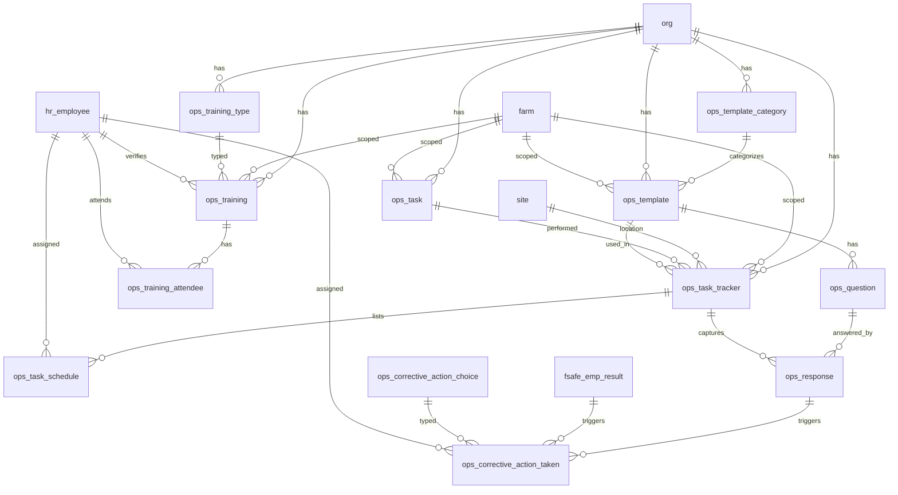

# Ops Schema

Tables for day-to-day operational activity across the organization. Covers task tracking and labor scheduling, staff training, and food safety checklists with corrective actions. These tables represent operational events — things that happened — rather than standing employee or configuration data.

> **Standard audit fields:** Every table includes `created_at` (TIMESTAMPTZ, default now), `created_by` (TEXT, user email), `updated_at` (TIMESTAMPTZ, default now), and `updated_by` (TEXT, user email). These are omitted from the column listings below for brevity.

## Entity Relationship Diagram

---

## Table Overview

| Table | Purpose |
|-------|---------|
| ops_task | Flat task catalog for labor tracking. Defines all tasks employees can perform at the org or farm level. |
| ops_task_tracker | Header record for a task event. Captures the task, farm, site, date, start/stop times, and verification status. |
| ops_task_schedule | Lists the employees scheduled for a task event with individual start/stop times and units completed. |
| **ops_weekly_schedule** (view) | **Pivoted weekly schedule. One row per employee per task per week with Sun–Sat time columns, total hours, and OT threshold flag.** |
| ops_training_type | Org-specific training type lookup (e.g. GMP, Food Safety, HACCP). TEXT PK derived from name. |
| ops_training | Staff training session records. Each row is one training event covering a specific topic for a group of employees. |
| ops_training_attendee | Individual attendance and certification records for each employee per training session. One row per employee per training. |
| ops_template_category | Org-defined categories for grouping checklist templates by module or purpose. |
| ops_template | Master checklist template definition. Defines the checklist name, category, and farm scope. |
| ops_corrective_action_choice | Org-defined reusable corrective action options available for dropdown selection when logging a corrective action. |
| ops_question | Questions within a checklist template. Ordered by display_order; each question has a response type (boolean, numeric, enum). |
| ops_response | Employee responses to checklist questions. One row per question per task tracker session. |
| ops_corrective_action_taken | Corrective actions raised against a failing checklist response or EMP test result. Tracks assignment, due date, and resolution. |

---

## ops_task

Flat task catalog for labor tracking. Tasks can be org-wide or scoped to a specific farm.

| Column      | Type         | Constraints                     | Description                              |
|------------|--------------|--------------------------------|------------------------------------------|
| id         | TEXT         | PK                             | Human-readable identifier derived from task name (lowercase trimmed) |
| org_id     | TEXT         | NOT NULL, FK → org(id)         | Owning organization for RLS filtering    |
| farm_id    | TEXT         | FK → farm(id), nullable        | Optional farm scope; NULL if task applies to all farms |
| name       | TEXT         | NOT NULL                       | Short name for the task, unique within the org (e.g. HARV, PICK) |
| description| TEXT         | nullable                       | Description of the task                  |
| is_active  | BOOLEAN      | NOT NULL, default true         | Soft delete flag; false hides the task from active use |

Unique constraint on `(org_id, name)`.

---

## ops_task_tracker

Header record for a task event. One record per task session — captures what task was done, where, when, and its verification status. `site_id` links each task event to a single site directly.

| Column             | Type         | Constraints                        | Description                              |
|-------------------|--------------|-----------------------------------|------------------------------------------|
| id                | UUID         | PK, auto-generated                | Unique identifier for the task event     |
| org_id            | TEXT         | NOT NULL, FK → org(id)            | Owning organization for RLS filtering    |
| farm_id           | TEXT         | FK → farm(id), nullable           | Farm where the task was performed        |
| site_id           | TEXT         | FK → site(id), nullable           | Site where the task was performed; replaces the separate ops_task_site junction table |
| ops_task_id       | TEXT         | NOT NULL, FK → ops_task(id)       | Task performed, references ops_task catalog |
| ops_template_id   | TEXT         | FK → ops_template(id), nullable   | Checklist template used for this task event; null if not a food safety task; FK added via ALTER TABLE in ops_template migration |
| start_time        | TIMESTAMPTZ  | NOT NULL                          | Timestamp when the task started; used as the default for schedule entries; date is derived from this field |
| stop_time         | TIMESTAMPTZ  | nullable                          | Time the task ended; used as the default for schedule entries |
| status            | TEXT         | NOT NULL, default open, CHECK     | Workflow status: open, in_progress, completed |
| notes             | TEXT         | nullable                          | Free-text notes about the task event     |
| photos            | JSONB        | NOT NULL, default []              | JSON array of photo URLs taken during the task |
| is_active         | BOOLEAN      | NOT NULL, default true            | Soft delete flag; false hides the record from active use |
| verified_at       | TIMESTAMPTZ  | nullable                          | Timestamp when the task event was verified |
| verified_by       | TEXT         | FK → hr_employee(id), nullable    | Employee who verified the task event record |

---

## ops_task_schedule

One row per employee per task event. Times are pre-filled from the task tracker but can be overridden if an employee started late or left early.

| Column                 | Type         | Constraints                               | Description                              |
|-----------------------|--------------|------------------------------------------|------------------------------------------|
| id                    | UUID         | PK, auto-generated                       | Unique identifier for the schedule entry |
| org_id                | TEXT         | NOT NULL, FK → org(id)                   | Owning organization for RLS filtering    |
| ops_task_tracker_id   | UUID         | NOT NULL, FK → ops_task_tracker(id)      | Parent task event this schedule entry belongs to |
| hr_employee_id        | TEXT         | NOT NULL, FK → hr_employee(id)           | Employee scheduled for the task          |
| start_time            | TIMESTAMPTZ  | NOT NULL                                 | Time this employee started; pre-filled from task tracker, overridable if they started late |
| stop_time             | TIMESTAMPTZ  | nullable                                 | Time this employee stopped; pre-filled from task tracker, overridable if they left early |
| units_completed       | NUMERIC      | nullable                                 | Generic output quantity for this employee (e.g. lbs picked, trays seeded, rows cleaned) |
| is_active             | BOOLEAN      | NOT NULL, default true                   | Soft delete flag; false removes the employee from the schedule without deleting the record |

Unique constraint on `(ops_task_tracker_id, hr_employee_id)` — one schedule entry per employee per task event.

---

## ops_weekly_schedule (view)

Pivoted weekly schedule view. One row per employee per task per week. Day columns are formatted as `HH:MM - HH:MM` strings from the schedule start/stop times. Null when the employee did not work that day. Only completed schedule entries (with a `stop_time`) contribute to `total_hours`.

| Column                  | Type         | Description                                                                 |
|-----------------------|--------------|-----------------------------------------------------------------------------|
| week_start_date         | DATE         | Sunday of the scheduled week                                                |
| full_name               | TEXT         | Employee first and last name                                                |
| hr_employee_id          | TEXT         | Employee identifier                                                         |
| org_id                  | TEXT         | Organization                                                                |
| hr_department_id        | TEXT         | Employee department identifier                                              |
| hr_work_authorization_id| TEXT         | Employee work authorization identifier                                      |
| task                    | TEXT         | Task name from ops_task catalog                                             |
| sunday                  | TEXT         | Formatted time range for Sunday, or null                                    |
| monday                  | TEXT         | Formatted time range for Monday, or null                                    |
| tuesday                 | TEXT         | Formatted time range for Tuesday, or null                                   |
| wednesday               | TEXT         | Formatted time range for Wednesday, or null                                 |
| thursday                | TEXT         | Formatted time range for Thursday, or null                                  |
| friday                  | TEXT         | Formatted time range for Friday, or null                                    |
| saturday                | TEXT         | Formatted time range for Saturday, or null                                  |
| total_hours             | NUMERIC      | Total hours worked for the week (sum of completed schedule entries)         |
| ot_threshold_weekly     | NUMERIC      | Weekly OT threshold derived from `hr_employee.overtime_threshold / 2`; null if not set |
| is_over_ot_threshold    | BOOLEAN      | True when `total_hours > ot_threshold_weekly`; false if threshold not set   |

---

## ops_training_type

Org-specific training types used to classify training sessions. Each org defines its own set of types.

| Column      | Type         | Constraints                     | Description                              |
|------------|--------------|--------------------------------|------------------------------------------|
| id         | TEXT         | PK                             | Human-readable identifier derived from name (trimmed lowercase, e.g. gmp, food_safety, haccp) |
| org_id     | TEXT         | NOT NULL, FK → org(id)         | Owning organization for RLS filtering    |
| name       | TEXT         | NOT NULL                       | Training type name, unique within the org (e.g. GMP, Food Safety, HACCP) |
| description| TEXT         | nullable                       | Optional description of the training type and its purpose |
| is_active  | BOOLEAN      | NOT NULL, default true         | Soft delete flag; false hides the type from active use |

Unique constraint on `(org_id, name)`.

---

## ops_training

Staff training session records. Each row is one training event covering a specific topic for a group of employees.

| Column                  | Type         | Constraints                              | Description                              |
|------------------------|--------------|------------------------------------------|------------------------------------------|
| id                     | UUID         | PK, auto-generated                       | Unique identifier for the training session |
| org_id                 | TEXT         | NOT NULL, FK → org(id)                   | Owning organization for RLS filtering    |
| farm_id                | TEXT         | FK → farm(id), nullable                  | Optional farm scope; null if training applies across the org |
| ops_training_type_id   | TEXT         | FK → ops_training_type(id), nullable     | Training type from the org lookup; references ops_training_type |
| training_date          | DATE         | nullable                                 | Date the training was conducted          |
| topics_covered         | JSONB        | NOT NULL, default '[]'                   | JSON array of topic strings covered during the training session |
| trainer_names          | JSONB        | NOT NULL, default '[]'                   | JSON array of trainer names; may include external trainers or internal employee names |
| materials_url          | TEXT         | nullable                                 | URL or path to the training materials or presentation used |
| notes                  | TEXT         | nullable                                 | Free-text notes about the training session |
| is_active              | BOOLEAN      | NOT NULL, default true                   | Soft delete flag; false hides the record from active use |
| verified_at            | TIMESTAMPTZ  | nullable                                 | Timestamp when the training session was verified |
| verified_by            | TEXT         | FK → hr_employee(id), nullable           | Employee who verified the training session record |

---

## ops_training_attendee

Individual attendance and certification records for each employee per training session. One row per employee per training.

| Column                   | Type         | Constraints                           | Description                              |
|-------------------------|--------------|---------------------------------------|------------------------------------------|
| id                      | UUID         | PK, auto-generated                    | Unique identifier for the attendee record |
| org_id                  | TEXT         | NOT NULL, FK → org(id)                | Owning organization for RLS filtering    |
| ops_training_id         | UUID         | NOT NULL, FK → ops_training(id)       | Training session this attendance record belongs to |
| hr_employee_id          | TEXT         | NOT NULL, FK → hr_employee(id)        | Employee who attended the training; row is created only when attendance is confirmed |
| signed_at               | TIMESTAMPTZ  | nullable                              | Timestamp when the employee signed the training attendance record |
| certification_number    | TEXT         | nullable                              | Certification number issued to the employee upon completion |
| certification_issued_on | DATE         | nullable                              | Date the certification was issued to the employee |
| certification_expires_on| DATE         | nullable                              | Date the employee certification expires |
| certificate_url         | TEXT         | nullable                              | URL or path to the issued certificate document |
| notes                   | TEXT         | nullable                              | Free-text notes about this attendee record |
| is_system_generated     | BOOLEAN      | NOT NULL, default false               | Whether this record was auto-generated by the system rather than manually created |
| is_active               | BOOLEAN      | NOT NULL, default true                | Soft delete flag; false hides the record from active use |

Unique constraint on `(ops_training_id, hr_employee_id)`.

---

## ops_template_category

Org-defined categories for grouping checklist templates by module or purpose. Users create categories like Pre-Op, Post-Op, or House Inspection and assign them to templates.

| Column      | Type         | Constraints                     | Description                              |
|------------|--------------|--------------------------------|------------------------------------------|
| id         | TEXT         | PK                             | Human-readable identifier derived from name (trimmed lowercase) |
| org_id     | TEXT         | NOT NULL, FK → org(id)         | Owning organization for RLS filtering    |
| name       | TEXT         | NOT NULL                       | Category name, unique within the org (e.g. Pre-Op, Post-Op, House Inspection) |
| description| TEXT         | nullable                       | Optional description of what this category covers |
| is_active  | BOOLEAN      | NOT NULL, default true         | Soft delete flag; false hides the category from active use |

Unique constraint on `(org_id, name)`.

---

## ops_template

Master checklist template. Defines the checklist and the questions employees answer during a task event.

| Column                    | Type         | Constraints                                   | Description                              |
|--------------------------|--------------|----------------------------------------------|------------------------------------------|
| id                       | TEXT         | PK                                           | Human-readable identifier derived from name (trimmed lowercase) |
| org_id                   | TEXT         | NOT NULL, FK → org(id)                       | Owning organization for RLS filtering    |
| farm_id                  | TEXT         | FK → farm(id), nullable                      | Optional farm scope; null if the template applies to all farms |
| name                     | TEXT         | NOT NULL                                     | Checklist template name, unique within the org (e.g. Pre-Op GH, House Inspection) |
| ops_template_category_id | TEXT         | FK → ops_template_category(id), nullable     | Category grouping this template by module or purpose; FK to org-defined ops_template_category lookup |
| description              | TEXT         | nullable                                     | Optional description of the checklist and its purpose |
| atp_site_count           | INTEGER      | nullable                                     | Number of sites to randomly select for ATP testing; null means no ATP testing for this template |
| numeric_minimum_rlu_value| NUMERIC      | nullable                                     | Minimum acceptable RLU value for ATP tests on this template; results below this are a fail |
| numeric_maximum_rlu_value| NUMERIC      | nullable                                     | Maximum acceptable RLU value for ATP tests on this template; results above this are a fail |
| is_active                | BOOLEAN      | NOT NULL, default true                       | Soft delete flag; false hides the template from active use |

Unique constraint on `(org_id, name)`.

---

## ops_corrective_action_choice

Org-defined reusable corrective action options available for selection when logging a corrective action. Users pick from this dropdown; if the action isn't listed they provide a custom description instead.

| Column      | Type         | Constraints                     | Description                              |
|------------|--------------|--------------------------------|------------------------------------------|
| id         | TEXT         | PK                             | Human-readable identifier derived from name (trimmed lowercase) |
| org_id     | TEXT         | NOT NULL, FK → org(id)         | Owning organization for RLS filtering    |
| name       | TEXT         | NOT NULL                       | Corrective action choice name, unique within the org (e.g. Sanitize Surface, Replace Gloves) |
| description| TEXT         | nullable                       | Optional description of what this corrective action entails |
| is_active  | BOOLEAN      | NOT NULL, default true         | Soft delete flag; false hides the choice from active use |

Unique constraint on `(org_id, name)`.

---

## ops_question

Questions within a checklist template. Ordered by `display_order` within each template.

| Column                              | Type         | Constraints                           | Description                              |
|------------------------------------|--------------|---------------------------------------|------------------------------------------|
| id                                 | UUID         | PK, auto-generated                    | Unique identifier for the question       |
| org_id                             | TEXT         | NOT NULL, FK → org(id)                | Owning organization for RLS filtering    |
| farm_id                            | TEXT         | FK → farm(id), nullable               | Optional farm scope; null if the question applies to all farms |
| ops_template_id                    | TEXT         | NOT NULL, FK → ops_template(id)       | Checklist template this question belongs to |
| display_order                      | INTEGER      | NOT NULL, default 0                   | Display order of this question within the template |
| question_text                      | TEXT         | NOT NULL                              | The question or checklist item text shown to the employee |
| response_type                      | TEXT         | NOT NULL, CHECK                       | Expected response format: boolean, numeric, or enum |
| is_required                        | BOOLEAN      | NOT NULL, default true                | Whether this question must be answered before the checklist can be submitted |
| boolean_pass_value                 | BOOLEAN      | nullable                              | The boolean value that constitutes a pass; used when response_type is boolean (e.g. true for Yes/Pass, false for No/Pass) |
| numeric_minimum_value              | NUMERIC      | nullable                              | Minimum acceptable numeric value; a response below this triggers a corrective action warning |
| numeric_maximum_value              | NUMERIC      | nullable                              | Maximum acceptable numeric value; a response above this triggers a corrective action warning |
| enum_options                       | JSONB        | nullable                              | JSON array of all available options for this question; used when response_type is enum (e.g. ["Pass", "Fail", "N/A"]) |
| enum_pass_options                  | JSONB        | nullable                              | JSON array of enum options that constitute a pass; responses not in this list trigger a corrective action warning (e.g. ["Pass"]) |
| warning_message                    | TEXT         | nullable                              | Custom warning message displayed to the user when the response fails; if null the frontend generates a default message from the pass criteria |
| ops_corrective_action_choice_ids   | JSONB        | nullable                              | JSON array of ops_corrective_action_choice IDs suggested in the dropdown when this question fails (e.g. ["sanitize_surface", "replace_gloves"]); null shows all active org choices |
| is_active                          | BOOLEAN      | NOT NULL, default true                | Soft delete flag; false hides the question from active checklists |

---

## ops_response

Employee responses to checklist questions. One row per question per task tracker session. The linked `ops_task_tracker` record acts as the header (who completed the checklist, when, and at which site).

| Column                | Type         | Constraints                               | Description                              |
|----------------------|--------------|------------------------------------------|------------------------------------------|
| id                   | UUID         | PK, auto-generated                       | Unique identifier for the response       |
| org_id               | TEXT         | NOT NULL, FK → org(id)                   | Owning organization for RLS filtering    |
| farm_id              | TEXT         | FK → farm(id), nullable                  | Optional farm scope; null if the response applies to all farms |
| ops_template_id      | TEXT         | FK → ops_template(id), nullable          | Checklist template this response belongs to; denormalized for easier filtering and reporting |
| ops_task_tracker_id  | UUID         | NOT NULL, FK → ops_task_tracker(id)      | Task tracker session this response belongs to; acts as the checklist completion header |
| ops_question_id      | UUID         | NOT NULL, FK → ops_question(id)          | Checklist question being answered        |
| site_id              | TEXT         | FK → site(id), nullable                  | Site where the ATP test was conducted; null for standard checklist question responses |
| response_boolean     | BOOLEAN      | nullable                                 | Boolean response value; used when question response_type is boolean |
| response_numeric     | NUMERIC      | nullable                                 | Numeric response value; used when question response_type is numeric |
| response_enum        | TEXT         | nullable                                 | Selected enum option; used when question response_type is enum |
| response_text        | TEXT         | nullable                                 | Free-text notes or observations for this response |
| is_active            | BOOLEAN      | NOT NULL, default true                   | Soft delete flag; false hides the response from active use |

Unique constraint on `(ops_task_tracker_id, ops_question_id)` — one response per question per session.

---

## ops_corrective_action_taken

Corrective actions raised against a failing checklist response or EMP test result. Tracks the action required, who is responsible, and the resolution status.

| Column                              | Type         | Constraints                                          | Description                              |
|------------------------------------|--------------|-----------------------------------------------------|------------------------------------------|
| id                                 | UUID         | PK, auto-generated                                  | Unique identifier for the corrective action |
| org_id                             | TEXT         | NOT NULL, FK → org(id)                              | Owning organization for RLS filtering    |
| farm_id                            | TEXT         | FK → farm(id), nullable                             | Optional farm scope; null if the corrective action applies to all farms |
| ops_template_id                    | TEXT         | FK → ops_template(id), nullable                     | Checklist template this corrective action belongs to; denormalized for easier filtering and reporting |
| ops_response_id                    | UUID         | FK → ops_response(id), nullable                     | Failing checklist response that triggered this corrective action; null if triggered by an EMP test result |
| fsafe_emp_result_id                | UUID         | FK → fsafe_emp_result(id), nullable                 | Failing EMP test result that triggered this corrective action; null if triggered by a checklist response; FK added via ALTER TABLE in fsafe_emp_result migration |
| ops_corrective_action_choice_id    | TEXT         | FK → ops_corrective_action_choice(id), nullable     | Predefined corrective action choice selected from the org lookup; null if a custom description is provided instead |
| other_action                       | TEXT         | nullable                                            | Free-text description of the corrective action when no predefined choice is selected |
| assigned_to                        | TEXT         | FK → hr_employee(id), nullable                      | Employee responsible for completing the corrective action |
| due_date                           | DATE         | nullable                                            | Date by which the corrective action must be completed |
| completed_on                       | DATE         | nullable                                            | Date when the corrective action was completed |
| status                             | TEXT         | NOT NULL, default open, CHECK                       | Resolution status: open, completed |
| notes                              | TEXT         | nullable                                            | Additional notes about the corrective action or its resolution |
| result_description                 | TEXT         | nullable                                            | Description of the observed outcome after the corrective action was implemented |
| is_active                          | BOOLEAN      | NOT NULL, default true                              | Soft delete flag; false hides the record from active use |
| verified_at                        | TIMESTAMPTZ  | nullable                                            | Timestamp when the corrective action was verified as effective |
| verified_by                        | TEXT         | FK → hr_employee(id), nullable                      | Employee who verified the corrective action was effective |

> `fsafe_emp_result_id` and `ops_response_id` are mutually exclusive — exactly one is set per row.
