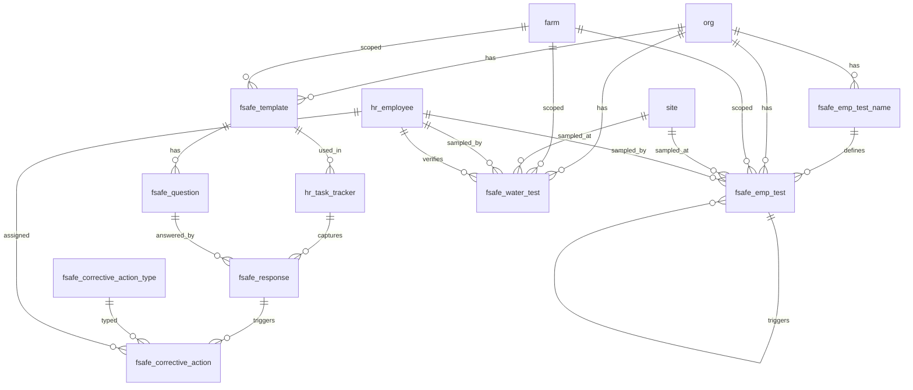

# Food Safety Schema

Tables for managing food safety checklists across the organization. Covers template definitions, checklist questions, employee responses, and corrective actions. Checklist sessions are anchored to `hr_task_tracker` which acts as the header record capturing who, when, and where.

> **Standard audit fields:** Every table includes `created_at` (TIMESTAMPTZ, default now), `created_by` (TEXT, user email), `updated_at` (TIMESTAMPTZ, default now), and `updated_by` (TEXT, user email). These are omitted from the column listings below for brevity.

---

## Migrated Use Cases

The following inspection and checklist workflows that previously existed as standalone databases or separate tables are now fully replaced by the fsafe checklist system. Each is implemented as an `fsafe_template` with its own set of `fsafe_question` records. Sessions are logged via `hr_task_tracker`.

| Legacy System | Replacement | template_type |
|---------------|-------------|---------------|
| House Inspection Database | `fsafe_template` + `fsafe_question` + `fsafe_response` | `house_inspection` |
| Pre-operation checks | `fsafe_template` + `fsafe_question` + `fsafe_response` | `pre_op` |
| Post-operation checks | `fsafe_template` + `fsafe_question` + `fsafe_response` | `post_op` |
| Cleaning checks | `fsafe_template` + `fsafe_question` + `fsafe_response` | `cleaning` |
| Pre-work checks | `fsafe_template` + `fsafe_question` + `fsafe_response` | `pre_work` |

> To add a new inspection type, create an `fsafe_template` record with the appropriate `template_type` value and define its questions in `fsafe_question`. No schema changes are required.

## Entity Relationship Diagram

---

## Table Overview

| Table | Purpose |
|-------|---------|
| fsafe_template | Master checklist template definition. Defines the checklist name, type, and farm scope. |
| fsafe_question | Questions within a checklist template. Ordered by display_order; each question has a response type (boolean, numeric, enum). |
| fsafe_response | Employee responses to checklist questions. One row per question per task tracker session. |
| fsafe_corrective_action | Corrective actions raised against a failing response. Tracks assignment, due date, and resolution. |
| fsafe_corrective_action_type | Org-defined predefined corrective action types available for dropdown selection when logging a corrective action. |
| fsafe_emp_test_name | Catalog of EMP test names, result configuration, and retest/vector test thresholds. |
| fsafe_emp_test | EMP test results. One row per test event; retests and vector tests link back to the original failing test. |
| fsafe_water_test | Water test results per submission covering E.coli, Salmonella, Listeria, and Total Coliform. |

---

## fsafe_template

Master food safety checklist template. Defines the checklist and the questions employees answer during a task event.

| Column          | Type         | Constraints                     | Description                              |
|----------------|--------------|--------------------------------|------------------------------------------|
| id             | TEXT         | PK                             | Human-readable identifier derived from name (trimmed lowercase) |
| org_id         | TEXT         | NOT NULL, FK → org(id)         | Owning organization for RLS filtering    |
| farm_id        | TEXT         | FK → farm(id), nullable        | Optional farm scope; null if the template applies to all farms |
| name           | TEXT         | NOT NULL                       | Checklist template name, unique within the org (e.g. Pre-Op GH, House Inspection) |
| template_type  | TEXT         | nullable                       | Module or purpose this checklist serves (e.g. food_safety, maintenance) |
| description    | TEXT         | nullable                       | Optional description of the checklist and its purpose |
| is_active      | BOOLEAN      | NOT NULL, default true         | Soft delete flag; false hides the template from active use |

Unique constraint on `(org_id, name)`.

---

## fsafe_question

Questions within a food safety checklist template. Ordered by `display_order` within each template.

| Column             | Type         | Constraints                           | Description                              |
|-------------------|--------------|---------------------------------------|------------------------------------------|
| id                | UUID         | PK, auto-generated                    | Unique identifier for the question       |
| org_id            | TEXT         | NOT NULL, FK → org(id)                | Owning organization for RLS filtering    |
| farm_id           | TEXT         | FK → farm(id), nullable               | Optional farm scope; null if the question applies to all farms |
| template_id       | TEXT         | NOT NULL, FK → fsafe_template(id)     | Checklist template this question belongs to |
| display_order     | INTEGER      | NOT NULL, default 0                   | Display order of this question within the template |
| question_text     | TEXT         | NOT NULL                              | The question or checklist item text shown to the employee |
| response_type     | TEXT         | NOT NULL, CHECK                       | Expected response format: boolean, numeric, or enum |
| is_required       | BOOLEAN      | NOT NULL, default true                | Whether this question must be answered before the checklist can be submitted |
| boolean_pass_value    | BOOLEAN      | nullable                              | The boolean value that constitutes a pass; used when response_type is boolean (e.g. true for Yes/Pass, false for No/Pass) |
| numeric_minimum_value | NUMERIC      | nullable                              | Minimum acceptable numeric value; a response below this triggers a corrective action warning |
| numeric_maximum_value | NUMERIC      | nullable                              | Maximum acceptable numeric value; a response above this triggers a corrective action warning |
| enum_options      | JSONB        | nullable                              | JSON array of all available options for this question; used when response_type is enum (e.g. ["Pass", "Fail", "N/A"]) |
| enum_pass_options | JSONB        | nullable                              | JSON array of enum options that constitute a pass; responses not in this list trigger a corrective action warning (e.g. ["Pass"]) |
| warning_message              | TEXT         | nullable                              | Custom warning message displayed to the user when the response fails; if null the frontend generates a default message from the pass criteria |
| corrective_action_type_ids   | JSONB        | nullable                              | JSON array of fsafe_corrective_action_type IDs suggested in the dropdown when this question fails (e.g. ["sanitize_surface", "replace_gloves"]); null shows all active org types |
| is_active                    | BOOLEAN      | NOT NULL, default true                | Soft delete flag; false hides the question from active checklists |

---

## fsafe_response

Employee responses to food safety checklist questions. One row per question per task tracker session. The linked `hr_task_tracker` record acts as the header (who completed the checklist, when, and at which site).

| Column            | Type         | Constraints                           | Description                              |
|------------------|--------------|---------------------------------------|------------------------------------------|
| id               | UUID         | PK, auto-generated                    | Unique identifier for the response       |
| org_id           | TEXT         | NOT NULL, FK → org(id)                | Owning organization for RLS filtering    |
| farm_id          | TEXT         | FK → farm(id), nullable               | Optional farm scope; null if the response applies to all farms |
| template_id      | TEXT         | FK → fsafe_template(id), nullable     | Checklist template this response belongs to; denormalized for easier filtering and reporting |
| task_tracker_id  | UUID         | NOT NULL, FK → hr_task_tracker(id)    | Task tracker session this response belongs to; acts as the checklist completion header |
| question_id      | UUID         | NOT NULL, FK → fsafe_question(id)     | Checklist question being answered        |
| response_boolean | BOOLEAN      | nullable                              | Boolean response value; used when question response_type is boolean |
| response_numeric | NUMERIC      | nullable                              | Numeric response value; used when question response_type is numeric |
| response_enum    | TEXT         | nullable                              | Selected enum option; used when question response_type is enum |
| response_text    | TEXT         | nullable                              | Free-text notes or observations for this response |
| is_active        | BOOLEAN      | NOT NULL, default true                | Soft delete flag; false hides the response from active use |

Unique constraint on `(task_tracker_id, question_id)` — one response per question per session.

---

## fsafe_corrective_action_type

Org-defined predefined corrective action types available for selection when logging a corrective action. Users pick from this dropdown; if the action isn't listed they provide a custom description instead.

| Column      | Type         | Constraints                     | Description                              |
|------------|--------------|--------------------------------|------------------------------------------|
| id         | TEXT         | PK                             | Human-readable identifier derived from name (trimmed lowercase) |
| org_id     | TEXT         | NOT NULL, FK → org(id)         | Owning organization for RLS filtering    |
| name       | TEXT         | NOT NULL                       | Corrective action type name, unique within the org (e.g. Sanitize Surface, Replace Gloves) |
| description| TEXT         | nullable                       | Optional description of what this corrective action entails |
| is_active  | BOOLEAN      | NOT NULL, default true         | Soft delete flag; false hides the type from active use |

Unique constraint on `(org_id, name)`.

---

## fsafe_corrective_action

Corrective actions raised against a failing food safety checklist response. Tracks the action required, who is responsible, and the resolution status.

| Column       | Type         | Constraints                           | Description                              |
|-------------|--------------|---------------------------------------|------------------------------------------|
| id          | UUID         | PK, auto-generated                    | Unique identifier for the corrective action |
| org_id      | TEXT         | NOT NULL, FK → org(id)                | Owning organization for RLS filtering    |
| farm_id     | TEXT         | FK → farm(id), nullable               | Optional farm scope; null if the corrective action applies to all farms |
| template_id | TEXT         | FK → fsafe_template(id), nullable     | Checklist template this corrective action belongs to; denormalized for easier filtering and reporting |
| response_id     | UUID         | FK → fsafe_response(id), nullable                       | Failing checklist response that triggered this corrective action; null if triggered by an EMP test result |
| emp_test_id     | UUID         | FK → fsafe_emp_test(id), nullable                       | Failing EMP test result that triggered this corrective action; null if triggered by a checklist response |
| action_type_id     | TEXT         | FK → fsafe_corrective_action_type(id), nullable  | Predefined corrective action type selected from the org lookup; null if a custom action is provided instead |
| other_action       | TEXT         | nullable                                          | Free-text description of the corrective action when no predefined action type is selected |
| assigned_to        | TEXT         | FK → hr_employee(id), nullable                   | Employee responsible for completing the corrective action |
| due_date           | DATE         | nullable                                          | Date by which the corrective action must be completed |
| completed_on       | DATE         | nullable                                          | Date when the corrective action was completed |
| status             | TEXT         | NOT NULL, default open, CHECK                    | Resolution status: open, completed |
| notes              | TEXT         | nullable                                          | Additional notes about the corrective action or its resolution |
| result_description | TEXT         | nullable                                          | Description of the observed outcome after the corrective action was implemented |
| verified_by        | TEXT         | FK → hr_employee(id), nullable                   | Employee who verified the corrective action was effective |
| verified_at        | TIMESTAMPTZ  | nullable                                          | Timestamp when the corrective action was verified as effective |
| is_active          | BOOLEAN      | NOT NULL, default true                            | Soft delete flag; false hides the record from active use |

---

## fsafe_emp_test_name

Catalog of EMP test names and their result configuration. Defines how results are evaluated and how many retests or vector tests are required on a fail.

| Column                  | Type         | Constraints                     | Description                              |
|------------------------|--------------|--------------------------------|------------------------------------------|
| id                     | TEXT         | PK                             | Human-readable unique identifier derived from org and test name |
| org_id                 | TEXT         | NOT NULL, FK → org(id)         | Owning organization for RLS filtering    |
| test_name              | TEXT         | NOT NULL                       | Name of the test or pathogen being tested for (e.g. Listeria, Salmonella) |
| test_methods           | JSONB        | NOT NULL, default []           | JSON array of available test methods users can select when recording a result (e.g. ["PCR", "Culture", "ELISA"]) |
| test_description       | TEXT         | nullable                       | Optional description of the test and its purpose |
| result_type            | TEXT         | NOT NULL, CHECK                | How results are recorded and evaluated: enum (select from list) or numeric (measured value) |
| enum_options           | JSONB        | nullable                       | JSON array of all selectable result options when result_type is enum (e.g. ["Detected", "Not Detected"]) |
| enum_pass_options      | JSONB        | nullable                       | JSON array of enum values that constitute a passing result (e.g. ["Not Detected"]) |
| numeric_minimum_value  | NUMERIC      | nullable                       | Minimum acceptable numeric value; results below this are a fail |
| numeric_maximum_value  | NUMERIC      | nullable                       | Maximum acceptable numeric value; results above this are a fail |
| required_retests       | INTEGER      | NOT NULL, default 0            | Number of retest records to auto-generate when any test of this type fails |
| required_vector_tests  | INTEGER      | NOT NULL, default 0            | Number of vector test records to auto-generate when any test of this type fails |
| is_active              | BOOLEAN      | NOT NULL, default true         | Soft delete flag; false hides the record from active use |

Unique constraint on `(org_id, test_name)`.

---

## fsafe_emp_test

EMP test results. One row per test event. Retests and vector tests link back to the original failing test via `original_test_id`, forming a clear chain of why each test was created. Detection limit values (e.g. `<1`, `>2419`) are converted to numeric values by the frontend before submission.

| Column              | Type         | Constraints                           | Description                              |
|--------------------|--------------|---------------------------------------|------------------------------------------|
| id                 | UUID         | PK, auto-generated                    | Unique identifier for the test result record |
| org_id             | TEXT         | NOT NULL, FK → org(id)                | Owning organization for RLS filtering    |
| farm_id            | TEXT         | FK → farm(id), nullable               | Farm where the sample was collected      |
| site_id            | TEXT         | FK → site(id), nullable               | Site where the sample was collected; zone classification is stored on the site record |
| task_tracker_id    | UUID         | FK → hr_task_tracker(id), nullable    | Task tracker activity this test result belongs to; links ATP results back to the checklist session for full form reconstruction |
| test_name_id       | TEXT         | NOT NULL, FK → fsafe_emp_test_name(id) | Test name and configuration used for this test event |
| test_method        | TEXT         | nullable                              | Test method used, selected from the test name methods list (e.g. PCR, Culture) |
| test_type          | TEXT         | NOT NULL, CHECK                       | Type of test: initial (first run), retest (triggered by initial fail), vector (triggered by retest fail) |
| test_status        | TEXT         | NOT NULL, default pending, CHECK      | Workflow status: pending, in_progress, completed |
| sampled_at         | TIMESTAMPTZ  | nullable                              | Timestamp when the sample was collected  |
| sampled_by         | TEXT         | FK → hr_employee(id), nullable        | Employee who collected the sample        |
| completed_at       | TIMESTAMPTZ  | nullable                              | Timestamp when the lab completed processing the sample |
| result_enum        | TEXT         | nullable                              | Enum result value selected from test_name enum_options when result_type is enum |
| result_numeric     | NUMERIC      | nullable                              | Numeric result value when result_type is numeric; frontend converts detection limit strings (e.g. <1, >2419) to numeric values before submission |
| results_pass       | BOOLEAN      | nullable                              | Whether the result meets the pass criteria defined on the test name |
| warning_message    | TEXT         | nullable                              | Warning message displayed when the result fails |
| fail_code          | TEXT         | nullable                              | Human-readable failure code assigned to this test result (e.g. LM-001) |
| original_test_id   | UUID         | FK → fsafe_emp_test(id), nullable     | Reference to the initial test that triggered this retest or vector test; null for initial tests |
| verified_by        | TEXT         | FK → hr_employee(id), nullable        | Employee who verified the test result |
| verified_at        | TIMESTAMPTZ  | nullable                              | Timestamp when the test result was verified |
| notes              | TEXT         | nullable                              | Free-text notes about the test event     |
| is_system_generated | BOOLEAN     | NOT NULL, default false               | Whether this record was auto-generated by the system when a prior test failed |

---

## fsafe_water_test

Water test results for internal or external lab submissions. One row per test submission covering the four standard pathogen tests. E.coli and Total Coliform results are stored as numerics — the frontend converts detection limit strings (e.g. `<1`, `>2419`) to numeric values before submission. Salmonella and Listeria are stored as `positive` or `negative`.

> **Note:** A `test_source` field (e.g. `internal`, `external`) can be added in future if distinguishing internal vs lab-submitted tests becomes a reporting requirement.

| Column | Type | Constraints | Description |
|--------|------|-------------|-------------|
| id | UUID | PK, auto-generated | Unique identifier for the water test record |
| org_id | TEXT | NOT NULL, FK → org(id) | Owning organization for RLS filtering |
| farm_id | TEXT | FK → farm(id), nullable | Farm where the water sample was collected |
| site_id | TEXT | FK → site(id), nullable | Site where the water sample was collected |
| lab_name | TEXT | nullable | Name of the lab that processed the sample; null for internal tests |
| lab_test_id | TEXT | nullable | Lab reference number for this submission; null for internal tests |
| sampled_at | TIMESTAMPTZ | nullable | Timestamp when the water sample was collected |
| sampled_by | TEXT | FK → hr_employee(id), nullable | Employee who collected the water sample |
| completed_at | TIMESTAMPTZ | nullable | Timestamp when lab results were received or testing was completed |
| ecoli_result | NUMERIC | nullable | E.coli numeric result; frontend converts detection limit strings (e.g. <1, >2419) to numeric values before submission |
| salmonella_result | TEXT | nullable, CHECK | Salmonella result; positive or negative |
| listeria_result | TEXT | nullable, CHECK | Listeria result; positive or negative |
| total_coliform_result | NUMERIC | nullable | Total coliform numeric result; frontend converts detection limit strings (e.g. <1, >2419) to numeric values before submission |
| report_url | TEXT | nullable | URL or path to the lab or internal test report document |
| notes | TEXT | nullable | Free-text notes about the water test submission |
| verified_by | TEXT | FK → hr_employee(id), nullable | Employee who verified the test result record |
| verified_at | TIMESTAMPTZ | nullable | Timestamp when the test result was verified |
| is_active | BOOLEAN | NOT NULL, default true | Soft delete flag; false hides the record from active use |
| is_active          | BOOLEAN      | NOT NULL, default true                | Soft delete flag; false hides the record from active use |
