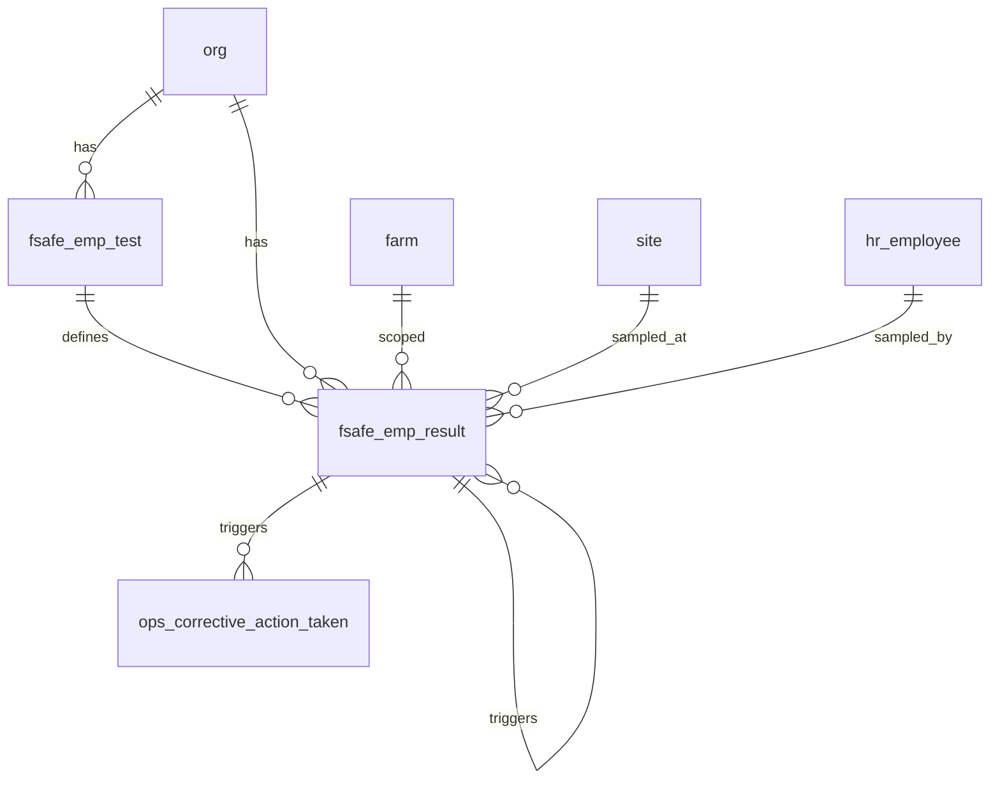

# Food Safety Schema

Tables for EMP (Environmental Monitoring Program) testing. Covers test definitions, individual test results, and retest/vector chaining. Checklist-based food safety (templates, questions, responses, corrective actions) is covered in the Ops module.

> **Standard audit fields:** Every table includes `created_at` (TIMESTAMPTZ, default now), `created_by` (TEXT, user email), `updated_at` (TIMESTAMPTZ, default now), and `updated_by` (TEXT, user email). These are omitted from the column listings below for brevity.

## Entity Relationship Diagram

---

## Table Overview

| Table | Purpose |
|-------|---------|
| fsafe_emp_test | Catalog of EMP test definitions, result configuration, and retest/vector test thresholds. |
| fsafe_emp_result | EMP test results. One row per test event; retests and vector tests link back to the original failing test. Water tests (e.g. water_listeria, water_ecoli, water_salmonella) are recorded here using named definitions. |

---

## fsafe_emp_test

Catalog of EMP test definitions and their result configuration. Defines how results are evaluated and how many retests or vector tests are required on a fail.

| Column                  | Type         | Constraints                     | Description                              |
|------------------------|--------------|--------------------------------|------------------------------------------|
| id                     | TEXT         | PK                             | Human-readable unique identifier derived from org and test name |
| org_id                 | TEXT         | NOT NULL, FK → org(id)         | Owning organization for RLS filtering    |
| test_name              | TEXT         | NOT NULL                       | Name of the test or pathogen being tested for (e.g. Listeria, Salmonella) |
| test_methods           | JSONB        | NOT NULL, default []           | JSON array of available test methods users can select when recording a result (e.g. ["PCR", "Culture", "ELISA"]) |
| test_description       | TEXT         | nullable                       | Optional description of the test and its purpose |
| result_type            | TEXT         | NOT NULL, CHECK                | How results are recorded and evaluated: enum (select from list) or numeric (measured value) |
| enum_options           | JSONB        | nullable                       | JSON array of all selectable result options when result_type is enum (e.g. ["Detected", "Not Detected"]) |
| enum_pass_options      | JSONB        | nullable                       | JSON array of enum values that constitute a passing result (e.g. ["Not Detected"]) |
| numeric_minimum_value  | NUMERIC      | nullable                       | Minimum acceptable numeric value; results below this are a fail |
| numeric_maximum_value  | NUMERIC      | nullable                       | Maximum acceptable numeric value; results above this are a fail |
| required_retests       | INTEGER      | NOT NULL, default 0            | Number of retest records to auto-generate when any test of this type fails |
| required_vector_tests  | INTEGER      | NOT NULL, default 0            | Number of vector test records to auto-generate when any test of this type fails |
| is_active              | BOOLEAN      | NOT NULL, default true         | Soft delete flag; false hides the record from active use |

Unique constraint on `(org_id, test_name)`.

---

## fsafe_emp_result

EMP test results. One row per test event. Retests and vector tests link back to the original failing test via `original_fsafe_emp_result_id`, forming a clear chain of why each test was created. Detection limit values (e.g. `<1`, `>2419`) are converted to numeric values by the frontend before submission.

| Column                       | Type         | Constraints                           | Description                              |
|-----------------------------|--------------|---------------------------------------|------------------------------------------|
| id                          | UUID         | PK, auto-generated                    | Unique identifier for the test result record |
| org_id                      | TEXT         | NOT NULL, FK → org(id)                | Owning organization for RLS filtering    |
| farm_id                     | TEXT         | FK → farm(id), nullable               | Farm where the sample was collected      |
| site_id                     | TEXT         | NOT NULL, FK → site(id)               | Site where the sample was collected; zone classification is stored on the site record |
| fsafe_emp_test_id           | TEXT         | NOT NULL, FK → fsafe_emp_test(id)     | EMP test definition used for this test event |
| test_method                 | TEXT         | NOT NULL                              | Test method used, selected from the test methods list on the EMP test definition (e.g. PCR, Culture) |
| initial_retest_vector       | TEXT         | NOT NULL, CHECK                       | Type of test: initial (first run), retest (triggered by initial fail), vector (triggered by retest fail) |
| status                      | TEXT         | NOT NULL, default pending, CHECK      | Workflow status: pending, in_progress, completed |
| result_enum                 | TEXT         | nullable                              | Enum result value selected from test enum_options when result_type is enum |
| result_numeric              | NUMERIC      | nullable                              | Numeric result value when result_type is numeric; frontend converts detection limit strings (e.g. <1, >2419) to numeric values before submission |
| results_pass                | BOOLEAN      | nullable                              | Whether the result meets the pass criteria defined on the EMP test definition |
| warning_message             | TEXT         | nullable                              | Warning message displayed when the result fails |
| fail_code                   | TEXT         | nullable                              | Human-readable failure code assigned to this test result (e.g. LM-001) |
| original_fsafe_emp_result_id| UUID         | FK → fsafe_emp_result(id), nullable   | Reference to the initial test result that triggered this retest or vector test; null for initial tests |
| notes                       | TEXT         | nullable                              | Free-text notes about the test event     |
| is_active                   | BOOLEAN      | NOT NULL, default true                | Soft delete flag; false hides the record from active use |
| sampled_at                  | TIMESTAMPTZ  | nullable                              | Timestamp when the sample was collected  |
| sampled_by                  | TEXT         | FK → hr_employee(id), nullable        | Employee who collected the sample        |
| completed_at                | TIMESTAMPTZ  | nullable                              | Timestamp when the lab completed processing the sample |
| verified_at                 | TIMESTAMPTZ  | nullable                              | Timestamp when the test result was verified |
| verified_by                 | TEXT         | FK → hr_employee(id), nullable        | Employee who verified the test result |
