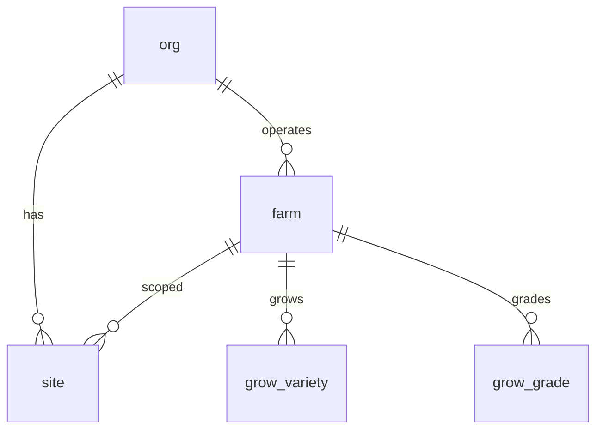

# Core Schema

Core tables that form the foundation of the Aloha ERP system. These include global reference tables shared across all organizations, identity and access management, customer management, farm structure, and crop varieties and grades.

> **Standard audit fields:** Every table includes `is_deleted` (BOOLEAN, default false), `created_at` (TIMESTAMPTZ, default now), `created_by` (TEXT, user email), `updated_at` (TIMESTAMPTZ, default now), and `updated_by` (TEXT, user email). These are omitted from the column listings below for brevity.

## Entity Relationship Diagram

---

## Table Overview

| Table | Purpose |
|-------|---------|
| util_uom | Standardized measurement units (kg, L, °C, etc.) shared across all organizations for consistent data entry and calculations. |
| org | Root entity for multi-org support. Every org-scoped record traces back to this table. Stores org-level settings like default currency. |
| farm | Represents a crop or product line within an organization (e.g. Cuke Farm, Lettuce Farm). Each farm has its own sites, varieties, grades, and products. |
| site | Physical locations within a farm where operations happen — nurseries for seedlings, growing sites for production, packing sites, and storage facilities. |
| grow_variety | Crop varieties grown on a specific farm, each with a short code for quick reference during data entry (e.g. "K" for Keiki). |
| grow_grade | Harvest quality grades used by a specific farm, each with a short code (e.g. "A" for Grade A). Applied during harvest and carried through to sales. |

---

## util_uom

Standardized measurement units shared across all organizations for consistent data entry and calculations throughout the system.

| Column  | Type        | Constraints          | Description                          |
|---------|-------------|----------------------|--------------------------------------|
| code    | TEXT | PK                   | Short code used as primary key and referenced by all unit FK columns across the system (e.g. kg, L, ppm) |
| name    | TEXT | NOT NULL, UNIQUE     | Full display name of the unit (e.g. Kilogram, Liter, Parts Per Million) |
| category| TEXT | NOT NULL             | Grouping category for the unit (e.g. weight, volume, temperature, concentration) |
| created_at  | TIMESTAMPTZ  | NOT NULL, default now() | Timestamp when the record was created |
| created_by  | TEXT         | nullable                | Email of the user who created the record |
| updated_at  | TIMESTAMPTZ  | NOT NULL, default now() | Timestamp when the record was last updated |
| updated_by  | TEXT         | nullable                | Email of the user who last updated the record |

## org

Root entity for multi-org support. Every org-scoped table references this. Stores org-level settings such as default currency.

| Column     | Type         | Constraints          | Description                          |
|------------|--------------|----------------------|--------------------------------------|
| id         | TEXT         | PK                   | Human-readable identifier derived from org name (lowercase, spaces replaced with underscores) |
| name       | TEXT | NOT NULL, UNIQUE     | Display name of the organization     |
| slug       | TEXT | NOT NULL, UNIQUE     | Short initials derived from the organization name (e.g. HF for Hawaii Farming) |
| address    | TEXT         | nullable             | Physical address of the organization |
| currency   | TEXT  | nullable             | Default currency code for the organization (e.g. USD, KES) |

## farm

Represents a crop or product line within an organization (e.g. Cuke Farm, Lettuce Farm). Each farm has its own sites, varieties, grades, and products. Farm-level defaults reference units of measure for weighing and growing operations.

| Column           | Type         | Constraints                     | Description                                  |
|------------------|--------------|--------------------------------|----------------------------------------------|
| id               | TEXT         | PK                              | Human-readable identifier derived from farm name (lowercase trimmed string) |
| org_id           | TEXT         | NOT NULL, FK → org(id)          | Owning organization for RLS filtering        |
| name             | TEXT | NOT NULL                        | Display name of the farm, unique within the org |
| weighing_uom  | TEXT  | FK → util_uom(code), nullable | Default unit of measure for weighing operations on this farm (e.g. lb, kg) |
| growing_uom   | TEXT  | FK → util_uom(code), nullable | Default unit of measure for growing/harvest tracking on this farm |

Unique constraint on `(org_id, name)` — no duplicate farm names within an org.

## site

Unified site register for all physical locations and assets across the organization. The `category` and `subcategory` fields drive which additional fields are relevant in the UI. Sites can be scoped to a specific farm or shared org-wide.

Categories and subcategories: growing (greenhouse, nursery), packaging (packroom, cold_storage), storage (warehouse, chemical_storage), maintenance (equipment, vehicle, infrastructure).

| Column         | Type         | Constraints                      | Description                    |
|----------------|--------------|----------------------------------|--------------------------------|
| id             | TEXT         | PK                               | Human-readable identifier derived from site name (trimmed lowercase) |
| org_id         | TEXT         | NOT NULL, FK → org(id)           | Owning organization for RLS filtering |
| farm_id        | TEXT         | FK → farm(id), nullable          | Optional farm scope; NULL if site is shared across the org |
| name           | TEXT | NOT NULL                         | Display name of the site, unique within the org+farm combination |
| category       | TEXT         | NOT NULL                         | Top-level classification selected from dropdown (e.g. growing, packaging, storage, maintenance) |
| subcategory    | TEXT         | nullable                         | Second-level classification within category (e.g. greenhouse, nursery, packroom, equipment, vehicle) |
| acres          | NUMERIC      | nullable                         | Acreage of the growing site    |
| total_rows     | INT          | nullable                         | Total number of growing rows in the site |
| avg_units_per_row | NUMERIC   | nullable                         | Average number of growing units (plants/pots) per row |
| code           | TEXT  | nullable                         | Short identifier for equipment/assets (e.g. PUMP-01, TRACTOR-03); nullable for non-equipment sites |
| manufacturer   | TEXT | nullable                         | Manufacturer or brand name for equipment/assets |
| model          | TEXT | nullable                         | Model name or number for equipment/assets |
| serial_number  | TEXT | nullable                         | Manufacturer serial number for equipment/assets |
| purchase_date  | DATE         | nullable                         | Date the equipment/asset was acquired |
| manual_url     | TEXT         | nullable                         | URL or path to the equipment manual or site documentation |
| notes          | TEXT         | nullable                         | General notes about the site or asset |
| photos         | JSONB        | NOT NULL, default []             | JSON array of photo URLs       |
| metadata       | JSONB        | NOT NULL, default {}             | Flexible JSON for display-only details (dimensions, capacity, environmental settings) |
| is_food_contact_surface | BOOLEAN | NOT NULL, default false         | Whether this site or surface comes into contact with food; requires sanitization before reuse if true |
| zone           | TEXT         | nullable, CHECK                  | EMP zone classification for this site as defined in food safety documentation: zone_1, zone_2, zone_3, zone_4; null if not applicable |

Unique constraint on `(org_id, farm_id, name)` — no duplicate site names within an org+farm combination.

## grow_variety

Crop varieties grown on a specific farm, each with a short code for quick reference during data entry. Used across seeding, growing, and harvest modules.

| Column     | Type        | Constraints                      | Description                   |
|------------|-------------|----------------------------------|-------------------------------|
| id         | TEXT        | PK                               | Human-readable identifier derived from variety name (lowercase trimmed) |
| org_id     | TEXT        | NOT NULL, FK → org(id)           | Owning organization for RLS filtering |
| farm_id    | TEXT        | NOT NULL, FK → farm(id)          | Farm this variety belongs to  |
| code       | TEXT | NOT NULL                         | Short code for the variety, unique within the farm (e.g. K, J, GR) |
| name       | TEXT | NOT NULL                         | Full display name of the variety, unique within the farm |
| description| TEXT        | nullable                         | Optional description or notes about the variety |

Unique constraints on `(farm_id, code)` and `(farm_id, name)`.

## grow_grade

Harvest quality grades for a specific farm, each with a short code. Applied during harvest logging and carried through to product definition, packing, and sales.

| Column     | Type        | Constraints                      | Description                   |
|------------|-------------|----------------------------------|-------------------------------|
| id         | TEXT        | PK                               | Human-readable identifier derived from grade name (lowercase trimmed) |
| org_id     | TEXT        | NOT NULL, FK → org(id)           | Owning organization for RLS filtering |
| farm_id    | TEXT        | NOT NULL, FK → farm(id)          | Farm this grade belongs to    |
| code       | TEXT | NOT NULL                         | Short code for the grade, unique within the farm (e.g. A, B, C) |
| name       | TEXT | NOT NULL                         | Full display name of the grade, unique within the farm |

Unique constraints on `(farm_id, code)` and `(farm_id, name)`.
