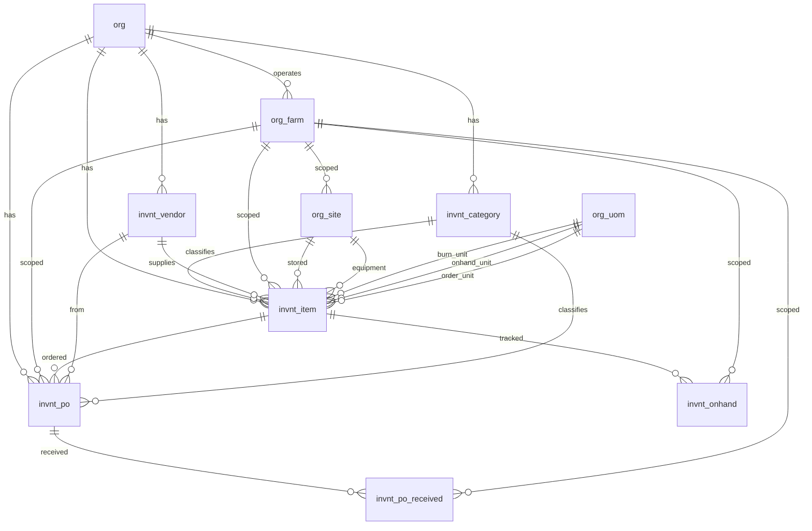

# Inventory Schema

Tables for managing inventory items, categories, and procurement across all farms within an organization. Covers seeds, chemicals, packaging materials, parts, and general supplies.

> **Standard audit fields:** Every table includes `created_at` (TIMESTAMPTZ, default now), `created_by` (TEXT, user email), `updated_at` (TIMESTAMPTZ, default now), `updated_by` (TEXT, user email), and `is_deleted` (BOOLEAN, default false). These are omitted from the column listings below for brevity.

## Entity Relationship Diagram

---

## Table Overview

| Table | Purpose |
|-------|---------|
| invnt_vendor | Organization-level suppliers for procurement. Referenced by inventory items and purchase orders. |
| invnt_category | Two-level category hierarchy. Rows with `sub_category_name IS NULL` are top-level categories; rows with `sub_category_name` set are subcategories under that `category_name`. Both `invnt_category_id` and `invnt_subcategory_id` on `invnt_item` reference this table. |
| invnt_item | The main inventory record for each item. Tracks units and conversions, burn rates for forecasting, reorder settings, and item details (seed variety, manufacturer, part number, etc.) as proper columns. Classification is handled by the two-level invnt_category hierarchy. On-hand and on-order quantities are computed from transaction data, not stored here. |
| invnt_po | Tracks purchase order requests through a workflow: requested → approved/rejected → ordered → partial/received. Snapshots item name, units, and cost at order time. Supports both inventory_item and non_inventory_item purchases. |
| invnt_po_received | Individual deliveries received against a purchase order. Captures quantity, lot number, expiry date, and acceptance details. Multiple records per order enable partial delivery tracking. |
| invnt_onhand | Records on-hand inventory snapshots per item. Captures quantity in onhand units with burn unit conversion and lot tracking. Source of truth for computed totals like current stock, burn-per-week, and weeks-on-hand. |

---

## invnt_vendor

Organization-level suppliers used for procurement across all farms. Stores contact details, address, and payment terms.

| Column         | Type         | Constraints            | Description                        |
|----------------|--------------|------------------------|------------------------------------|
| id             | TEXT         | PK                     | Human-readable identifier derived from vendor name (lowercase trimmed) |
| org_id         | TEXT         | NOT NULL, FK → org(id) | Owning organization for RLS filtering |
| name           | TEXT | NOT NULL               | Display name of the vendor, unique within the org |
| contact_person | TEXT | nullable               | Primary contact person at the vendor |
| email          | TEXT | nullable               | Vendor email address               |
| phone          | TEXT  | nullable               | Vendor phone number                |
| address        | TEXT         | nullable               | Vendor physical address            |
| payment_terms  | TEXT  | nullable               | Payment terms (e.g. Net 30, COD, Prepaid) |

Unique constraint on `(org_id, name)` — no duplicate supplier names within an org.

---

## invnt_category

Two-level category hierarchy for inventory items in a single table. A row with `sub_category_name IS NULL` is a top-level category (e.g. Fertilizers). A row with `sub_category_name` set is a subcategory under that `category_name` (e.g. Nitrogen Fertilizers under Fertilizers). Both `invnt_category_id` and `invnt_subcategory_id` in `invnt_item` reference this table.

**Frontend query pattern:**
- Get all categories: `WHERE sub_category_name IS NULL`
- Get subcategories for a category: `WHERE category_name = :name AND sub_category_name IS NOT NULL`

| Column             | Type         | Constraints                    | Description                              |
|--------------------|--------------|-------------------------------|------------------------------------------|
| id                 | TEXT         | PK                             | Human-readable identifier derived from the name (lowercase trimmed) |
| org_id             | TEXT         | NOT NULL, FK → org(id)         | Owning organization for RLS filtering    |
| category_name      | TEXT         | NOT NULL                       | Top-level category name (e.g. Fertilizers, Seeds, Packaging Materials) |
| sub_category_name  | TEXT         | nullable                       | Subcategory name under the parent category; NULL when this row represents a top-level category |

**Uniqueness rules:**

PostgreSQL does not treat `NULL = NULL` in standard `UNIQUE` constraints, so a regular `CONSTRAINT UNIQUE (org_id, category_name, sub_category_name)` would allow duplicate top-level category rows where `sub_category_name IS NULL`. To enforce uniqueness correctly at both levels, two partial unique indexes are used instead:

| Index | Columns | Condition | Prevents |
|-------|---------|-----------|---------|
| `uq_invnt_category_top_level` | `(org_id, category_name)` | `WHERE sub_category_name IS NULL` | Duplicate top-level category names within the same org |
| `uq_invnt_category_sub_level` | `(org_id, category_name, sub_category_name)` | `WHERE sub_category_name IS NOT NULL` | Duplicate subcategory names within the same category and org |

These indexes are enforced at the database level and behave identically to a `CONSTRAINT UNIQUE` — any insert or update that violates them will be rejected.

## invnt_item

The main inventory record. Items belong to an organization and optionally to a specific farm. Classification is handled by the category/subcategory structure. All item details are proper columns grouped by logical sections. Seed-specific fields are prefixed `seed_`; maintenance part fields are prefixed `maint_`.

| Column                    | Type         | Constraints                           | Description                              |
|--------------------------|--------------|---------------------------------------|------------------------------------------|
| id                       | UUID         | PK, auto-generated                    | Unique identifier for the inventory item |
| org_id                   | TEXT         | NOT NULL, FK → org(id)                | Owning organization for RLS filtering    |
| farm_id                  | TEXT         | FK → org_farm(id), nullable               | Optional farm scope; NULL if item is shared across farms |
| invnt_category_id        | TEXT         | FK → invnt_category(id), nullable     | Top-level category for item classification; references invnt_category rows where sub_category_name IS NULL |
| invnt_subcategory_id     | TEXT         | FK → invnt_category(id), nullable     | Subcategory for finer item classification; references invnt_category rows where sub_category_name IS NOT NULL |
| name                     | TEXT         | NOT NULL                              | Display name of the item, unique within the org |
| accounting_id            | TEXT         | nullable                              | Identifier used to link this item to the accounting system |
| description              | TEXT         | nullable                              | Detailed description of the item         |
| burn_uom                 | TEXT         | FK → org_uom(code), nullable         | Smallest consumption unit used for burn rate tracking (e.g. ml, g, seed) |
| onhand_uom               | TEXT         | FK → org_uom(code), nullable         | Unit used for physical stock counts (e.g. bottle, bag, box) |
| order_uom                | TEXT         | FK → org_uom(code), nullable         | Unit used when placing orders with vendors (e.g. case, pallet) |
| burn_per_onhand          | NUMERIC      | nullable                              | Number of burn units in one onhand unit  |
| burn_per_order           | NUMERIC      | nullable                              | Number of burn units in one order unit   |
| is_palletized            | BOOLEAN      | NOT NULL, default false               | Whether this item is received and stored on pallets |
| order_per_pallet         | NUMERIC      | nullable                              | Number of order units per pallet         |
| pallet_per_truckload| NUMERIC      | nullable                              | Number of pallets per truckload          |
| is_frequently_used       | BOOLEAN      | NOT NULL, default false               | Flag for items that appear frequently in ordering and usage dashboards |
| burn_per_week            | NUMERIC      | nullable                              | Estimated weekly consumption in burn units for reorder calculations |
| cushion_weeks            | NUMERIC      | nullable                              | Safety stock buffer in weeks used in next-order-date calculations |
| is_auto_reorder          | BOOLEAN      | NOT NULL, default false               | Whether automatic reorder requests are generated when stock hits reorder point |
| reorder_point_in_burn       | NUMERIC      | nullable                              | Stock level in burn units that triggers a reorder |
| reorder_quantity_in_burn    | NUMERIC      | nullable                              | Quantity in burn units to reorder when reorder point is reached |
| requires_lot_tracking    | BOOLEAN      | NOT NULL, default false               | Whether deliveries and transactions must include a lot number |
| requires_expiry_date     | BOOLEAN      | NOT NULL, default false               | Whether deliveries must include an expiry date |
| site_id_storage          | TEXT         | FK → org_site(id), nullable               | Storage site where this item is kept |
| site_id_equipment  | TEXT         | FK → org_site(id), nullable               | Equipment site this part belongs to |
| invnt_vendor_id          | TEXT         | FK → invnt_vendor(id), nullable       | Primary vendor for procurement           |
| manufacturer             | TEXT         | nullable                              | Manufacturer or brand name               |
| grow_variety_id          | TEXT         | FK → grow_variety(id), nullable       | Linked crop variety for seed items       |
| seed_is_pelleted         | BOOLEAN      | NOT NULL, default false               | Whether seed item is pelleted for easier planting |
| maint_part_type          | TEXT         | nullable                              | Type classification for parts (e.g. electrical, mechanical, plumbing) |
| maint_part_number        | TEXT         | nullable                              | Manufacturer part number or catalog SKU  |
| photos                   | JSONB        | NOT NULL, default []                  | JSON array of photo URLs for the item    |
| is_active                | BOOLEAN      | NOT NULL, default true                | Whether this item is currently active for ordering and tracking; false means inactive but not deleted |

Unique constraint on `(org_id, name)` — no duplicate item names within an org.

## invnt_po

Tracks purchase order requests through a workflow from request to receipt. Each order snapshots the item name, units, and cost at order time so the record stays accurate even if the item changes later. `request_type` determines whether it's a `non_inventory_item` purchase (classified by `invnt_category_id`) or an `inventory_item` purchase (linked via `invnt_item_id`). `item_name` is always populated either way. 
| Column                | Type         | Constraints                           | Description                              |
|----------------------|--------------|---------------------------------------|------------------------------------------|
| id                   | UUID         | PK, auto-generated                    | Unique identifier for the purchase order |
| org_id               | TEXT         | NOT NULL, FK → org(id)                | Owning organization for RLS filtering    |
| farm_id              | TEXT         | FK → org_farm(id), nullable               | Optional farm scope for the order        |
| request_type         | TEXT         | NOT NULL, default inventory_item, CHECK | Whether this is a non-inventory purchase or an inventory item purchase: non_inventory_item, inventory_item |
| urgency_level        | TEXT         | nullable, CHECK                       | How urgently the item is needed: today, 2_days, 7_days, not_urgent |
| invnt_category_id    | TEXT         | FK → invnt_category(id), nullable     | Category for non_inventory_item requests; references invnt_category rows where sub_category_name IS NULL |
| invnt_item_id        | UUID         | FK → invnt_item(id), nullable         | Linked inventory item; NULL for non_inventory_item requests |
| item_name            | TEXT         | NOT NULL                              | Snapshot of item name at order time; manually entered for non_inventory_item requests |
| burn_uom             | TEXT         | FK → org_uom(code), nullable         | Unit of measure for burn quantity (snapshot from item at order time) |
| order_uom            | TEXT         | FK → org_uom(code), nullable         | Unit of measure for the order quantity (snapshot from item at order time) |
| order_quantity       | NUMERIC      | NOT NULL                              | Quantity ordered in order units          |
| burn_per_order       | NUMERIC      | nullable                              | Snapshot of burn units per order unit at order time |
| vendor_po_number     | TEXT         | nullable                              | PO number assigned by the vendor for this order |
| invnt_vendor_id      | TEXT         | FK → invnt_vendor(id), nullable       | Vendor the order is placed with          |
| total_cost           | NUMERIC      | nullable                              | Total cost for the order                 |
| is_freight_included  | BOOLEAN      | NOT NULL, default false               | Whether total_cost includes freight charges |
| expected_delivery_date | DATE       | nullable                              | Expected delivery date from the vendor   |
| tracking_number      | TEXT         | nullable                              | Shipping or freight tracking number      |
| notes                | TEXT         | nullable                              | Free-text notes about the order          |
| rejected_reason      | TEXT         | nullable                              | Reason for rejection when status is rejected |
| request_photos       | JSONB        | NOT NULL, default []                  | JSON array of photo URLs attached to the request |
| status               | TEXT         | NOT NULL, default requested, CHECK    | Workflow status: requested, approved, rejected, ordered, partial, received, cancelled |
| requested_at         | TIMESTAMPTZ  | NOT NULL, default now                 | Timestamp when the order was requested   |
| requested_by         | TEXT         | NOT NULL, FK → hr_employee(id)        | Employee who submitted the order request |
| reviewed_at          | TIMESTAMPTZ  | nullable                              | Timestamp when the order was reviewed    |
| reviewed_by          | TEXT         | FK → hr_employee(id), nullable        | Employee who approved or rejected the order |
| ordered_at           | TIMESTAMPTZ  | nullable                              | Timestamp when the order was placed with the vendor |
| ordered_by           | TEXT         | FK → hr_employee(id), nullable        | Employee who placed the order with the vendor |

## invnt_po_received

Individual deliveries received against a purchase order. One order can have multiple received records to handle partial deliveries. Each record captures its own lot number, expiry date, quantity, and acceptance details.

| Column                | Type         | Constraints                           | Description                              |
|----------------------|--------------|---------------------------------------|------------------------------------------|
| id                   | UUID         | PK, auto-generated                    | Unique identifier for the received delivery record |
| org_id               | TEXT         | NOT NULL, FK → org(id)                | Owning organization for RLS filtering    |
| farm_id              | TEXT         | FK → org_farm(id), nullable               | Optional farm scope; inherited from parent invnt_po |
| invnt_po_id          | UUID         | NOT NULL, FK → invnt_po(id)           | Parent purchase order this delivery belongs to |
| received_date        | DATE         | NOT NULL                              | Actual date the delivery arrived         |
| received_uom         | TEXT         | FK → org_uom(code), nullable         | Unit of measure for the received quantity |
| received_quantity    | NUMERIC      | NOT NULL                              | Quantity received in the received unit   |
| burn_per_received    | NUMERIC      | nullable                              | Conversion factor: burn units per received unit at time of delivery |
| lot_number           | TEXT         | nullable                              | Lot or batch number from the vendor      |
| lot_expiry_date      | DATE         | nullable                              | Expiry date for this lot                 |
| delivery_truck_clean | BOOLEAN      | nullable                              | Whether the delivery truck was clean upon arrival |
| delivery_acceptable  | BOOLEAN      | nullable                              | Whether the delivery was accepted in acceptable condition |
| notes                | TEXT         | nullable                              | Free-text notes about the delivery       |
| received_photos      | JSONB        | NOT NULL, default []                  | JSON array of photo URLs documenting the delivery |
| received_at          | TIMESTAMPTZ  | NOT NULL, default now                 | Timestamp when the delivery was recorded |
| received_by          | TEXT         | nullable                              | Email of the user who recorded the delivery |

## invnt_onhand

Records on-hand inventory snapshots per item. Each record captures the quantity in onhand units with burn unit conversion and optional lot tracking. Source of truth for computed totals like current stock, burn-per-week, and weeks-on-hand.

| Column                | Type         | Constraints                           | Description                              |
|----------------------|--------------|---------------------------------------|------------------------------------------|
| id                   | UUID         | PK, auto-generated                    | Unique identifier for the on-hand record |
| org_id               | TEXT         | NOT NULL, FK → org(id)                | Owning organization for RLS filtering    |
| farm_id              | TEXT         | FK → org_farm(id), nullable               | Optional farm scope                      |
| invnt_item_id        | UUID         | NOT NULL, FK → invnt_item(id)         | Inventory item this record tracks        |
| onhand_date          | DATE         | NOT NULL                              | Date of the on-hand snapshot             |
| onhand_uom           | TEXT         | FK → org_uom(code), nullable         | Unit of measure for the on-hand quantity |
| onhand_quantity      | NUMERIC      | NOT NULL                              | Quantity on hand in onhand units         |
| burn_per_onhand      | NUMERIC      | nullable                              | Burn units per onhand unit at time of record |
| lot_number           | TEXT         | nullable                              | Lot or batch number for lot-tracked items |
| lot_expiry_date      | DATE         | nullable                              | Expiry date for this lot                 |
| notes                | TEXT         | nullable                              | Free-text notes about this on-hand record |

## Views

### View Overview

| View | Purpose |
|------|---------|
| invnt_item_summary | Dashboard view combining latest on-hand snapshot, open order totals with received deliveries, and computed forecasts (weeks-on-hand, next-order-date) per active inventory item. |
| invnt_lot_summary | Latest on-hand snapshot per item and lot number combination. Only includes lots with positive stock. Used for lot traceability, expiry tracking, and FIFO usage. |

---

### invnt_item_summary

Dashboard view combining latest on-hand snapshot, open order totals with delivery progress, and computed forecasts. Joins `invnt_item` with the latest `invnt_onhand` record and aggregated open `invnt_po` orders (factoring in `invnt_po_received` deliveries).

| Column                       | Source                              | Description                              |
|------------------------------|-------------------------------------|------------------------------------------|
| org_id                       | invnt_item.org_id                   | The organization                         |
| farm_id                      | invnt_item.farm_id                  | Optional farm scope                      |
| invnt_item_id                | invnt_item.id                       | The item                                 |
| invnt_category_id            | invnt_item.invnt_category_id        | Main category                            |
| invnt_subcategory_id         | invnt_item.invnt_subcategory_id     | Item subcategory                         |
| invnt_vendor_id              | invnt_item.invnt_vendor_id          | Primary vendor                           |
| burn_uom                     | invnt_item.burn_uom                 | Burn unit of measure                     |
| onhand_uom                   | invnt_item.onhand_uom               | On-hand unit of measure                  |
| order_uom                    | invnt_item.order_uom                | Order unit of measure                    |
| burn_per_onhand              | invnt_item.burn_per_onhand          | Burn units per onhand unit               |
| burn_per_order               | invnt_item.burn_per_order           | Burn units per order unit                |
| is_frequently_used           | invnt_item                          | Whether item is used regularly           |
| burn_per_week                | invnt_item                          | Configured weekly burn rate              |
| cushion_weeks                | invnt_item                          | Safety stock buffer in weeks             |
| is_auto_reorder              | invnt_item                          | Whether auto-reorder is enabled          |
| reorder_point_in_burn           | invnt_item                          | Reorder trigger level in burn units      |
| reorder_quantity_in_burn        | invnt_item                          | Reorder quantity in burn units           |
| onhand_quantity              | Latest invnt_onhand                 | Current on-hand in onhand units          |
| onhand_quantity_in_burn                  | Computed                            | Current on-hand in burn units (onhand_quantity × burn_per_onhand) |
| onhand_date                  | Latest invnt_onhand                 | Date of most recent on-hand record       |
| days_since_onhand            | Computed                            | Days since last on-hand record           |
| ordered_quantity_in_burn     | invnt_po (aggregated)               | Total ordered quantity in burn units across open orders (approved, ordered, partial) |
| received_quantity_in_burn    | invnt_po_received (aggregated)      | Total received quantity in burn units against open orders |
| remaining_quantity_in_burn               | Computed                            | Outstanding burn units still on order (ordered − received) |
| weeks_on_hand                | Computed                            | Current stock / burn_per_week            |
| next_order_date              | Computed                            | Estimated date to place next order based on burn rate and cushion weeks |

### invnt_lot_summary

Latest on-hand snapshot per unique item and lot number combination. Uses `DISTINCT ON (invnt_item_id, lot_number)` ordered by `onhand_date DESC` to pick the most recent record. Only includes lots with positive stock.

| Column                  | Source                        | Description                              |
|------------------------|-------------------------------|------------------------------------------|
| org_id                 | invnt_onhand.org_id           | The organization                         |
| invnt_item_id          | invnt_onhand.invnt_item_id    | The item                                 |
| lot_number             | invnt_onhand                  | Lot code from vendor                     |
| lot_expiry_date        | invnt_onhand                  | Expiry date for this lot                 |
| onhand_uom             | invnt_onhand                  | Unit for the on-hand quantity            |
| onhand_quantity        | invnt_onhand                  | Latest on-hand quantity for this lot     |
| burn_per_onhand        | invnt_onhand                  | Burn units per onhand unit at time of record |
| onhand_date            | invnt_onhand                  | Date of the on-hand snapshot             |
| created_at             | invnt_onhand                  | When the record was created              |
| created_by             | invnt_onhand                  | Who created the record                   |
| updated_at             | invnt_onhand                  | When the record was last updated         |
| updated_by             | invnt_onhand                  | Who last updated the record              |

---

## Deferred

`invnt_usage` and `invnt_sales_product_item` are designed but deferred from the MVP. See [Future Improvements](20260319_09_future.md) for table definitions and planned features.
