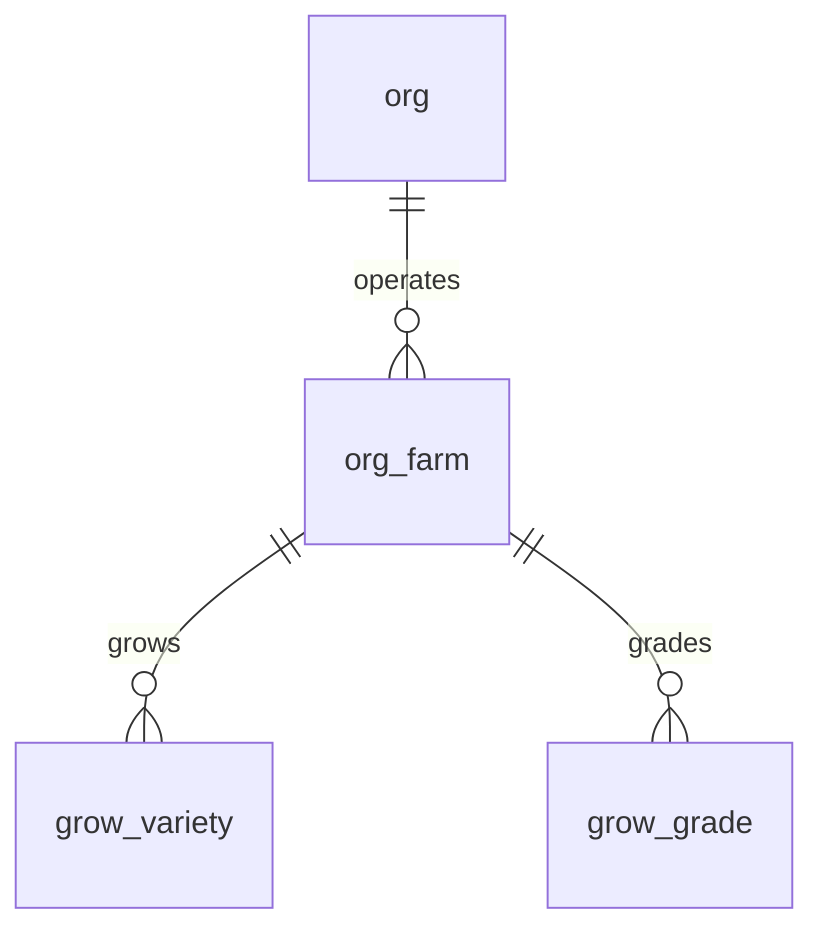

# Grow Schema

Tables for managing crop varieties and harvest grades. These are farm-scoped lookup tables used across seeding, growing, harvest, and sales modules.

> **Standard audit fields:** Every table includes `created_at` (TIMESTAMPTZ, default now), `created_by` (TEXT), `updated_at` (TIMESTAMPTZ, default now), `updated_by` (TEXT), and `is_deleted` (BOOLEAN, default false). These are omitted from the column listings below for brevity.

## Entity Relationship Diagram

---

## Table Overview

| Table | Purpose |
|-------|---------|
| grow_variety | Crop varieties with short codes for quick reference during data entry. Farm-scoped. |
| grow_grade | Harvest quality grades with short codes, applied during harvest and carried through to sales. Farm-scoped. |

---

## grow_variety

Crop varieties grown on a specific farm, each with a short code for quick reference during data entry. Used across seeding, growing, and harvest modules.

| Column | Type | Constraints | Description |
|--------|------|-------------|-------------|
| id | TEXT | PK | Human-readable identifier derived from variety name (lowercase trimmed) |
| org_id | TEXT | NOT NULL, FK → org(id) | |
| farm_id | TEXT | NOT NULL, FK → org_farm(id) | |
| code | TEXT | NOT NULL | Short code for the variety, unique within the farm (e.g. K, J, GR) |
| name | TEXT | NOT NULL | Full display name of the variety, unique within the farm |
| description | TEXT | nullable | |

Unique constraints on `(farm_id, code)` and `(farm_id, name)`.

---

## grow_grade

Harvest quality grades for a specific farm, each with a short code. Applied during harvest logging and carried through to product definition, packing, and sales.

| Column | Type | Constraints | Description |
|--------|------|-------------|-------------|
| id | TEXT | PK | Human-readable identifier derived from grade name (lowercase trimmed) |
| org_id | TEXT | NOT NULL, FK → org(id) | |
| farm_id | TEXT | NOT NULL, FK → org_farm(id) | |
| code | TEXT | NOT NULL | Short code for the grade, unique within the farm (e.g. A, B, C) |
| name | TEXT | NOT NULL | Full display name of the grade, unique within the farm |

Unique constraints on `(farm_id, code)` and `(farm_id, name)`.
