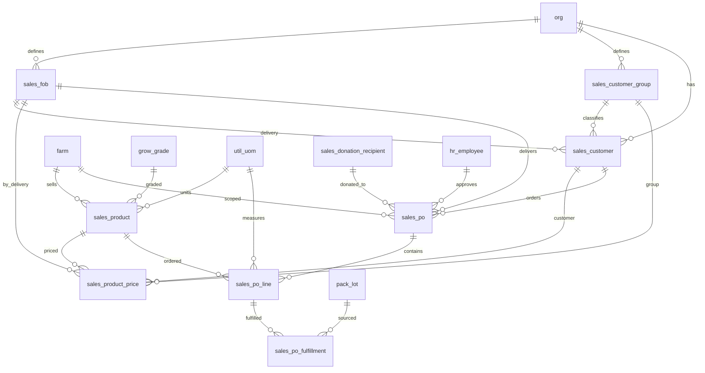

# Sales Schema

Tables for the product catalog, tiered pricing, customer orders, order fulfillment against pack lots, and donation tracking. Orders follow a workflow from draft through approval to fulfillment, with snapshot pricing captured at time of order. Standing orders support automatic recurrence.

> **Standard audit fields:** Every table includes `created_at` (TIMESTAMPTZ, default now), `created_by` (TEXT, user email), `updated_at` (TIMESTAMPTZ, default now), and `updated_by` (TEXT, user email). These are omitted from the column listings below for brevity.

---

## ERD

---

## `sales_product`

The sellable products from each farm. Combines a grade with a full packaging hierarchy (item → pack → sale → shipping) that drives inventory calculations. Columns are grouped by logical sections: identity, packaging quantities, weights, dimensions, storage, shipping, flags, and identification. All net weight values share `weight_uom`, all dimensions share `dimension_uom`, and all temperatures share `temperature_uom`.

| Column                      | Type         | Constraints                        | Description                              |
|-----------------------------|--------------|------------------------------------|------------------------------------------|
| id                          | TEXT         | PK                                 | Human-readable identifier derived from product name (lowercase trimmed) |
| org_id                      | TEXT         | NOT NULL, FK → org(id)             | Owning organization for RLS filtering    |
| farm_id                     | TEXT         | NOT NULL, FK → farm(id)            | Farm (crop line) this product belongs to |
| grow_grade_id                    | TEXT         | FK → grow_grade(id), nullable      | Harvest quality grade for this product   |
| code                        | TEXT         | NOT NULL                           | Short product code, unique within the farm |
| name                        | TEXT         | NOT NULL                           | Full display name of the product, unique within the farm |
| segment                     | TEXT         | CHECK                              | Market segment: wholesale, retail, or food_service |
| description                 | TEXT         | nullable                           | Product description for catalogs and labels |
| pack_packaging_type_id      | TEXT         | FK → pack_packaging_type(id), nullable | Packaging type for this product; FK to org-defined pack_packaging_type lookup |
| item_uom                    | TEXT         | FK → util_uom(code), nullable      | Unit of measure for the individual product item (e.g. each, head) |
| pack_uom                    | TEXT         | FK → util_uom(code), nullable      | Unit of measure for the consumer pack level (e.g. bag, clamshell) |
| item_per_pack_uom           | NUMERIC      | nullable                           | Number of items per pack                 |
| sale_uom                    | TEXT         | FK → util_uom(code), nullable      | Unit of measure for the sale level (e.g. case, box) |
| pack_per_sale_uom           | NUMERIC      | nullable                           | Number of packs per sale unit            |
| shipping_uom                | TEXT         | FK → util_uom(code), nullable      | Unit of measure for the shipping level (e.g. pallet) |
| max_sale_per_shipping_uom   | NUMERIC      | nullable                           | Maximum number of sale units the shipping unit can physically hold beyond the standard TI x HI configuration |
| pack_net_weight             | NUMERIC      | nullable                           | Net weight of one pack in weight_uom     |
| sale_net_weight             | NUMERIC      | nullable                           | Net weight of one sale unit in weight_uom |
| shipping_net_weight         | NUMERIC      | nullable                           | Net weight of one full shipping unit in weight_uom |
| weight_uom                  | TEXT         | FK → util_uom(code), nullable      | Unit of measure for all net weight values on this product (e.g. lb, kg) |
| sale_uom_length             | NUMERIC      | nullable                           | Length of the sale unit in dimension_uom  |
| sale_uom_width              | NUMERIC      | nullable                           | Width of the sale unit in dimension_uom   |
| sale_uom_height             | NUMERIC      | nullable                           | Height of the sale unit in dimension_uom  |
| dimension_uom               | TEXT         | FK → util_uom(code), nullable      | Unit of measure for all dimension values on this product (e.g. in, cm) |
| manufacture_storage_method  | TEXT         | nullable                           | How the product should be stored (e.g. refrigerated, frozen, ambient) |
| minimum_storage_temperature | NUMERIC      | nullable                           | Minimum storage temperature in temperature_uom |
| maximum_storage_temperature | NUMERIC      | nullable                           | Maximum storage temperature in temperature_uom |
| temperature_uom             | TEXT         | FK → util_uom(code), nullable      | Unit of measure for storage temperature values (e.g. F, C) |
| shelf_life_days             | INT          | nullable                           | Product shelf life in days from date of manufacture |
| shipping_ti                 | NUMERIC      | nullable                           | TI — number of sale units per layer on the shipping unit |
| shipping_hi                 | NUMERIC      | nullable                           | HI — number of layers stacked on the shipping unit |
| shipping_requirements       | TEXT         | nullable                           | Special shipping instructions (e.g. temperature range, handling notes) |
| is_catch_weight             | BOOLEAN      | NOT NULL, default false            | Whether this product is sold by actual weight rather than fixed weight |
| is_hazardous                | BOOLEAN      | NOT NULL, default false            | Whether this product is classified as hazardous material |
| is_fsma_traceable           | BOOLEAN      | NOT NULL, default false            | Whether this product is on the FDA FSMA 204 Food Traceability List |
| gtin                        | TEXT         | nullable                           | Global Trade Item Number (up to 14 digits) |
| upc                         | TEXT         | nullable                           | Universal Product Code (up to 12 digits) |
| photos                      | JSONB        | NOT NULL, default []               | JSON array of photo URLs for the product |
| display_order               | INT          | NOT NULL, default 0                | Sort order for UI display within the farm |
| is_active                   | BOOLEAN      | NOT NULL, default true             | Soft delete flag; false hides the product from active use |

Unique constraints on `(farm_id, code)` and `(farm_id, name)`.

---

## `sales_product_price`

Manages product pricing with three tiers of specificity and date ranges to track price changes over time. When a price changes, the current row gets an effective_to date and a new row is created. Currency always uses the org default from org.currency.

| Column            | Type        | Constraints                         | Description                              |
|-------------------|-------------|-------------------------------------|------------------------------------------|
| id                | UUID        | PK, auto-generated                  | Unique identifier for the price record   |
| org_id            | TEXT        | NOT NULL, FK → org(id)              | Owning organization for RLS filtering    |
| sales_product_id  | TEXT        | NOT NULL, FK → sales_product(id)    | Product this price applies to            |
| sales_fob_id      | TEXT        | NOT NULL, FK → sales_fob(id)        | FOB delivery point this price applies to |
| sales_customer_group_id | TEXT  | FK → sales_customer_group(id), nullable | Customer group for group-level pricing; NULL for customer-specific or default pricing |
| sales_customer_id | TEXT        | FK → sales_customer(id), nullable   | Specific customer for customer-level pricing; NULL for group or default pricing |
| price             | NUMERIC     | NOT NULL                            | Price per sale unit                      |
| effective_from    | DATE        | NOT NULL                            | Start date when this price becomes active |
| effective_to      | DATE        | nullable                            | End date when this price expires; NULL means no expiry |
| is_active         | BOOLEAN     | NOT NULL, default true              | Soft delete flag; false hides the price from active use |

Pricing lookup priority: customer price (tier 1) → group price (tier 2) → default price (tier 3), filtered by `effective_from <= today AND (effective_to IS NULL OR effective_to > today)`.

---

## `sales_fob`

Defines each organization's available delivery methods (e.g. Farm Pick-up, Local Delivery, Distributor). Used in customer setup to set a preferred delivery and in pricing to set delivery-specific prices.

| Column | Type | Constraints | Description |
|--------|------|-------------|-------------|
| id | TEXT | PK | Human-readable identifier derived from FOB name (lowercase trimmed) |
| org_id | TEXT | NOT NULL, FK → org(id) | Owning organization for RLS filtering |
| name | TEXT | NOT NULL | Display name of the FOB point, unique within the org |
| is_active | BOOLEAN | NOT NULL, default true | Soft delete flag; false hides the FOB point from active use |

Unique constraint on `(org_id, name)` — no duplicate delivery methods within an org.

---

## `sales_customer_group`

Allows each organization to classify customers into groups for reporting and group-based pricing (e.g. Wholesale, Retail, Restaurant).

| Column | Type | Constraints | Description |
|--------|------|-------------|-------------|
| id | TEXT | PK | Human-readable identifier derived from group name (lowercase trimmed) |
| org_id | TEXT | NOT NULL, FK → org(id) | Owning organization for RLS filtering |
| name | TEXT | NOT NULL | Display name of the customer group, unique within the org |
| is_active | BOOLEAN | NOT NULL, default true | Soft delete flag; false hides the customer group from active use |

Unique constraint on `(org_id, name)` — no duplicate group names within an org.

---

## `sales_customer`

Stores an organization's customers with their group classification, preferred delivery method, billing address, and a link to external accounting software via accounting_id. Additional contact emails are stored in cc_emails.

| Column | Type | Constraints | Description |
|--------|------|-------------|-------------|
| id | TEXT | PK | Human-readable identifier derived from customer name (lowercase trimmed) |
| org_id | TEXT | NOT NULL, FK → org(id) | Owning organization for RLS filtering |
| sales_customer_group_id | TEXT | FK → sales_customer_group(id), nullable | Customer group for reporting and group-level pricing |
| sales_fob_id | TEXT | FK → sales_fob(id), nullable | Default FOB delivery point for this customer |
| accounting_id | TEXT | nullable | External accounting system identifier for integration |
| name | TEXT | NOT NULL | Display name of the customer, unique within the org |
| email | TEXT | nullable | Primary email address for the customer |
| cc_emails | JSONB | NOT NULL, default [] | JSON array of additional email addresses to CC on communications |
| billing_address | TEXT | nullable | Billing address for invoicing |
| is_active | BOOLEAN | NOT NULL, default true | Soft delete flag; false hides the customer from active use |

Unique constraint on `(org_id, name)` — no duplicate customer names within an org.

---

## `sales_donation_recipient`

Org-defined lookup of places product can be donated to (e.g. food banks, shelters, community programs).

| Column | Type | Constraints | Description |
|--------|------|-------------|-------------|
| id | TEXT | PK | Human-readable identifier derived from name (trimmed lowercase) |
| org_id | TEXT | NOT NULL, FK → org(id) | Owning organization for RLS filtering |
| name | TEXT | NOT NULL | Donation recipient name, unique within the org |
| description | TEXT | nullable | Optional description of the donation recipient |
| is_active | BOOLEAN | NOT NULL, default true | Soft delete flag; false hides the record from active use |

Unique constraint on `(org_id, name)` — one recipient name per org.

---

## `sales_po`

Customer order header. One row per order. Tracks customer, FOB, dates, approval workflow, and optional recurring frequency for standing orders.

| Column | Type | Constraints | Description |
|--------|------|-------------|-------------|
| id | UUID | PK, auto-generated | Unique identifier for the order |
| org_id | TEXT | NOT NULL, FK → org(id) | Owning organization for RLS filtering |
| farm_id | TEXT | NOT NULL, FK → farm(id) | Farm (crop line) this order belongs to |
| sales_customer_id | TEXT | NOT NULL, FK → sales_customer(id) | Customer placing the order |
| sales_customer_group_id | TEXT | FK → sales_customer_group(id), nullable | Customer group for this order; null if using the customer default group |
| sales_donation_recipient_id | TEXT | FK → sales_donation_recipient(id), nullable | Donation recipient if this order is a donation; null for regular sales orders |
| sales_fob_id | TEXT | FK → sales_fob(id), nullable | FOB delivery point for this order; null if using the customer default |
| po_number | TEXT | nullable | Customer purchase order number for reference and cross-system matching |
| order_date | DATE | NOT NULL | Date the order was placed |
| invoice_date | DATE | nullable | Date the invoice was issued; null until invoiced |
| recurring_frequency | TEXT | nullable, CHECK | Standing order frequency: weekly, biweekly, or monthly; null for one-time orders |
| notes | TEXT | nullable | Free-text notes about the order |
| status | TEXT | NOT NULL, default draft, CHECK | Order status: draft (new), approved (ready to fulfill), fulfilled (shipped) |
| is_active | BOOLEAN | NOT NULL, default true | Soft delete flag; false hides the record from active use |
| approved_at | TIMESTAMPTZ | nullable | Timestamp when the order was approved |
| approved_by | TEXT | FK → hr_employee(id), nullable | Employee who approved the order |
| uploaded_at | TIMESTAMPTZ | nullable | Timestamp when the order was uploaded to the accounting system |
| uploaded_by | TEXT | FK → hr_employee(id), nullable | Employee who uploaded the order to the accounting system |

---

## `sales_po_line`

Individual products within an order. One row per product per order with snapshot pricing at time of order.

| Column | Type | Constraints | Description |
|--------|------|-------------|-------------|
| id | UUID | PK, auto-generated | Unique identifier for the order line |
| org_id | TEXT | NOT NULL, FK → org(id) | Owning organization for RLS filtering |
| farm_id | TEXT | NOT NULL, FK → farm(id) | Farm (crop line) this order line belongs to; inherited from parent sales_po |
| sales_po_id | UUID | NOT NULL, FK → sales_po(id) | Parent order this line belongs to |
| sales_product_id | TEXT | NOT NULL, FK → sales_product(id) | Product being ordered |
| sale_uom | TEXT | NOT NULL, FK → util_uom(code) | Unit of measure for the quantity ordered (e.g. case, box) |
| quantity_ordered | NUMERIC | NOT NULL | Number of sale units ordered |
| price_per_unit | NUMERIC | NOT NULL | Snapshot price per unit at time of order |
| notes | TEXT | nullable | Free-text notes about this order line |
| is_active | BOOLEAN | NOT NULL, default true | Soft delete flag; false hides the record from active use |

Unique constraint on `(sales_po_id, sales_product_id)` — one product per order.

---

## `sales_po_fulfillment`

Fulfillment records linking order lines to pack lots. One row per lot per order line, supporting partial fulfillment across multiple lots.

| Column | Type | Constraints | Description |
|--------|------|-------------|-------------|
| id | UUID | PK, auto-generated | Unique identifier for the fulfillment record |
| org_id | TEXT | NOT NULL, FK → org(id) | Owning organization for RLS filtering |
| farm_id | TEXT | NOT NULL, FK → farm(id) | Farm (crop line) this fulfillment belongs to; inherited from parent sales_po_line |
| sales_po_id | UUID | NOT NULL, FK → sales_po(id) | Parent order this fulfillment belongs to; inherited from parent sales_po_line |
| sales_po_line_id | UUID | NOT NULL, FK → sales_po_line(id) | Order line being fulfilled |
| pack_lot_id | UUID | FK → pack_lot(id), nullable | Pack lot the fulfilled product was drawn from; null if lot tracking is not applicable |
| quantity_fulfilled | NUMERIC | NOT NULL | Number of sale units fulfilled from this lot for this order line |
| notes | TEXT | nullable | Free-text notes about this fulfillment |
| is_active | BOOLEAN | NOT NULL, default true | Soft delete flag; false hides the record from active use |
