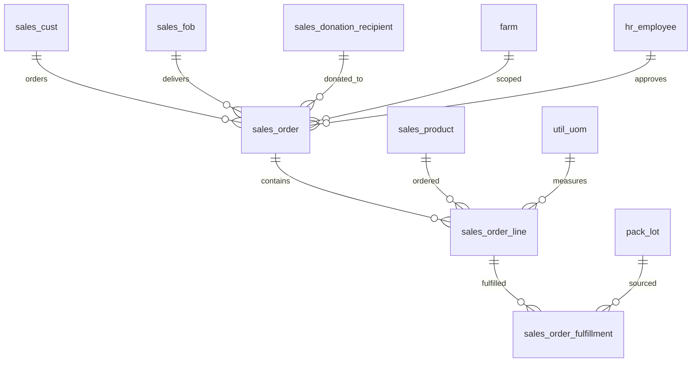

# Sales Schema

Tables for managing customer orders, order fulfillment against pack lots, and donation tracking. Orders follow a workflow from draft through approval to fulfillment, with snapshot pricing captured at time of order. Standing orders support automatic recurrence.

> **Standard audit fields:** Every table includes `created_at` (TIMESTAMPTZ, default now), `created_by` (TEXT, user email), `updated_at` (TIMESTAMPTZ, default now), and `updated_by` (TEXT, user email). These are omitted from the column listings below for brevity.

---

## ERD

---

## `sales_donation_recipient`

Org-defined lookup of places product can be donated to (e.g. food banks, shelters, community programs).

| Column | Type | Constraints | Description |
|--------|------|-------------|-------------|
| id | TEXT | PK | Human-readable identifier derived from name (trimmed lowercase) |
| org_id | TEXT | NOT NULL, FK → org(id) | Owning organization for RLS filtering |
| name | TEXT | NOT NULL | Donation recipient name, unique within the org |
| description | TEXT | nullable | Optional description of the donation recipient |
| display_order | INTEGER | NOT NULL, default 0 | Sort position for ordering recipients in the UI |
| is_active | BOOLEAN | NOT NULL, default true | Soft delete flag; false hides the record from active use |

Unique constraint on `(org_id, name)` — one recipient name per org.

---

## `sales_order`

Customer order header. One row per order. Tracks customer, FOB, dates, approval workflow, and optional recurring frequency for standing orders.

| Column | Type | Constraints | Description |
|--------|------|-------------|-------------|
| id | UUID | PK, auto-generated | Unique identifier for the order |
| org_id | TEXT | NOT NULL, FK → org(id) | Owning organization for RLS filtering |
| farm_id | TEXT | NOT NULL, FK → farm(id) | Farm (crop line) this order belongs to |
| sales_cust_id | TEXT | NOT NULL, FK → sales_cust(id) | Customer placing the order |
| sales_fob_id | TEXT | FK → sales_fob(id), nullable | FOB delivery point for this order; null if using the customer default |
| sales_donation_recipient_id | TEXT | FK → sales_donation_recipient(id), nullable | Donation recipient if this order is a donation; null for regular sales orders |
| external_order_number | TEXT | nullable | Order number from an external system (e.g. customer PO number) |
| order_date | DATE | NOT NULL | Date the order was placed |
| invoice_date | DATE | nullable | Date the invoice was issued; null until invoiced |
| recurring_frequency | TEXT | nullable, CHECK | Standing order frequency: weekly, biweekly, or monthly; null for one-time orders |
| notes | TEXT | nullable | Free-text notes about the order |
| status | TEXT | NOT NULL, default draft, CHECK | Order status: draft (new), approved (ready to fulfill), fulfilled (shipped) |
| is_active | BOOLEAN | NOT NULL, default true | Soft delete flag; false hides the record from active use |
| approved_at | TIMESTAMPTZ | nullable | Timestamp when the order was approved |
| approved_by | TEXT | FK → hr_employee(id), nullable | Employee who approved the order |
| uploaded_at | TIMESTAMPTZ | nullable | Timestamp when the order was uploaded to the accounting system |
| uploaded_by | TEXT | FK → hr_employee(id), nullable | Employee who uploaded the order to the accounting system |

---

## `sales_order_line`

Individual products within an order. One row per product per order with snapshot pricing at time of order.

| Column | Type | Constraints | Description |
|--------|------|-------------|-------------|
| id | UUID | PK, auto-generated | Unique identifier for the order line |
| org_id | TEXT | NOT NULL, FK → org(id) | Owning organization for RLS filtering |
| sales_order_id | UUID | NOT NULL, FK → sales_order(id) | Parent order this line belongs to |
| sales_product_id | TEXT | NOT NULL, FK → sales_product(id) | Product being ordered |
| uom | TEXT | NOT NULL, FK → util_uom(code) | Unit of measure for the quantity ordered (e.g. case, box) |
| quantity_ordered | NUMERIC | NOT NULL | Number of sale units ordered |
| price_per_sale_unit | NUMERIC | NOT NULL | Snapshot price per sale unit at time of order |
| notes | TEXT | nullable | Free-text notes about this order line |
| is_active | BOOLEAN | NOT NULL, default true | Soft delete flag; false hides the record from active use |

Unique constraint on `(sales_order_id, sales_product_id)` — one product per order.

---

## `sales_order_fulfillment`

Fulfillment records linking order lines to pack lots. One row per lot per order line, supporting partial fulfillment across multiple lots.

| Column | Type | Constraints | Description |
|--------|------|-------------|-------------|
| id | UUID | PK, auto-generated | Unique identifier for the fulfillment record |
| org_id | TEXT | NOT NULL, FK → org(id) | Owning organization for RLS filtering |
| sales_order_line_id | UUID | NOT NULL, FK → sales_order_line(id) | Order line being fulfilled |
| pack_lot_id | UUID | FK → pack_lot(id), nullable | Pack lot the fulfilled product was drawn from; null if lot tracking is not applicable |
| quantity_fulfilled | NUMERIC | NOT NULL | Number of sale units fulfilled from this lot for this order line |
| notes | TEXT | nullable | Free-text notes about this fulfillment |
| is_active | BOOLEAN | NOT NULL, default true | Soft delete flag; false hides the record from active use |
