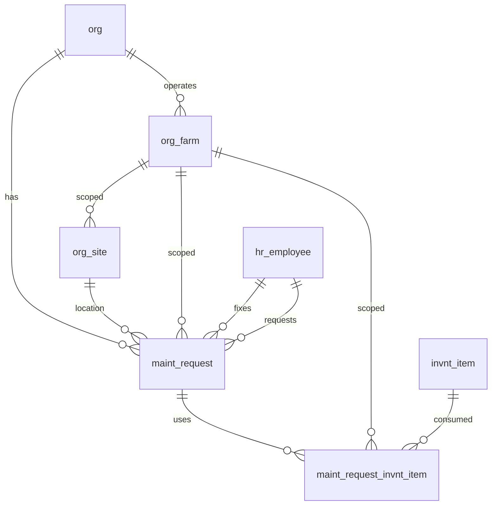

# Maintenance Schema

Standalone maintenance work order module for tracking site repairs, preventive maintenance tasks, parts used, and before/after photo documentation.

> **Standard audit fields:** Every table includes `created_at` (TIMESTAMPTZ, default now), `created_by` (TEXT, user email), `updated_at` (TIMESTAMPTZ, default now), `updated_by` (TEXT, user email), and `is_deleted` (BOOLEAN, default false). These are omitted from the column listings below for brevity.

## Entity Relationship Diagram

---

## Table Overview

| Table | Purpose |
|-------|---------|
| maint_request | Standalone maintenance work order. Tracks site issues, preventive tasks, urgency, scheduling, fixer assignment, completion details, and before/after photos. |
| maint_request_invnt_item | Inventory items consumed during a maintenance request. One row per item per request. |

---

## maint_request

Standalone maintenance work order requests. Tracks site issues, preventive maintenance, urgency, scheduling, fixer assignment, completion details, and before/after photos.

| Column                   | Type         | Constraints                           | Description                              |
|--------------------------|--------------|---------------------------------------|------------------------------------------|
| id                        | UUID         | PK, auto-generated                    | Unique identifier for the maintenance request |
| org_id                    | TEXT         | NOT NULL, FK → org(id)                | Owning organization for RLS filtering    |
| farm_id                   | TEXT         | FK → org_farm(id), nullable               | Optional farm scope for the request      |
| site_id                   | TEXT         | NOT NULL, FK → org_site(id)               | Site where the maintenance is required   |
| status                    | TEXT         | NOT NULL, default new, CHECK          | Workflow status: new, pending, priority, done |
| request_description       | TEXT         | nullable                              | Description of the maintenance work required |
| recurring_frequency       | TEXT         | nullable, CHECK                       | How often this task recurs: daily, weekly, monthly, quarterly; NULL if not recurring |
| due_date                  | DATE         | nullable                              | Date by which the maintenance should be completed |
| completed_on              | DATE         | nullable                              | Date when the maintenance was marked as completed |
| fixer_id                  | TEXT         | FK → hr_employee(id), nullable        | Employee assigned to carry out the maintenance |
| fixer_description         | TEXT         | nullable                              | Comments or notes left by the fixer upon completion |
| before_photos             | JSONB        | NOT NULL, default []                  | JSON array of photo URLs taken before the maintenance work |
| after_photos              | JSONB        | NOT NULL, default []                  | JSON array of photo URLs taken after the maintenance work |
| is_preventive_maintenance | BOOLEAN      | NOT NULL, default false               | Whether this is a scheduled preventive maintenance task rather than a reactive repair |
| requested_at              | TIMESTAMPTZ  | NOT NULL, default now                 | Timestamp when the request was submitted |
| requested_by              | TEXT         | NOT NULL, FK → hr_employee(id)        | Employee who submitted the maintenance request |

---

## maint_request_invnt_item

Inventory items consumed during a maintenance request. One row per item per request.

| Column            | Type         | Constraints                           | Description                              |
|-------------------|--------------|---------------------------------------|------------------------------------------|
| id                | UUID         | PK, auto-generated                    | Unique identifier for the record         |
| org_id            | TEXT         | NOT NULL, FK → org(id)                | Owning organization for RLS filtering    |
| farm_id           | TEXT         | FK → org_farm(id), nullable               | Optional farm scope; inherited from parent maint_request |
| maint_request_id  | UUID         | NOT NULL, FK → maint_request(id)      | Maintenance request this inventory item usage belongs to |
| invnt_item_id     | UUID         | NOT NULL, FK → invnt_item(id)         | Inventory item used during the maintenance |
| uom               | TEXT         | FK → org_uom(code), nullable         | Unit of measure for the quantity used    |
| quantity_used     | NUMERIC      | nullable                              | Quantity of the item consumed during the maintenance |

Unique constraint on `(maint_request_id, invnt_item_id)` — one entry per item per request.
