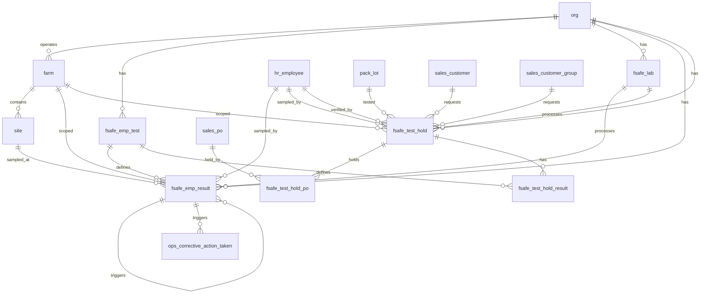

# Food Safety Schema

Tables for food safety testing. Covers EMP (Environmental Monitoring Program) test definitions and results, laboratory management, and test-and-hold testing for pack lots. Checklist-based food safety (templates, questions, responses, corrective actions) is covered in the Operations module.

> **Standard audit fields:** Every table includes `is_deleted` (BOOLEAN, default false), `created_at` (TIMESTAMPTZ, default now), `created_by` (TEXT, user email), `updated_at` (TIMESTAMPTZ, default now), and `updated_by` (TEXT, user email). These are omitted from the column listings below for brevity.

## Entity Relationship Diagram

---

## Table Overview

| Table | Purpose |
|-------|---------|
| fsafe_emp_test | Catalog of EMP test definitions, result configuration, and retest/vector test thresholds. |
| fsafe_emp_result | EMP test results. One row per test event; retests and vector tests link back to the original failing test. Water tests (e.g. water_listeria, water_ecoli, water_salmonella) are recorded here using named definitions. |
| fsafe_lab | Catalog of laboratories used for food safety test submissions. |
| fsafe_test_hold | Test-and-hold header. One record per pack lot being tested; tracks sample collection, lab submission, and test timeline. |
| fsafe_test_hold_po | Links a test-and-hold record to one or more sales purchase orders on hold pending results. |
| fsafe_test_hold_result | Individual test results for a test-and-hold record. One row per test type per event. |

---

## fsafe_emp_test

Catalog of EMP test definitions and their result configuration. Defines how results are evaluated and how many retests or vector tests are required on a fail.

| Column                  | Type         | Constraints                     | Description                              |
|------------------------|--------------|--------------------------------|------------------------------------------|
| id                     | TEXT         | PK                             | Human-readable unique identifier derived from org and test name |
| org_id                 | TEXT         | NOT NULL, FK → org(id)         | Owning organization for RLS filtering    |
| test_name              | TEXT         | NOT NULL                       | Name of the test or pathogen being tested for (e.g. Listeria, Salmonella) |
| test_methods           | JSONB        | NOT NULL, default []           | JSON array of available test methods users can select when recording a result (e.g. ["PCR", "Culture", "ELISA"]) |
| test_description       | TEXT         | nullable                       | Optional description of the test and its purpose |
| result_type            | TEXT         | NOT NULL, CHECK                | How results are recorded and evaluated: enum (select from list) or numeric (measured value) |
| enum_options           | JSONB        | nullable                       | JSON array of all selectable result options when result_type is enum (e.g. ["Detected", "Not Detected"]) |
| enum_pass_options      | JSONB        | nullable                       | JSON array of enum values that constitute a passing result (e.g. ["Not Detected"]) |
| numeric_minimum_value  | NUMERIC      | nullable                       | Minimum acceptable numeric value; results below this are a fail |
| numeric_maximum_value  | NUMERIC      | nullable                       | Maximum acceptable numeric value; results above this are a fail |
| required_retests       | INTEGER      | NOT NULL, default 0            | Number of retest records to auto-generate when any test of this type fails |
| required_vector_tests  | INTEGER      | NOT NULL, default 0            | Number of vector test records to auto-generate when any test of this type fails |

Unique constraint on `(org_id, test_name)`.

---

## fsafe_emp_result

EMP test results. One row per test event. Retests and vector tests link back to the original failing test via `original_fsafe_emp_result_id`, forming a clear chain of why each test was created. Detection limit values (e.g. `<1`, `>2419`) are converted to numeric values by the frontend before submission.

| Column                       | Type         | Constraints                           | Description                              |
|-----------------------------|--------------|---------------------------------------|------------------------------------------|
| id                          | UUID         | PK, auto-generated                    | Unique identifier for the test result record |
| org_id                      | TEXT         | NOT NULL, FK → org(id)                | Owning organization for RLS filtering    |
| farm_id                     | TEXT         | FK → farm(id), nullable               | Farm where the sample was collected      |
| site_id                     | TEXT         | NOT NULL, FK → site(id)               | Site where the sample was collected; zone classification is stored on the site record |
| fsafe_lab_id                | TEXT         | FK → fsafe_lab(id), nullable          | Laboratory where the sample is submitted for testing; null if tested internally |
| fsafe_emp_test_id           | TEXT         | NOT NULL, FK → fsafe_emp_test(id)     | EMP test definition used for this test event |
| test_method                 | TEXT         | NOT NULL                              | Test method used, selected from the test methods list on the EMP test definition (e.g. PCR, Culture) |
| initial_retest_vector       | TEXT         | NOT NULL, CHECK                       | Type of test: initial (first run), retest (triggered by any fail), vector (triggered by any fail) |
| status                      | TEXT         | NOT NULL, default pending, CHECK      | Workflow status: pending, in_progress, completed |
| result_enum                 | TEXT         | nullable                              | Enum result value selected from test enum_options when result_type is enum |
| result_numeric              | NUMERIC      | nullable                              | Numeric result value when result_type is numeric; frontend converts detection limit strings (e.g. <1, >2419) to numeric values before submission |
| results_pass                | BOOLEAN      | nullable                              | Whether the result meets the pass criteria defined on the EMP test definition |
| warning_message             | TEXT         | nullable                              | Warning message displayed when the result fails |
| fail_code                   | TEXT         | nullable                              | Human-readable failure code assigned to this test result (e.g. LM-001) |
| original_fsafe_emp_result_id| UUID         | FK → fsafe_emp_result(id), nullable   | Reference to the initial test result that triggered this retest or vector test; null for initial tests |
| notes                       | TEXT         | nullable                              | Free-text notes about the test event     |
| sampled_at                  | TIMESTAMPTZ  | nullable                              | Timestamp when the sample was collected  |
| sampled_by                  | TEXT         | FK → hr_employee(id), nullable        | Employee who collected the sample        |
| completed_at                | TIMESTAMPTZ  | nullable                              | Timestamp when the lab completed processing the sample |
| verified_at                 | TIMESTAMPTZ  | nullable                              | Timestamp when the test result was verified |
| verified_by                 | TEXT         | FK → hr_employee(id), nullable        | Employee who verified the test result |

---

## fsafe_lab

Catalog of laboratories used for food safety test submissions (e.g. test-and-hold pathogen testing).

| Column      | Type    | Constraints              | Description                              |
|-------------|---------|--------------------------|------------------------------------------|
| id          | TEXT    | PK                       | Human-readable unique identifier derived from org and lab name |
| org_id      | TEXT    | NOT NULL, FK → org(id)   | Owning organization for RLS filtering    |
| name        | TEXT    | NOT NULL                 | Display name of the laboratory           |
| description | TEXT    | nullable                 | Optional description of the laboratory and services offered |

Unique constraint on `(org_id, name)`.

---

## fsafe_test_hold

Test-and-hold header. One record per pack lot being tested. Tracks sample collection, lab submission, and test timeline. Results are stored per test type in `fsafe_test_hold_result`.

| Column                  | Type         | Constraints                              | Description                              |
|------------------------|--------------|------------------------------------------|------------------------------------------|
| id                     | UUID         | PK, auto-generated                       | Unique identifier for the test-and-hold record |
| org_id                 | TEXT         | NOT NULL, FK → org(id)                   | Owning organization for RLS filtering    |
| farm_id                | TEXT         | NOT NULL, FK → farm(id)                  | Farm where the sample was collected      |
| pack_lot_id            | UUID         | NOT NULL, FK → pack_lot(id)              | Pack lot being tested; one test-and-hold per lot |
| sales_customer_id      | TEXT         | FK → sales_customer(id), nullable        | Customer requesting the test-and-hold; null if group-level or internal testing |
| sales_customer_group_id| TEXT         | FK → sales_customer_group(id), nullable  | Customer group requesting the test-and-hold; null if customer-specific or internal testing |
| fsafe_lab_id           | TEXT         | FK → fsafe_lab(id), nullable             | Laboratory where the sample is submitted for testing |
| lab_test_id            | TEXT         | nullable                                 | External reference number assigned by the laboratory for tracking |
| status                 | TEXT         | NOT NULL, default pending, CHECK         | Workflow status: pending (awaiting sample), in_progress (at lab), completed (results received) |
| notes                  | TEXT         | nullable                                 | Free-text notes about this test-and-hold event |
| sampled_on             | DATE         | nullable                                 | Date when the sample was collected from the lot |
| sampled_by             | TEXT         | FK → hr_employee(id), nullable           | Employee who collected the sample        |
| delivered_to_lab_on    | DATE         | nullable                                 | Date when the sample was delivered to the laboratory |
| test_started_on        | DATE         | nullable                                 | Date when the laboratory started processing the sample |
| completed_on           | DATE         | nullable                                 | Date when all test results were received from the laboratory |
| verified_at            | TIMESTAMPTZ  | nullable                                 | Timestamp when the test-and-hold results were verified |
| verified_by            | TEXT         | FK → hr_employee(id), nullable           | Employee who verified the test-and-hold results |

---

## fsafe_test_hold_po

Links a test-and-hold record to one or more sales purchase orders that are on hold pending test results.

| Column             | Type | Constraints                              | Description                              |
|--------------------|------|------------------------------------------|------------------------------------------|
| id                 | UUID | PK, auto-generated                       | Unique identifier for the test-hold-to-PO link |
| org_id             | TEXT | NOT NULL, FK → org(id)                   | Owning organization for RLS filtering    |
| farm_id            | TEXT | NOT NULL, FK → farm(id)                  | Farm this record belongs to; inherited from parent test-and-hold |
| fsafe_test_hold_id | UUID | NOT NULL, FK → fsafe_test_hold(id)       | Parent test-and-hold record              |
| sales_po_id        | UUID | NOT NULL, FK → sales_po(id)              | Sales purchase order that is on hold pending test results |

Unique constraint on `(fsafe_test_hold_id, sales_po_id)`.

---

## fsafe_test_hold_result

Individual test results for a test-and-hold record. One row per test type per test-and-hold event.

| Column             | Type    | Constraints                              | Description                              |
|--------------------|---------|------------------------------------------|------------------------------------------|
| id                 | UUID    | PK, auto-generated                       | Unique identifier for the test result    |
| org_id             | TEXT    | NOT NULL, FK → org(id)                   | Owning organization for RLS filtering    |
| farm_id            | TEXT    | NOT NULL, FK → farm(id)                  | Farm this result belongs to; inherited from parent test-and-hold |
| fsafe_test_hold_id | UUID    | NOT NULL, FK → fsafe_test_hold(id)       | Parent test-and-hold record this result belongs to |
| fsafe_emp_test_id  | TEXT    | NOT NULL, FK → fsafe_emp_test(id)        | EMP test definition that defines how this result is recorded and evaluated |
| response_enum      | TEXT    | nullable                                 | Enum result value when test type response_type is enum (e.g. Positive, Negative) |
| response_numeric   | NUMERIC | nullable                                 | Numeric result value when test type response_type is numeric (e.g. CFU/g count) |
| result_pass        | BOOLEAN | nullable                                 | Whether this result meets the pass criteria; null until result is entered |
| notes              | TEXT    | nullable                                 | Free-text notes about this specific test result |

Unique constraint on `(fsafe_test_hold_id, fsafe_emp_test_id)`.
