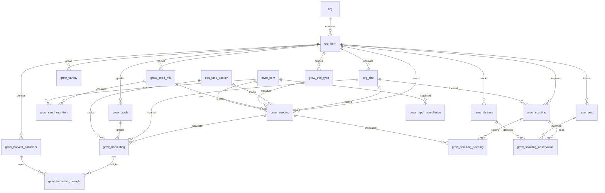

# Grow Schema

Tables for managing crop varieties, harvest grades, seed mix recipes, and seeding batches. These are farm-scoped tables used across seeding, growing, harvest, and sales modules.

> **Standard audit fields:** Every table includes `created_at` (TIMESTAMPTZ, default now), `created_by` (TEXT), `updated_at` (TIMESTAMPTZ, default now), `updated_by` (TEXT), and `is_deleted` (BOOLEAN, default false). These are omitted from the column listings below for brevity.

## Entity Relationship Diagram

---

## Table Overview

| Table | Purpose |
|-------|---------|
| grow_variety | Crop varieties with short codes for quick reference during data entry. Farm-scoped. |
| grow_grade | Harvest quality grades with short codes, applied during harvest and carried through to sales. Farm-scoped. |
| grow_trial_type | Lookup defining types of seeding trials (e.g. new lot, new variety). Farm-scoped. |
| grow_seed_mix | Named seed blend recipes. Items and percentages defined in grow_seed_mix_item. Farm-scoped. |
| grow_seed_mix_item | Individual seed items within a mix recipe with their proportion. |
| grow_seeding | Individual seeding batch linked to an ops activity. Either a single seed item or a seed mix, never both. |
| grow_harvest_container | Container definitions with tare weight, optionally specific to variety and grade. |
| grow_harvesting | Harvest header linked to a seeding batch for full traceability. Weigh-ins recorded in child table. |
| grow_harvesting_weight | Individual weigh-in per container type with quantity. Tare auto-calculated from container definition. |
| grow_pest | Standardized pest names for scouting observations. Farm-scoped. |
| grow_disease | Standardized disease names for scouting observations. Farm-scoped. |
| grow_scouting | Scouting event header. Records a site inspection for pests and diseases. |
| grow_scouting_seeding | Join table linking a scouting event to one or more seeding batches. |
| grow_scouting_observation | Individual pest or disease finding within a scouting event. |
| grow_input_compliance | Chemical label registry with REI, PHI, application rates, and regulatory info per product. |

---

## grow_variety

Crop varieties grown on a specific farm, each with a short code for quick reference during data entry. Used across seeding, growing, and harvest modules.

| Column | Type | Constraints | Description |
|--------|------|-------------|-------------|
| id | TEXT | PK | Human-readable identifier derived from variety name (lowercase trimmed) |
| org_id | TEXT | NOT NULL, FK → org(id) | |
| farm_id | TEXT | NOT NULL, FK → org_farm(id) | |
| code | TEXT | NOT NULL | Short code for the variety, unique within the farm (e.g. K, J, GR) |
| name | TEXT | NOT NULL | Full display name of the variety, unique within the farm |
| description | TEXT | nullable | |

Unique constraints on `(farm_id, code)` and `(farm_id, name)`.

---

## grow_grade

Harvest quality grades for a specific farm, each with a short code. Applied during harvest logging and carried through to product definition, packing, and sales.

| Column | Type | Constraints | Description |
|--------|------|-------------|-------------|
| id | TEXT | PK | Human-readable identifier derived from grade name (lowercase trimmed) |
| org_id | TEXT | NOT NULL, FK → org(id) | |
| farm_id | TEXT | NOT NULL, FK → org_farm(id) | |
| code | TEXT | NOT NULL | Short code for the grade, unique within the farm (e.g. A, B, C) |
| name | TEXT | NOT NULL | Full display name of the grade, unique within the farm |

Unique constraints on `(farm_id, code)` and `(farm_id, name)`.

---

## grow_trial_type

Lookup table defining types of seeding trials (e.g. new lot, new variety, new seed source). Farm-scoped.

| Column | Type | Constraints | Description |
|--------|------|-------------|-------------|
| id | TEXT | PK | Human-readable identifier derived from name |
| org_id | TEXT | NOT NULL, FK → org(id) | |
| farm_id | TEXT | NOT NULL, FK → org_farm(id) | |
| name | TEXT | NOT NULL | |
| description | TEXT | nullable | |

Unique constraint on `(org_id, farm_id, name)`.

---

## grow_seed_mix

Named seed blend recipes (e.g. Spring Blend, Mixed Version 1). Farm-scoped. Items and percentages are defined in grow_seed_mix_item.

| Column | Type | Constraints | Description |
|--------|------|-------------|-------------|
| id | TEXT | PK | Human-readable identifier derived from mix name |
| org_id | TEXT | NOT NULL, FK → org(id) | |
| farm_id | TEXT | NOT NULL, FK → org_farm(id) | |
| name | TEXT | NOT NULL | |
| description | TEXT | nullable | |

Unique constraint on `(org_id, farm_id, name)`.

---

## grow_seed_mix_item

Individual seed items within a mix recipe with their proportion. Each row defines one seed and its percentage in the blend.

| Column | Type | Constraints | Description |
|--------|------|-------------|-------------|
| id | UUID | PK, default gen_random_uuid() | |
| org_id | TEXT | NOT NULL, FK → org(id) | |
| farm_id | TEXT | NOT NULL, FK → org_farm(id) | |
| grow_seed_mix_id | TEXT | NOT NULL, FK → grow_seed_mix(id) | |
| invnt_item_id | TEXT | NOT NULL, FK → invnt_item(id) | |
| lot_number | TEXT | nullable | Supplier seed lot number for traceability |
| percentage | NUMERIC | NOT NULL | Proportion in the mix (e.g. 0.6 for 60%) |

Unique constraint on `(grow_seed_mix_id, invnt_item_id)`.

---

## grow_seeding

Individual seeding batch linked to an ops activity. Either a single seed item or a seed mix, never both — enforced by a CHECK constraint.

| Column | Type | Constraints | Description |
|--------|------|-------------|-------------|
| id | UUID | PK, default gen_random_uuid() | |
| org_id | TEXT | NOT NULL, FK → org(id) | |
| farm_id | TEXT | NOT NULL, FK → org_farm(id) | |
| site_id | TEXT | FK → org_site(id), nullable | Growing site where this batch was seeded |
| ops_task_tracker_id | UUID | FK → ops_task_tracker(id), nullable | |
| batch_code | TEXT | NOT NULL | System-generated traceability code that carries through to transplanting and harvest; editable by user |
| grow_trial_type_id | TEXT | FK → grow_trial_type(id), nullable | Null if not a trial |
| grow_seed_mix_id | TEXT | FK → grow_seed_mix(id), nullable | Set if seeding a mix; null for single variety |
| invnt_item_id | TEXT | FK → invnt_item(id), nullable | Set if seeding a single variety; null for mixes |
| lot_number | TEXT | nullable | Supplier seed lot number for single-variety batches; populated from frontend dropdown |
| seeding_uom | TEXT | NOT NULL, FK → sys_uom(code) | Unit used for seeding (e.g. board, flat, tray) |
| number_of_units | INTEGER | NOT NULL | |
| seeds_per_unit | INTEGER | NOT NULL | |
| number_of_rows | INTEGER | NOT NULL | |
| seeding_date | DATE | NOT NULL | |
| transplant_date | DATE | NOT NULL | |
| estimated_harvest_date | DATE | NOT NULL | |
| status | TEXT | NOT NULL, default 'planned', CHECK | Lifecycle status: planned, seeded, transplanted, harvesting, harvested |
| notes | TEXT | nullable | |

Unique constraint on `(org_id, batch_code)`.

CHECK constraint: exactly one of `invnt_item_id` or `grow_seed_mix_id` must be set.

---

## grow_harvest_container

Harvest container definitions with tare weight per container type, optionally specific to variety and grade. Used to auto-calculate tare during weigh-ins.

| Column | Type | Constraints | Description |
|--------|------|-------------|-------------|
| id | TEXT | PK | |
| org_id | TEXT | NOT NULL, FK → org(id) | |
| farm_id | TEXT | NOT NULL, FK → org_farm(id) | |
| name | TEXT | NOT NULL | |
| grow_variety_id | TEXT | FK → grow_variety(id), nullable | Null means this tare applies to any variety |
| grow_grade_id | TEXT | FK → grow_grade(id), nullable | Null means this tare applies to any grade |
| weight_uom | TEXT | NOT NULL, FK → sys_uom(code) | Unit for tare weight (e.g. lb, kg) |
| tare_weight | NUMERIC | NOT NULL | Weight of one empty container in the specified weight_uom |

Unique constraint on `(org_id, farm_id, name, grow_variety_id, grow_grade_id)`.

---

## grow_harvesting

Harvest header linked to a seeding batch for full traceability. Individual weigh-ins are recorded in grow_harvesting_weight.

| Column | Type | Constraints | Description |
|--------|------|-------------|-------------|
| id | UUID | PK, default gen_random_uuid() | |
| org_id | TEXT | NOT NULL, FK → org(id) | |
| farm_id | TEXT | NOT NULL, FK → org_farm(id) | |
| site_id | TEXT | FK → org_site(id), nullable | |
| ops_task_tracker_id | UUID | FK → ops_task_tracker(id), nullable | |
| grow_seeding_id | UUID | NOT NULL, FK → grow_seeding(id) | |
| grow_grade_id | TEXT | FK → grow_grade(id), nullable | |
| harvest_date | DATE | NOT NULL | |
| notes | TEXT | nullable | |

---

## grow_harvesting_weight

Individual weigh-in for a harvest. One row per container type weighed. Quantity allows weighing multiple containers at once. Tare is auto-calculated from container definition.

| Column | Type | Constraints | Description |
|--------|------|-------------|-------------|
| id | UUID | PK, default gen_random_uuid() | |
| org_id | TEXT | NOT NULL, FK → org(id) | |
| farm_id | TEXT | NOT NULL, FK → org_farm(id) | |
| grow_harvesting_id | UUID | NOT NULL, FK → grow_harvesting(id) | |
| grow_harvest_container_id | TEXT | NOT NULL, FK → grow_harvest_container(id) | |
| number_of_containers | INTEGER | NOT NULL | Number of containers weighed in this entry |
| weight_uom | TEXT | NOT NULL, FK → sys_uom(code) | Unit for weight fields (e.g. lb, kg) |
| gross_weight | NUMERIC | NOT NULL | |
| net_weight | NUMERIC | NOT NULL | gross_weight minus calculated tare |

---

## grow_pest

Standardized pest names for scouting observations. Farm-scoped.

| Column | Type | Constraints | Description |
|--------|------|-------------|-------------|
| id | TEXT | PK | |
| org_id | TEXT | NOT NULL, FK → org(id) | |
| farm_id | TEXT | NOT NULL, FK → org_farm(id) | |
| name | TEXT | NOT NULL | |
| description | TEXT | nullable | |

Unique constraint on `(org_id, farm_id, name)`.

---

## grow_disease

Standardized disease names for scouting observations. Farm-scoped.

| Column | Type | Constraints | Description |
|--------|------|-------------|-------------|
| id | TEXT | PK | |
| org_id | TEXT | NOT NULL, FK → org(id) | |
| farm_id | TEXT | NOT NULL, FK → org_farm(id) | |
| name | TEXT | NOT NULL | |
| description | TEXT | nullable | |

Unique constraint on `(org_id, farm_id, name)`.

---

## grow_scouting

Scouting event header. Records a site inspection for pests and diseases. Can cover multiple seeding batches via grow_scouting_seeding.

| Column | Type | Constraints | Description |
|--------|------|-------------|-------------|
| id | UUID | PK, default gen_random_uuid() | |
| org_id | TEXT | NOT NULL, FK → org(id) | |
| farm_id | TEXT | NOT NULL, FK → org_farm(id) | |
| site_id | TEXT | FK → org_site(id), nullable | |
| scouting_date | DATE | NOT NULL | |
| site_side | TEXT | nullable | Which side of the site was scouted (e.g. East, West) |
| site_row_numbers | TEXT | nullable | Which rows were inspected (e.g. rows 3-5, all) |
| notes | TEXT | nullable | |
| photos | JSONB | NOT NULL, default [] | |

---

## grow_scouting_seeding

Join table linking a scouting event to one or more seeding batches being inspected.

| Column | Type | Constraints | Description |
|--------|------|-------------|-------------|
| id | UUID | PK, default gen_random_uuid() | |
| org_id | TEXT | NOT NULL, FK → org(id) | |
| farm_id | TEXT | NOT NULL, FK → org_farm(id) | |
| grow_scouting_id | UUID | NOT NULL, FK → grow_scouting(id) | |
| grow_seeding_id | UUID | NOT NULL, FK → grow_seeding(id) | |

Unique constraint on `(grow_scouting_id, grow_seeding_id)`.

---

## grow_scouting_observation

Individual pest or disease finding within a scouting event. Either a pest or disease, enforced by CHECK constraint.

| Column | Type | Constraints | Description |
|--------|------|-------------|-------------|
| id | UUID | PK, default gen_random_uuid() | |
| org_id | TEXT | NOT NULL, FK → org(id) | |
| farm_id | TEXT | NOT NULL, FK → org_farm(id) | |
| grow_scouting_id | UUID | NOT NULL, FK → grow_scouting(id) | |
| observation_type | TEXT | NOT NULL, CHECK | Type of finding: pest or disease |
| grow_pest_id | TEXT | FK → grow_pest(id), nullable | Set if observation_type = pest |
| grow_disease_id | TEXT | FK → grow_disease(id), nullable | Set if observation_type = disease |
| severity_level | TEXT | NOT NULL, CHECK | Severity: low, moderate, high, severe |
| disease_infection_stage | TEXT | nullable, CHECK | Stage of infection: early, mid, late, advanced; null for pest observations |
| notes | TEXT | nullable | |

CHECK constraint: `observation_type = pest` requires `grow_pest_id` set and `grow_disease_id` null, and vice versa.

---

## grow_input_compliance

Chemical label registry storing regulatory information per product. One row per chemical/fertilizer item with REI, PHI, label rates, and application restrictions.

| Column | Type | Constraints | Description |
|--------|------|-------------|-------------|
| id | TEXT | PK | |
| org_id | TEXT | NOT NULL, FK → org(id) | |
| farm_id | TEXT | NOT NULL, FK → org_farm(id) | |
| invnt_item_id | TEXT | NOT NULL, FK → invnt_item(id) | |
| epa_registration | TEXT | nullable | EPA registration number for the chemical product |
| phi_days | INTEGER | nullable | Pre-Harvest Interval in days |
| rei_hours | INTEGER | nullable | Restricted Entry Interval in hours |
| label_date | DATE | nullable | |
| application_method | TEXT | nullable | How the product is applied (e.g. spray, drench, granular) |
| target_pest_disease | TEXT | nullable | The pest or disease this product is intended to treat |
| maximum_quantity_per_acre | NUMERIC | nullable | Maximum label rate per acre per application |
| application_uom | TEXT | FK → sys_uom(code), nullable | Unit of measure for the application rate |
| burn_uom | TEXT | FK → sys_uom(code), nullable | Smallest consumption unit for this product |
| application_per_burn_unit | NUMERIC | nullable | Application rate expressed in burn units |
| external_label_url | TEXT | nullable | |
| effective_date | DATE | nullable | Date this compliance record becomes effective |
| expiration_date | DATE | nullable | Date this compliance record expires and must be reviewed |

Unique constraint on `(org_id, farm_id, invnt_item_id)`.
