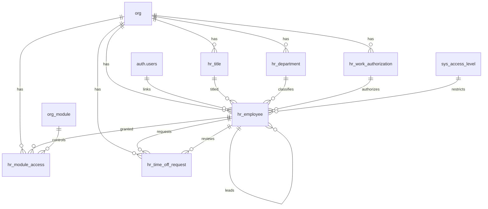

# Human Resources Schema

Tables for managing employees and the lookup tables that support them. Operational activity (task tracking, training, checklists) is covered in the Ops module.

> **Standard audit fields:** Every table includes `created_at` (TIMESTAMPTZ, default now), `created_by` (TEXT), `updated_at` (TIMESTAMPTZ, default now), `updated_by` (TEXT), and `is_deleted` (BOOLEAN, default false). These are omitted from the column listings below for brevity.

## Entity Relationship Diagram

---

## Table Overview

| Table | Purpose |
|-------|---------|
| hr_department | Org-specific department lookup for classifying employees (e.g. GH, PH, Lettuce). TEXT PK derived from name. |
| hr_work_authorization | Org-specific work authorization type lookup (e.g. Local, FURTE, WFE, H1B). TEXT PK derived from name. |
| hr_title | Org-specific job title lookup (e.g. Farm Manager, Supervisor, Grower). TEXT PK derived from name. |
| hr_employee | Unified employee register and org membership. Every user with org access has a row here. Tracks employment details, management hierarchy, compensation, and access level. A user can have rows in multiple orgs. |
| hr_module_access | Controls which application modules each employee can access. One row per employee per module; is_enabled toggles access. |
| hr_time_off_request | Employee time off requests with approval workflow (pending → approved/denied). |

---

## hr_department

Org-specific departments used to classify employees. Each org defines its own set of departments.

| Column      | Type         | Constraints                     | Description                              |
|------------|--------------|--------------------------------|------------------------------------------|
| id         | TEXT         | PK                             | Human-readable identifier derived from name (trimmed lowercase, e.g. gh, ph) |
| org_id     | TEXT         | NOT NULL, FK → org(id)         | Owning organization for RLS filtering    |
| name       | TEXT         | NOT NULL                       | |
| description| TEXT         | nullable                       | |

Unique constraint on `(org_id, name)`.

---

## hr_work_authorization

Org-specific work authorization types used to classify employees. Each org defines its own set of types.

| Column      | Type         | Constraints                     | Description                              |
|------------|--------------|--------------------------------|------------------------------------------|
| id         | TEXT         | PK                             | Human-readable identifier derived from name (trimmed lowercase, e.g. h1b, wfe) |
| org_id     | TEXT         | NOT NULL, FK → org(id)         | Owning organization for RLS filtering    |
| name       | TEXT         | NOT NULL                       | |
| description| TEXT         | nullable                       | |

Unique constraint on `(org_id, name)`.

---

## hr_title

Org-specific job titles used to classify employees. Each org defines its own set of titles.

| Column      | Type         | Constraints                     | Description                              |
|------------|--------------|--------------------------------|------------------------------------------|
| id         | TEXT         | PK                             | Human-readable identifier derived from name (trimmed lowercase, e.g. farm_manager, supervisor) |
| org_id     | TEXT         | NOT NULL, FK → org(id)         | Owning organization for RLS filtering    |
| name       | TEXT         | NOT NULL                       | |
| description| TEXT         | nullable                       | |

Unique constraint on `(org_id, name)`.

---

## hr_employee

Unified employee register and org membership table. Every employee gets a row here with a required `sys_access_level_id` that defines their role (owner, manager, team_lead, employee). Employees without app access have a null `user_id`. A user can belong to multiple orgs by having one row per org. Tracks employment details, management hierarchy, and compensation.

| Column                   | Type         | Constraints                              | Description                              |
|-------------------------|--------------|------------------------------------------|------------------------------------------|
| id                       | TEXT         | PK                                       | Human-readable identifier derived from employee name (e.g. john_smith) |
| org_id                   | TEXT         | NOT NULL, FK → org(id)                   | Owning organization for RLS filtering    |
| first_name               | TEXT         | NOT NULL                                 | Employee first name                      |
| last_name                | TEXT         | NOT NULL                                 | Employee last name                       |
| preferred_name           | TEXT         | nullable                                 | Preferred or nickname used in day-to-day communication |
| gender                   | TEXT         | nullable                                 | Employee gender                          |
| date_of_birth            | DATE         | nullable                                 | Employee date of birth                   |
| is_minority              | BOOLEAN      | NOT NULL, default false                  | |
| profile_photo_url        | TEXT         | nullable                                 | URL to employee profile photo            |
| phone                    | TEXT         | nullable                                 | |
| email                    | TEXT         | nullable                                 | |
| company_email            | TEXT         | nullable                                 | Company-issued email address             |
| user_id                  | UUID         | FK → auth.users(id), nullable            | |
| hr_department_id         | TEXT         | FK → hr_department(id), nullable         | Department the employee belongs to; references hr_department |
| hr_title_id              | TEXT         | FK → hr_title(id), nullable              | Job title from the org title lookup; references hr_title |
| sys_access_level_id      | TEXT         | NOT NULL, FK → sys_access_level(id)      | |
| team_lead_id             | TEXT         | FK → hr_employee(id), nullable           | Self-referencing TEXT FK to direct team_lead; stores readable employee id (e.g. jane_doe) |
| compensation_manager_id  | TEXT         | FK → hr_employee(id), nullable           | Self-referencing TEXT FK to compensation manager; stores readable employee id |
| hr_work_authorization_id | TEXT         | FK → hr_work_authorization(id), nullable | |
| start_date               | DATE         | nullable                                 | Employment start date                    |
| end_date                 | DATE         | nullable                                 | Employment end date; NULL if currently employed |
| payroll_id               | TEXT         | nullable                                 | External payroll system identifier       |
| pay_structure            | TEXT         | nullable, CHECK                          | hourly, salary |
| overtime_threshold       | NUMERIC      | nullable                                 | Hours threshold before overtime kicks in |
| wc                       | TEXT         | nullable                                 | Workers compensation code identifying the compensation plan or pay grade |
| payroll_processor        | TEXT         | nullable                                 | |
| pay_delivery_method      | TEXT         | nullable                                 | |
| site_id_housing          | TEXT         | FK → org_site(id), nullable                  | Reference to the site record used as the employee housing assignment |

Unique constraint on `(org_id, first_name, last_name)` — no duplicate employee names within an org.

---

## hr_module_access

Controls which application modules each employee can access. One row per employee per module; is_enabled toggles access without deleting the record.

| Column | Type | Constraints | Description |
|--------|------|-------------|-------------|
| id | UUID | PK, default gen_random_uuid() | |
| org_id | TEXT | NOT NULL, FK → org(id) | |
| hr_employee_id | TEXT | NOT NULL, FK → hr_employee(id) | |
| org_module_id | TEXT | NOT NULL, FK → org_module(id) | |
| is_enabled | BOOLEAN | NOT NULL, default true | Whether the employee currently has access to this module |

Unique constraint on `(hr_employee_id, org_module_id)` — one record per employee per module.

---

## hr_time_off_request

Employee time off requests with PTO and sick leave breakdown and a simple approval workflow.
| Column           | Type         | Constraints                       | Description                              |
|-----------------|--------------|-----------------------------------|------------------------------------------|
| id              | UUID         | PK, auto-generated                | Unique identifier for the time off request |
| org_id          | TEXT         | NOT NULL, FK → org(id)            | Owning organization for RLS filtering    |
| hr_employee_id  | TEXT         | NOT NULL, FK → hr_employee(id)    | Employee submitting the request          |
| start_date      | DATE         | NOT NULL                          | First day of the requested time off      |
| return_date     | DATE         | nullable                          | First day the employee returns to work   |
| non_pto_days    | NUMERIC      | nullable                          | Days not charged to PTO or sick leave (e.g. unpaid leave, personal days) |
| pto_days        | NUMERIC      | nullable                          | Number of days charged to PTO balance    |
| sick_leave_days | NUMERIC      | nullable                          | Number of days charged to sick leave balance |
| request_reason  | TEXT         | nullable                          | Employee-provided reason for the time off |
| denial_reason   | TEXT         | nullable                          | Reason provided when the request is denied |
| notes           | TEXT         | nullable                          | |
| status          | TEXT         | NOT NULL, default pending, CHECK  | Approval status: pending, approved, denied |
| requested_at    | TIMESTAMPTZ  | NOT NULL, default now             | Timestamp when the request was submitted |
| requested_by    | TEXT         | NOT NULL, FK → hr_employee(id)    | Employee who submitted the request       |
| reviewed_at     | TIMESTAMPTZ  | nullable                          | Timestamp when the request was reviewed  |
| reviewed_by     | TEXT         | FK → hr_employee(id), nullable    | Employee who approved or denied the request |
