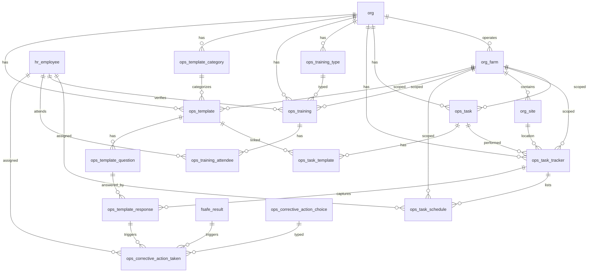

# Operations Schema

Tables for day-to-day operational activity across the organization. Covers task tracking and labor scheduling, staff training, and food safety checklists with corrective actions. These tables represent operational events — things that happened — rather than standing employee or configuration data.

> **Standard audit fields:** Every table includes `created_at` (TIMESTAMPTZ, default now), `created_by` (TEXT), `updated_at` (TIMESTAMPTZ, default now), `updated_by` (TEXT), and `is_deleted` (BOOLEAN, default false). These are omitted from the column listings below for brevity.

## Entity Relationship Diagram

---

## Table Overview

| Table | Purpose |
|-------|---------|
| ops_task | Flat task catalog for labor tracking. Defines all tasks employees can perform at the org or farm level. |
| ops_task_tracker | Header record for a task event. Captures the task, farm, site, date, start/stop times, and verification status. |
| ops_task_schedule | Lists the employees scheduled for a task event with individual start/stop times and units completed. |
| **ops_weekly_schedule** (view) | **Pivoted weekly schedule. One row per employee per task per week with Sun–Sat time columns, total hours, and OT threshold flag.** |
| ops_training_type | Org-specific training type lookup (e.g. GMP, Food Safety, HACCP). TEXT PK derived from name. |
| ops_training | Staff training session records. Each row is one training event covering a specific topic for a group of employees. |
| ops_training_attendee | Individual attendance and certification records for each employee per training session. One row per employee per training. |
| ops_template_category | Org-defined categories for grouping checklist templates by module or purpose. |
| ops_template | Master checklist template definition. Defines the checklist name, category, and farm scope. |
| ops_task_template | Many-to-many link between tasks and templates. When a user creates an activity, the app loads all templates linked to that task. |
| ops_corrective_action_choice | Org-defined reusable corrective action options available for dropdown selection when logging a corrective action. |
| ops_template_question | Questions within a checklist template. Ordered by display_order; each question has a response type (boolean, numeric, enum). |
| ops_template_response | Employee responses to checklist questions. One row per question per task tracker session. |
| ops_corrective_action_taken | Corrective actions raised against a failing checklist response or EMP test result. Tracks assignment, due date, and resolution. |

---

## ops_task

Flat task catalog for labor tracking. Tasks can be org-wide or scoped to a specific farm.

| Column      | Type         | Constraints                     | Description                              |
|------------|--------------|--------------------------------|------------------------------------------|
| id         | TEXT         | PK                             | Human-readable identifier derived from task name (lowercase trimmed) |
| org_id     | TEXT         | NOT NULL, FK → org(id)         | Owning organization for RLS filtering    |
| farm_id    | TEXT         | FK → org_farm(id), nullable        | Optional farm scope; NULL if task applies to all farms |
| name       | TEXT         | NOT NULL                       | |
| description| TEXT         | nullable                       | |

Unique constraint on `(org_id, name)`.

---

## ops_task_tracker

Header record for a task event. One record per task session — captures what task was done, where, when, and its verification status. `site_id` links each task event to a single site directly.

| Column             | Type         | Constraints                        | Description                              |
|-------------------|--------------|-----------------------------------|------------------------------------------|
| id                | UUID         | PK, auto-generated                | |
| org_id            | TEXT         | NOT NULL, FK → org(id)            | |
| farm_id           | TEXT         | FK → org_farm(id), nullable           | |
| site_id           | TEXT         | FK → org_site(id), nullable           | |
| ops_task_id       | TEXT         | NOT NULL, FK → ops_task(id)       | |
| start_time        | TIMESTAMPTZ  | NOT NULL                          | |
| stop_time         | TIMESTAMPTZ  | nullable                          | |
| status            | TEXT         | NOT NULL, default pending, CHECK  | pending, completed |
| notes             | TEXT         | nullable                          | |
| verified_at       | TIMESTAMPTZ  | nullable                          | |
| verified_by       | TEXT         | FK → hr_employee(id), nullable    | |

---

## ops_task_schedule

Employee task assignments for both planning and execution. When `ops_task_tracker_id` is null, the row is a planned schedule entry. When set, it is an executed activity. `ops_task_id` is always set — derived from the tracker when linked, or selected by the user for planned entries.

| Column                 | Type         | Constraints                               | Description                              |
|-----------------------|--------------|------------------------------------------|------------------------------------------|
| id                    | UUID         | PK, auto-generated                       | Unique identifier for the schedule entry |
| org_id                | TEXT         | NOT NULL, FK → org(id)                   | |
| farm_id               | TEXT         | FK → org_farm(id), nullable              | |
| ops_task_id           | TEXT         | NOT NULL, FK → ops_task(id)              | Always set; derived from tracker when linked, user-selected for planned entries |
| ops_task_tracker_id   | UUID         | FK → ops_task_tracker(id), nullable      | Null for planned entries; set when the task is actually executed |
| hr_employee_id        | TEXT         | NOT NULL, FK → hr_employee(id)           | |
| start_time            | TIMESTAMPTZ  | NOT NULL                                 | Planned or actual start time |
| stop_time             | TIMESTAMPTZ  | nullable                                 | Planned or actual stop time |

Partial unique indexes: `(ops_task_tracker_id, hr_employee_id)` for executed entries; `(ops_task_id, hr_employee_id, start_time)` for planned entries.

---

## ops_weekly_schedule (view)

Pivoted weekly schedule view. One row per employee per task per week. Day columns are formatted as `HH:MM - HH:MM` strings from the schedule start/stop times. Null when the employee did not work that day. Only completed schedule entries (with a `stop_time`) contribute to `total_hours`.

| Column                  | Type         | Description                                                                 |
|-----------------------|--------------|-----------------------------------------------------------------------------|
| week_start_date         | DATE         | Sunday of the scheduled week                                                |
| full_name               | TEXT         | Employee first and last name                                                |
| hr_employee_id          | TEXT         | Employee identifier                                                         |
| org_id                  | TEXT         | Organization                                                                |
| hr_department_id        | TEXT         | Employee department identifier                                              |
| hr_work_authorization_id| TEXT         | Employee work authorization identifier                                      |
| task                    | TEXT         | Task name from ops_task catalog                                             |
| sunday                  | TEXT         | Formatted time range for Sunday, or null                                    |
| monday                  | TEXT         | Formatted time range for Monday, or null                                    |
| tuesday                 | TEXT         | Formatted time range for Tuesday, or null                                   |
| wednesday               | TEXT         | Formatted time range for Wednesday, or null                                 |
| thursday                | TEXT         | Formatted time range for Thursday, or null                                  |
| friday                  | TEXT         | Formatted time range for Friday, or null                                    |
| saturday                | TEXT         | Formatted time range for Saturday, or null                                  |
| total_hours             | NUMERIC      | Total hours worked for the week (sum of completed schedule entries)         |
| ot_threshold_weekly     | NUMERIC      | Weekly OT threshold derived from `hr_employee.overtime_threshold / 2`; null if not set |
| is_over_ot_threshold    | BOOLEAN      | True when `total_hours > ot_threshold_weekly`; false if threshold not set   |

---

## ops_training_type

Org-specific training types used to classify training sessions. Each org defines its own set of types.

| Column      | Type         | Constraints                     | Description                              |
|------------|--------------|--------------------------------|------------------------------------------|
| id         | TEXT         | PK                             | Human-readable identifier derived from name (trimmed lowercase, e.g. gmp, food_safety, haccp) |
| org_id     | TEXT         | NOT NULL, FK → org(id)         | Owning organization for RLS filtering    |
| name       | TEXT         | NOT NULL                       | |
| description| TEXT         | nullable                       | |

Unique constraint on `(org_id, name)`.

---

## ops_training

Staff training session records. Each row is one training event covering a specific topic for a group of employees.

| Column                  | Type         | Constraints                              | Description                              |
|------------------------|--------------|------------------------------------------|------------------------------------------|
| id                     | UUID         | PK, auto-generated                       | Unique identifier for the training session |
| org_id                 | TEXT         | NOT NULL, FK → org(id)                   | Owning organization for RLS filtering    |
| farm_id                | TEXT         | FK → org_farm(id), nullable                  | Optional farm scope; null if training applies across the org |
| ops_training_type_id   | TEXT         | FK → ops_training_type(id), nullable     | Training type from the org lookup; references ops_training_type |
| training_date          | DATE         | nullable                                 | Date the training was conducted          |
| topics_covered         | JSONB        | NOT NULL, default '[]'                   | JSON array of topic strings covered during the training session |
| trainer_names          | JSONB        | NOT NULL, default '[]'                   | JSON array of trainer names; may include external trainers or internal employee names |
| materials_url          | TEXT         | nullable                                 | URL or path to the training materials or presentation used |
| notes                  | TEXT         | nullable                                 | |
| verified_at            | TIMESTAMPTZ  | nullable                                 | Timestamp when the training session was verified |
| verified_by            | TEXT         | FK → hr_employee(id), nullable           | Employee who verified the training session record |

---

## ops_training_attendee

Individual attendance and certification records for each employee per training session. One row per employee per training.

| Column                   | Type         | Constraints                           | Description                              |
|-------------------------|--------------|---------------------------------------|------------------------------------------|
| id                      | UUID         | PK, auto-generated                    | Unique identifier for the attendee record |
| org_id                  | TEXT         | NOT NULL, FK → org(id)                | Owning organization for RLS filtering    |
| farm_id                 | TEXT         | FK → org_farm(id), nullable               | Optional farm scope; inherited from parent ops_training |
| ops_training_id         | UUID         | NOT NULL, FK → ops_training(id)       | Training session this attendance record belongs to |
| hr_employee_id          | TEXT         | NOT NULL, FK → hr_employee(id)        | Employee who attended the training; row is created only when attendance is confirmed |
| signed_at               | TIMESTAMPTZ  | nullable                              | Timestamp when the employee signed the training attendance record |
| certification_number    | TEXT         | nullable                              | Certification number issued to the employee upon completion |
| certification_issued_on | DATE         | nullable                              | Date the certification was issued to the employee |
| certification_expires_on| DATE         | nullable                              | Date the employee certification expires |
| certificate_url         | TEXT         | nullable                              | URL or path to the issued certificate document |
| notes                   | TEXT         | nullable                              | |

Unique constraint on `(ops_training_id, hr_employee_id)`.

---

## ops_template_category

Org-defined categories for grouping checklist templates by module or purpose. Users create categories like Pre-Op, Post-Op, or House Inspection and assign them to templates.

| Column      | Type         | Constraints                     | Description                              |
|------------|--------------|--------------------------------|------------------------------------------|
| id         | TEXT         | PK                             | Human-readable identifier derived from name (trimmed lowercase) |
| org_id     | TEXT         | NOT NULL, FK → org(id)         | Owning organization for RLS filtering    |
| name       | TEXT         | NOT NULL                       | |
| description| TEXT         | nullable                       | |

Unique constraint on `(org_id, name)`.

---

## ops_template

Master checklist template. Defines the checklist and the questions employees answer during a task event.

| Column                    | Type         | Constraints                                   | Description                              |
|--------------------------|--------------|----------------------------------------------|------------------------------------------|
| id                       | TEXT         | PK                                           | Human-readable identifier derived from name (trimmed lowercase) |
| org_id                   | TEXT         | NOT NULL, FK → org(id)                       | Owning organization for RLS filtering    |
| farm_id                  | TEXT         | FK → org_farm(id), nullable                      | Optional farm scope; null if the template applies to all farms |
| name                     | TEXT         | NOT NULL                                     | |
| ops_template_category_id | TEXT         | FK → ops_template_category(id), nullable     | Category grouping this template by module or purpose; FK to org-defined ops_template_category lookup |
| description              | TEXT         | nullable                                     | |
| display_order            | INTEGER      | NOT NULL, default 0                          | |
| atp_site_count           | INTEGER      | nullable                                     | Number of sites to randomly select for ATP testing; null means no ATP testing for this template |
| numeric_minimum_rlu_value| NUMERIC      | nullable                                     | Minimum acceptable RLU value for ATP tests on this template; results below this are a fail |
| numeric_maximum_rlu_value| NUMERIC      | nullable                                     | Maximum acceptable RLU value for ATP tests on this template; results above this are a fail |

Unique constraint on `(org_id, name)`.

---

## ops_task_template

Many-to-many link between tasks and checklist templates. When a user creates an activity for a task, the app loads all templates linked to that task. Templates without a task link are standalone.

| Column | Type | Constraints | Description |
|--------|------|-------------|-------------|
| id | UUID | PK, default gen_random_uuid() | |
| org_id | TEXT | NOT NULL, FK → org(id) | |
| farm_id | TEXT | FK → org_farm(id), nullable | |
| ops_task_id | TEXT | NOT NULL, FK → ops_task(id) | |
| ops_template_id | TEXT | NOT NULL, FK → ops_template(id) | |

Unique constraint on `(ops_task_id, ops_template_id)`.

---

## ops_corrective_action_choice

Org-defined reusable corrective action options available for selection when logging a corrective action. Users pick from this dropdown; if the action isn't listed they provide a custom description instead.

| Column      | Type         | Constraints                     | Description                              |
|------------|--------------|--------------------------------|------------------------------------------|
| id         | TEXT         | PK                             | Human-readable identifier derived from name (trimmed lowercase) |
| org_id     | TEXT         | NOT NULL, FK → org(id)         | Owning organization for RLS filtering    |
| name       | TEXT         | NOT NULL                       | |
| description| TEXT         | nullable                       | |

Unique constraint on `(org_id, name)`.

---

## ops_template_question

Questions within a checklist template. Ordered by `display_order` within each template.

| Column                              | Type         | Constraints                           | Description                              |
|------------------------------------|--------------|---------------------------------------|------------------------------------------|
| id                                 | UUID         | PK, auto-generated                    | Unique identifier for the question       |
| org_id                             | TEXT         | NOT NULL, FK → org(id)                | Owning organization for RLS filtering    |
| farm_id                            | TEXT         | FK → org_farm(id), nullable               | Optional farm scope; null if the question applies to all farms |
| ops_template_id                    | TEXT         | NOT NULL, FK → ops_template(id)       | Checklist template this question belongs to |
| display_order                      | INTEGER      | NOT NULL, default 0                   | |
| question_text                      | TEXT         | NOT NULL                              | The question or checklist item text shown to the employee |
| response_type                      | TEXT         | NOT NULL, CHECK                       | boolean, numeric, enum |
| is_required                        | BOOLEAN      | NOT NULL, default true                | |
| boolean_pass_value                 | BOOLEAN      | nullable                              | The boolean value that constitutes a pass |
| numeric_minimum_value              | NUMERIC      | nullable                              | |
| numeric_maximum_value              | NUMERIC      | nullable                              | |
| enum_options                       | JSONB        | nullable                              | JSON array of available options when response_type is enum |
| enum_pass_options                  | JSONB        | nullable                              | JSON array of enum values that constitute a pass |
| warning_message                    | TEXT         | nullable                              | |
| ops_corrective_action_choice_ids   | JSONB        | nullable                              | JSON array of suggested corrective action choice IDs when this question fails |

---

## ops_template_response

Employee responses to checklist questions. One row per question per task tracker session. The linked `ops_task_tracker` record acts as the header (who completed the checklist, when, and at which site).

| Column                | Type         | Constraints                               | Description                              |
|----------------------|--------------|------------------------------------------|------------------------------------------|
| id                   | UUID         | PK, auto-generated                       | Unique identifier for the response       |
| org_id               | TEXT         | NOT NULL, FK → org(id)                   | Owning organization for RLS filtering    |
| farm_id              | TEXT         | FK → org_farm(id), nullable                  | Optional farm scope; null if the response applies to all farms |
| ops_task_tracker_id  | UUID         | NOT NULL, FK → ops_task_tracker(id)      | Task tracker session this response belongs to; acts as the checklist completion header |
| ops_template_id      | TEXT         | NOT NULL, FK → ops_template(id)          | Checklist template this response belongs to; every response — checklist or ATP — belongs to a template |
| ops_template_question_id      | UUID         | FK → ops_template_question(id), nullable          | Null for ATP surface test results |
| site_id              | TEXT         | FK → org_site(id), nullable                  | Null for standard checklist responses |
| response_boolean     | BOOLEAN      | nullable                                 | |
| response_numeric     | NUMERIC      | nullable                                 | |
| response_enum        | TEXT         | nullable                                 | |
| response_text        | TEXT         | nullable                                 | Free-text notes or observations for this response |

Partial unique indexes: checklist responses are unique per `(ops_task_tracker_id, ops_template_question_id)` where `ops_template_question_id IS NOT NULL`; ATP results are unique per `(ops_task_tracker_id, site_id)` where `ops_template_question_id IS NULL AND site_id IS NOT NULL`.

---

## ops_corrective_action_taken

Corrective actions raised against a failing checklist response or EMP test result. Tracks the action required, who is responsible, and the resolution status.

| Column                              | Type         | Constraints                                          | Description                              |
|------------------------------------|--------------|-----------------------------------------------------|------------------------------------------|
| id                                 | UUID         | PK, auto-generated                                  | Unique identifier for the corrective action |
| org_id                             | TEXT         | NOT NULL, FK → org(id)                              | Owning organization for RLS filtering    |
| farm_id                            | TEXT         | FK → org_farm(id), nullable                             | Optional farm scope; null if the corrective action applies to all farms |
| ops_template_id                    | TEXT         | FK → ops_template(id), nullable                     | |
| ops_template_response_id                    | UUID         | FK → ops_template_response(id), nullable                     | |
| fsafe_result_id                    | UUID         | FK → fsafe_result(id), nullable                     | |
| ops_corrective_action_choice_id    | TEXT         | FK → ops_corrective_action_choice(id), nullable     | |
| other_action                       | TEXT         | nullable                                            | |
| assigned_to                        | TEXT         | FK → hr_employee(id), nullable                      | |
| due_date                           | DATE         | nullable                                            | |
| completed_on                       | DATE         | nullable                                            | |
| status                             | TEXT         | NOT NULL, default open, CHECK                       | open, completed |

| notes                              | TEXT         | nullable                                            | |
| result_description                 | TEXT         | nullable                                            | |
| verified_at                        | TIMESTAMPTZ  | nullable                                            | |
| verified_by                        | TEXT         | FK → hr_employee(id), nullable                      | |

> `fsafe_result_id` and `ops_template_response_id` are mutually exclusive — exactly one is set per row.
