# Grow Schema

Tables for managing crop varieties, harvest grades, seed mix recipes, and seeding batches. These are farm-scoped tables used across seeding, growing, harvest, and sales modules.

> **Standard audit fields:** Every table includes `created_at` (TIMESTAMPTZ, default now), `created_by` (TEXT), `updated_at` (TIMESTAMPTZ, default now), `updated_by` (TEXT), and `is_deleted` (BOOLEAN, default false). These are omitted from the column listings below for brevity.

## Entity Relationship Diagram

```mermaid
erDiagram
    org ||--o{ org_farm : operates
    org_farm ||--o{ org_site : contains
    org_farm ||--o{ grow_variety : grows
    org_farm ||--o{ grow_grade : grades
    org_farm ||--o{ grow_trial_type : defines
    org_farm ||--o{ grow_seed_mix : recipes
    org_farm ||--o{ grow_harvest_container : defines
    grow_seed_mix ||--o{ grow_seed_mix_item : contains
    invnt_item ||--o{ grow_seed_mix_item : uses
    org_farm ||--o{ grow_seed_batch : seeds
    org_site ||--o{ grow_seed_batch : located
    ops_task_tracker ||--o{ grow_seed_batch : tracks
    grow_trial_type ||--o{ grow_seed_batch : classifies
    grow_seed_mix ||--o{ grow_seed_batch : blends
    invnt_item ||--o{ grow_seed_batch : uses
    ops_task_tracker ||--o{ grow_harvest_weight : weighs
    grow_seed_batch ||--o{ grow_harvest_weight : harvests
    org_site ||--o{ grow_harvest_weight : located
    grow_grade ||--o{ grow_harvest_weight : grades
    grow_harvest_container ||--o{ grow_harvest_weight : uses
    grow_cycle_pattern ||--o{ grow_seed_batch : follows
    org ||--o{ grow_pest : has
    org ||--o{ grow_disease : has
    ops_task_tracker ||--o{ grow_task_seed_batch : covers
    grow_seed_batch ||--o{ grow_task_seed_batch : linked
    ops_task_tracker ||--o{ grow_task_photo : documents
    ops_task_tracker ||--o{ grow_scout_observation : finds
    grow_pest ||--o{ grow_scout_observation : identified
    grow_disease ||--o{ grow_scout_observation : identified
    grow_scout_observation ||--o{ grow_scout_observation_row : affects
    invnt_item ||--o{ grow_spray_compliance : regulated
    ops_task_tracker ||--o{ grow_spray_input : applies
    grow_spray_compliance ||--o{ grow_spray_input : regulates
    ops_task_tracker ||--o{ grow_spray_equipment : uses
    org_equipment ||--o{ grow_spray_equipment : assigned
    org_farm ||--o{ grow_fertigation_recipe : defines
    grow_fertigation_recipe ||--o{ grow_fertigation_recipe_item : contains
    org_equipment ||--o{ grow_fertigation_recipe_item : tank
    invnt_item ||--o{ grow_fertigation_recipe_item : uses
    grow_fertigation_recipe ||--o{ grow_fertigation_recipe_site : feeds
    org_site ||--o{ grow_fertigation_recipe_site : receives
    grow_fertigation_recipe ||--o{ grow_fertigation : applied
    ops_task_tracker ||--o{ grow_fertigation : uses
    org_equipment ||--o{ grow_fertigation : assigned
    org_farm ||--o{ grow_monitoring_metric : defines
    ops_task_tracker ||--o{ grow_monitoring_reading : records
    org_site ||--o{ grow_monitoring_reading : located
    grow_monitoring_metric ||--o{ grow_monitoring_reading : measures
```

---

## Table Overview

| Table | Purpose |
|-------|---------|
| grow_variety | Crop varieties with short codes for quick reference during data entry. Farm-scoped. |
| grow_grade | Harvest quality grades with short codes, applied during harvest and carried through to sales. Farm-scoped. |
| grow_trial_type | Lookup defining types of seeding trials (e.g. new lot, new variety). Farm-scoped. |
| grow_seed_mix | Named seed blend recipes. Items and percentages defined in grow_seed_mix_item. Farm-scoped. |
| grow_seed_mix_item | Individual seed items within a mix recipe with their proportion. |
| grow_seed_batch | Individual seeding batch linked to an ops activity. Either a single seed item or a seed mix, never both. |
| grow_cycle_pattern | Defines growing cycle patterns per farm (e.g. 14-Day Lettuce, 42-Day Cucumber). |
| grow_harvest_container | Container definitions with tare weight, optionally specific to variety and grade. |
| grow_harvest_weight | Individual weigh-in per container type. Links directly to seeding batch for traceability. Tare auto-calculated from container definition. |
| grow_pest | Standardized pest names for scouting observations. Org-scoped. |
| grow_disease | Standardized disease names for scouting observations. Org-scoped. |
| grow_task_seed_batch | Unified join table linking any grow activity to seeding batches. Activity type derived from ops_task_tracker → ops_task_id. |
| grow_task_photo | Unified photo table for any grow activity (scouting, monitoring) with optional caption. Replaces the 2 individual photo tables. |
| grow_scout_observation | Individual pest or disease finding within a scouting event with side and severity. |
| grow_scout_observation_row | Rows affected by a specific observation. One row per affected growing row. |
| grow_spray_compliance | Chemical label registry with REI, PHI, application rates, and regulatory info per product. |
| grow_spray_input | Individual chemical/fertilizer applied per spraying activity with quantity and compliance link. |
| grow_spray_equipment | Equipment used per spraying activity with water UOM and quantity. |
| grow_fertigation_recipe | Reusable fertigation recipe. Can be a fertilizer mix, flush water, or top-up water. |
| grow_fertigation_recipe_item | Items in the recipe with quantities. invnt_item_id nullable for one-off products. |
| grow_fertigation_recipe_site | Sites that receive this recipe (configuration). |
| grow_fertigation | Tanks used per event with volume applied. |
| grow_monitoring_metric | Defines what to measure per farm + site category with UOM, thresholds, and optional formula. |
| grow_monitoring_reading | Individual measurement per monitoring event per point per station. |

---

## grow_variety

Crop varieties grown on a specific farm, each with a short code for quick reference during data entry. Used across seeding, growing, and harvest modules.

| Column | Type | Constraints | Description |
|--------|------|-------------|-------------|
| id | TEXT | PK | Human-readable identifier derived from variety name (lowercase trimmed) |
| org_id | TEXT | NOT NULL, FK → org(id) | |
| farm_id | TEXT | NOT NULL, FK → org_farm(id) | |
| code | TEXT | NOT NULL | Short code for the variety, unique within the farm (e.g. K, J, GR) |
| name | TEXT | NOT NULL | |
| description | TEXT | nullable | |

Unique constraints on `(farm_id, code)` and `(farm_id, name)`.

---

## grow_grade

Harvest quality grades for a specific farm, each with a short code. Applied during harvest logging and carried through to product definition, packing, and sales.

| Column | Type | Constraints | Description |
|--------|------|-------------|-------------|
| id | TEXT | PK | Human-readable identifier derived from grade name (lowercase trimmed) |
| org_id | TEXT | NOT NULL, FK → org(id) | |
| farm_id | TEXT | NOT NULL, FK → org_farm(id) | |
| code | TEXT | NOT NULL | Short code for the grade, unique within the farm (e.g. A, B, C) |
| name | TEXT | NOT NULL | |

Unique constraints on `(farm_id, code)` and `(farm_id, name)`.

---

## grow_trial_type

Lookup table defining types of seeding trials (e.g. new lot, new variety, new seed source). Farm-scoped.

| Column | Type | Constraints | Description |
|--------|------|-------------|-------------|
| id | TEXT | PK | Human-readable identifier derived from name |
| org_id | TEXT | NOT NULL, FK → org(id) | |
| farm_id | TEXT | NOT NULL, FK → org_farm(id) | |
| name | TEXT | NOT NULL | |
| description | TEXT | nullable | |

Unique constraint on `(org_id, farm_id, name)`.

---

## grow_seed_mix

Named seed blend recipes (e.g. Spring Blend, Mixed Version 1). Farm-scoped. Items and percentages are defined in grow_seed_mix_item.

| Column | Type | Constraints | Description |
|--------|------|-------------|-------------|
| id | TEXT | PK | Human-readable identifier derived from mix name |
| org_id | TEXT | NOT NULL, FK → org(id) | |
| farm_id | TEXT | NOT NULL, FK → org_farm(id) | |
| name | TEXT | NOT NULL | |
| description | TEXT | nullable | |

Unique constraint on `(org_id, farm_id, name)`.

---

## grow_seed_mix_item

Individual seed items within a mix recipe with their proportion. Each row defines one seed and its percentage in the blend.

| Column | Type | Constraints | Description |
|--------|------|-------------|-------------|
| id | UUID | PK, default gen_random_uuid() | |
| org_id | TEXT | NOT NULL, FK → org(id) | |
| farm_id | TEXT | NOT NULL, FK → org_farm(id) | |
| grow_seed_mix_id | TEXT | NOT NULL, FK → grow_seed_mix(id) | |
| invnt_item_id | TEXT | NOT NULL, FK → invnt_item(id) | |
| lot_number | TEXT | nullable | Supplier seed lot number for traceability |
| percentage | NUMERIC | NOT NULL | Proportion in the mix (e.g. 0.6 for 60%) |

Unique constraint on `(grow_seed_mix_id, invnt_item_id)`.

---

## grow_seed_batch

Individual seeding batch linked to an ops activity. Either a single seed item or a seed mix, never both — enforced by a CHECK constraint.

| Column | Type | Constraints | Description |
|--------|------|-------------|-------------|
| id | UUID | PK, default gen_random_uuid() | |
| org_id | TEXT | NOT NULL, FK → org(id) | |
| farm_id | TEXT | NOT NULL, FK → org_farm(id) | |
| site_id | TEXT | FK → org_site(id), nullable | Growing site where this batch was seeded |
| ops_task_tracker_id | UUID | FK → ops_task_tracker(id), nullable | |
| batch_code | TEXT | NOT NULL | System-generated traceability code that carries through to transplanting and harvest; editable by user |
| grow_cycle_pattern_id | TEXT | FK → grow_cycle_pattern(id), nullable | Classifies this batch by its growth cycle |
| grow_trial_type_id | TEXT | FK → grow_trial_type(id), nullable | Null if not a trial |
| grow_seed_mix_id | TEXT | FK → grow_seed_mix(id), nullable | Set if seeding a mix; null for single variety |
| invnt_item_id | TEXT | FK → invnt_item(id), nullable | Set if seeding a single variety; null for mixes |
| lot_number | TEXT | nullable | Supplier seed lot number for single-variety batches; populated from frontend dropdown |
| seeding_uom | TEXT | NOT NULL, FK → sys_uom(code) | Unit used for seeding (e.g. board, flat, tray) |
| number_of_units | INTEGER | NOT NULL | |
| seeds_per_unit | INTEGER | NOT NULL | |
| number_of_rows | INTEGER | NOT NULL | |
| seeding_date | DATE | NOT NULL | |
| transplant_date | DATE | NOT NULL | |
| estimated_harvest_date | DATE | NOT NULL | |
| status | TEXT | NOT NULL, default 'planned', CHECK | Lifecycle status: planned, seeded, transplanted, harvesting, harvested |
| notes | TEXT | nullable | |

Unique constraint on `(org_id, batch_code)`.

CHECK constraint: exactly one of `invnt_item_id` or `grow_seed_mix_id` must be set.

---

## grow_cycle_pattern

Defines growing cycle patterns per farm (e.g. 14-Day Lettuce, 42-Day Cucumber). Used to classify seeding batches by their growth cycle.

| Column | Type | Constraints | Description |
|--------|------|-------------|-------------|
| id | TEXT | PK | |
| org_id | TEXT | NOT NULL, FK → org(id) | |
| farm_id | TEXT | NOT NULL, FK → org_farm(id) | |
| name | TEXT | NOT NULL | |
| description | TEXT | nullable | |

Unique constraint on `(org_id, farm_id, name)`.

---

## grow_harvest_container

Harvest container definitions with tare weight per container type, optionally specific to variety and grade. Used to auto-calculate tare during weigh-ins.

| Column | Type | Constraints | Description |
|--------|------|-------------|-------------|
| id | TEXT | PK | |
| org_id | TEXT | NOT NULL, FK → org(id) | |
| farm_id | TEXT | NOT NULL, FK → org_farm(id) | |
| name | TEXT | NOT NULL | |
| grow_variety_id | TEXT | FK → grow_variety(id), nullable | Null means this tare applies to any variety |
| grow_grade_id | TEXT | FK → grow_grade(id), nullable | Null means this tare applies to any grade |
| weight_uom | TEXT | NOT NULL, FK → sys_uom(code) | Unit for tare weight (e.g. lb, kg) |
| tare_weight | NUMERIC | NOT NULL | Weight of one empty container in the specified weight_uom |

Unique constraint on `(org_id, farm_id, name, grow_variety_id, grow_grade_id)`.

---

## grow_harvest_weight

Individual weigh-in for a harvest. One row per container type weighed. Links directly to the seeding batch for traceability. Tare is calculated on the fly from grow_harvest_container.tare_weight × number_of_containers.

| Column | Type | Constraints | Description |
|--------|------|-------------|-------------|
| id | UUID | PK, default gen_random_uuid() | |
| org_id | TEXT | NOT NULL, FK → org(id) | |
| farm_id | TEXT | NOT NULL, FK → org_farm(id) | |
| site_id | TEXT | FK → org_site(id), nullable | |
| ops_task_tracker_id | UUID | FK → ops_task_tracker(id), nullable | |
| grow_seed_batch_id | UUID | NOT NULL, FK → grow_seed_batch(id) | |
| grow_grade_id | TEXT | FK → grow_grade(id), nullable | |
| harvest_date | DATE | NOT NULL | |
| grow_harvest_container_id | TEXT | NOT NULL, FK → grow_harvest_container(id) | |
| number_of_containers | INTEGER | NOT NULL | |
| weight_uom | TEXT | NOT NULL, FK → sys_uom(code) | |
| gross_weight | NUMERIC | NOT NULL | |
| net_weight | NUMERIC | NOT NULL | gross_weight minus calculated tare (grow_harvest_container.tare_weight × number_of_containers) |

---

## grow_pest

Standardized pest names for scouting observations. Org-scoped.

| Column | Type | Constraints | Description |
|--------|------|-------------|-------------|
| id | TEXT | PK | |
| org_id | TEXT | NOT NULL, FK → org(id) | |
| name | TEXT | NOT NULL | |
| description | TEXT | nullable | |

Unique constraint on `(org_id, name)`.

---

## grow_disease

Standardized disease names for scouting observations. Org-scoped.

| Column | Type | Constraints | Description |
|--------|------|-------------|-------------|
| id | TEXT | PK | |
| org_id | TEXT | NOT NULL, FK → org(id) | |
| name | TEXT | NOT NULL | |
| description | TEXT | nullable | |

Unique constraint on `(org_id, name)`.

---

## grow_task_seed_batch

Unified join table linking any grow activity (scouting, spraying, fertigation, monitoring) to one or more seeding batches. Activity type is derived from `ops_task_tracker` → `ops_task_id`.

| Column | Type | Constraints | Description |
|--------|------|-------------|-------------|
| id | UUID | PK, default gen_random_uuid() | |
| org_id | TEXT | NOT NULL, FK → org(id) | |
| farm_id | TEXT | NOT NULL, FK → org_farm(id) | |
| ops_task_tracker_id | UUID | NOT NULL, FK → ops_task_tracker(id) | |
| grow_seed_batch_id | UUID | NOT NULL, FK → grow_seed_batch(id) | |

Unique constraint on `(ops_task_tracker_id, grow_seed_batch_id)`.

---

## grow_scout_observation

Individual pest or disease finding within a scouting event. Either a pest or disease, enforced by CHECK constraint.

| Column | Type | Constraints | Description |
|--------|------|-------------|-------------|
| id | UUID | PK, default gen_random_uuid() | |
| org_id | TEXT | NOT NULL, FK → org(id) | |
| farm_id | TEXT | NOT NULL, FK → org_farm(id) | |
| ops_task_tracker_id | UUID | NOT NULL, FK → ops_task_tracker(id) | |
| observation_type | TEXT | NOT NULL, CHECK | Type of finding: pest or disease |
| grow_pest_id | TEXT | FK → grow_pest(id), nullable | Set if observation_type = pest |
| grow_disease_id | TEXT | FK → grow_disease(id), nullable | Set if observation_type = disease |
| severity_level | TEXT | NOT NULL, CHECK | Severity: low, moderate, high, severe |
| disease_infection_stage | TEXT | nullable, CHECK | Stage of infection for disease observations: early, mid, late, advanced; null for pest observations |
| notes | TEXT | nullable | |

CHECK constraint: `observation_type = pest` requires `grow_pest_id` set and `grow_disease_id` null, and vice versa.

---

## grow_scout_observation_row

Rows affected by a specific scouting observation. One row per affected growing row per observation.

| Column | Type | Constraints | Description |
|--------|------|-------------|-------------|
| id | UUID | PK, default gen_random_uuid() | |
| org_id | TEXT | NOT NULL, FK → org(id) | |
| farm_id | TEXT | NOT NULL, FK → org_farm(id) | |
| grow_scout_observation_id | UUID | NOT NULL, FK → grow_scout_observation(id) | |
| row_number | INTEGER | NOT NULL | |

Unique constraint on `(grow_scout_observation_id, row_number)`.

---

## grow_task_photo

Unified photo table for any grow activity (scouting, monitoring). One row per photo with optional caption. Replaces the 2 individual tables: `grow_scout_photo` and `grow_monitoring_photo`.

| Column | Type | Constraints | Description |
|--------|------|-------------|-------------|
| id | UUID | PK, default gen_random_uuid() | |
| org_id | TEXT | NOT NULL, FK → org(id) | |
| farm_id | TEXT | NOT NULL, FK → org_farm(id) | |
| ops_task_tracker_id | UUID | NOT NULL, FK → ops_task_tracker(id) | |
| photo_url | TEXT | NOT NULL | |
| caption | TEXT | nullable | |

---

## grow_spray_compliance

Chemical label registry storing regulatory information per product. Multiple records per item are allowed to maintain compliance history — the current record is determined by effective/expiration date range.

| Column | Type | Constraints | Description |
|--------|------|-------------|-------------|
| id | UUID | PK, default gen_random_uuid() | |
| org_id | TEXT | NOT NULL, FK → org(id) | |
| farm_id | TEXT | NOT NULL, FK → org_farm(id) | |
| invnt_item_id | TEXT | NOT NULL, FK → invnt_item(id) | |
| epa_registration | TEXT | NOT NULL | EPA registration number for the chemical product |
| phi_days | INTEGER | NOT NULL | Pre-Harvest Interval in days — minimum days between last application and harvest |
| rei_hours | INTEGER | NOT NULL | Restricted Entry Interval in hours — minimum hours before workers can re-enter treated area |
| application_method | JSONB | NOT NULL, default [] | JSON array of application methods (e.g. ["spray", "drench", "granular"]) |
| target_pest_disease | JSONB | NOT NULL, default [] | JSON array of pests and diseases this product is intended to treat |
| application_uom | TEXT | NOT NULL, FK → sys_uom(code) | Unit of measure for the application rate |
| maximum_quantity_per_acre | NUMERIC | NOT NULL | Maximum label rate per acre per application |
| burn_uom | TEXT | NOT NULL, FK → sys_uom(code) | Smallest consumption unit for this product |
| application_per_burn | NUMERIC | NOT NULL | Application rate expressed in burn units |
| label_date | DATE | NOT NULL | |
| effective_date | DATE | NOT NULL | Date this compliance record becomes effective |
| expiration_date | DATE | nullable | Date this compliance record expires and must be reviewed |
| external_label_url | TEXT | NOT NULL | |

---

## grow_spray_input

Individual chemical or fertilizer applied during a spraying activity. One row per input product. Links to compliance record for PHI/REI lookup.

| Column | Type | Constraints | Description |
|--------|------|-------------|-------------|
| id | UUID | PK, default gen_random_uuid() | |
| org_id | TEXT | NOT NULL, FK → org(id) | |
| farm_id | TEXT | NOT NULL, FK → org_farm(id) | |
| ops_task_tracker_id | UUID | NOT NULL, FK → ops_task_tracker(id) | |
| grow_spray_compliance_id | UUID | NOT NULL, FK → grow_spray_compliance(id) | Compliance record — source of truth; invnt_item_id is pre-filled from this record |
| invnt_item_id | TEXT | NOT NULL, FK → invnt_item(id) | Pre-filled from the compliance record for convenience; not independently selected |
| target_pest_disease | JSONB | NOT NULL, default [] | Specific pest or disease being targeted with this input |
| application_uom | TEXT | NOT NULL, FK → sys_uom(code) | |
| application_quantity | NUMERIC | NOT NULL | |

---

## grow_spray_equipment

Equipment used during a spraying activity with the water quantity per piece of equipment.

| Column | Type | Constraints | Description |
|--------|------|-------------|-------------|
| id | UUID | PK, default gen_random_uuid() | |
| org_id | TEXT | NOT NULL, FK → org(id) | |
| farm_id | TEXT | NOT NULL, FK → org_farm(id) | |
| ops_task_tracker_id | UUID | NOT NULL, FK → ops_task_tracker(id) | |
| equipment_id | TEXT | NOT NULL, FK → org_equipment(id) | |
| water_uom | TEXT | NOT NULL, FK → sys_uom(code) | Unit for water quantity (e.g. gallons, liters) |
| water_quantity | NUMERIC | NOT NULL | |

Unique constraint on `(ops_task_tracker_id, equipment_id)`.

---

## grow_fertigation_recipe

Reusable fertigation recipe. Can be a fertilizer mix, flush water, or top-up water — each is a separate recipe. Items are defined in grow_fertigation_recipe_item. Sites are linked via grow_fertigation_recipe_site.

| Column | Type | Constraints | Description |
|--------|------|-------------|-------------|
| id | TEXT | PK | |
| org_id | TEXT | NOT NULL, FK → org(id) | |
| farm_id | TEXT | NOT NULL, FK → org_farm(id) | |
| name | TEXT | NOT NULL | |
| description | TEXT | nullable | |

Unique constraint on `(org_id, farm_id, name)`.

---

## grow_fertigation_recipe_item

Individual fertilizer items within a recipe. invnt_item_id is nullable for products not stored in-house; item_name is always set for display.

| Column | Type | Constraints | Description |
|--------|------|-------------|-------------|
| id | UUID | PK, default gen_random_uuid() | |
| org_id | TEXT | NOT NULL, FK → org(id) | |
| farm_id | TEXT | NOT NULL, FK → org_farm(id) | |
| grow_fertigation_recipe_id | TEXT | NOT NULL, FK → grow_fertigation_recipe(id) | |
| equipment_id | TEXT | NOT NULL, FK → org_equipment(id) | Tank this fertilizer goes into |
| invnt_item_id | TEXT | FK → invnt_item(id), nullable | Null for one-off fertilizers not tracked in inventory |
| item_name | TEXT | NOT NULL | Display name; auto-filled from invnt_item if linked, manually entered otherwise |
| application_uom | TEXT | NOT NULL, FK → sys_uom(code) | |
| application_quantity | NUMERIC | NOT NULL | |
| burn_uom | TEXT | FK → sys_uom(code), nullable | |
| application_per_burn | NUMERIC | nullable | |
| notes | TEXT | nullable | |

---

## grow_fertigation_recipe_site

Sites that receive this fertigation recipe. Used to pre-fill site selection and look up active seedings during a fertigation event.

| Column | Type | Constraints | Description |
|--------|------|-------------|-------------|
| id | UUID | PK, default gen_random_uuid() | |
| org_id | TEXT | NOT NULL, FK → org(id) | |
| farm_id | TEXT | NOT NULL, FK → org_farm(id) | |
| grow_fertigation_recipe_id | TEXT | NOT NULL, FK → grow_fertigation_recipe(id) | |
| site_id | TEXT | NOT NULL, FK → org_site(id) | |

Unique constraint on `(grow_fertigation_recipe_id, site_id)`.

---

## grow_fertigation

Tanks used during a fertigation event with the volume applied per tank.

| Column | Type | Constraints | Description |
|--------|------|-------------|-------------|
| id | UUID | PK, default gen_random_uuid() | |
| org_id | TEXT | NOT NULL, FK → org(id) | |
| farm_id | TEXT | NOT NULL, FK → org_farm(id) | |
| ops_task_tracker_id | UUID | NOT NULL, FK → ops_task_tracker(id) | |
| grow_fertigation_recipe_id | TEXT | NOT NULL, FK → grow_fertigation_recipe(id) | Recipe applied in this fertigation event |
| equipment_id | TEXT | NOT NULL, FK → org_equipment(id) | |
| volume_uom | TEXT | NOT NULL, FK → sys_uom(code) | Unit for volume applied (e.g. gallons, liters) |
| volume_applied | NUMERIC | NOT NULL | |

Unique constraint on `(ops_task_tracker_id, equipment_id)`.

---

## grow_monitoring_metric

Defines what to measure per farm and site category. Direct points are entered manually; calculated points are derived from other points using a formula.

| Column | Type | Constraints | Description |
|--------|------|-------------|-------------|
| id | TEXT | PK | |
| org_id | TEXT | NOT NULL, FK → org(id) | |
| farm_id | TEXT | NOT NULL, FK → org_farm(id) | |
| site_category | TEXT | NOT NULL | Matches org_site.category to scope which points apply (e.g. greenhouse, nursery, pond) |
| name | TEXT | NOT NULL | |
| description | TEXT | nullable | |
| uom | TEXT | FK → sys_uom(code), nullable | |
| minimum_value | NUMERIC | nullable | Below this value the reading is flagged as out of range |
| maximum_value | NUMERIC | nullable | Above this value the reading is flagged as out of range |
| display_order | INTEGER | NOT NULL, default 0 | |
| response_type | TEXT | NOT NULL, default 'numeric', CHECK | How the reading is captured: numeric (number input), boolean (yes/no toggle), text (free text) |
| point_type | TEXT | NOT NULL, default 'direct', CHECK | direct = manually entered; calculated = derived from formula |
| formula | TEXT | nullable | Expression string for calculated points (e.g. (drain_ml / (drip_ml * dripper) * 100)); null for direct points |
| input_point_ids | JSONB | nullable | JSON array of grow_monitoring_metric IDs that feed into this calculation; null for direct points |
| corrective_actions | JSONB | NOT NULL, default [] | JSON array of available corrective action options for out-of-range readings (e.g. ["Adjust pH", "Add nutrients", "Flush lines"]) |

Unique constraint on `(org_id, farm_id, site_category, name)`.

---

## grow_monitoring_reading

Individual measurement recorded during a monitoring event. One row per point per station. Calculated points store the computed result for historical record.

| Column | Type | Constraints | Description |
|--------|------|-------------|-------------|
| id | UUID | PK, default gen_random_uuid() | |
| org_id | TEXT | NOT NULL, FK → org(id) | |
| farm_id | TEXT | NOT NULL, FK → org_farm(id) | |
| site_id | TEXT | NOT NULL, FK → org_site(id) | |
| ops_task_tracker_id | UUID | NOT NULL, FK → ops_task_tracker(id) | |
| grow_monitoring_metric_id | TEXT | NOT NULL, FK → grow_monitoring_metric(id) | |
| monitoring_station | TEXT | nullable | Selected from org_site.monitoring_stations JSONB dropdown |
| reading | NUMERIC | nullable | |
| reading_boolean | BOOLEAN | nullable | Used when point response_type is boolean |
| reading_text | TEXT | nullable | Used when point response_type is text |
| is_out_of_range | BOOLEAN | NOT NULL, default false | Auto-set by comparing reading against grow_monitoring_metric.minimum_value and maximum_value |
| corrective_action | TEXT | nullable | Selected from grow_monitoring_metric.corrective_actions when reading is out of range |
| notes | TEXT | nullable | |

Unique constraint on `(ops_task_tracker_id, grow_monitoring_metric_id, monitoring_station)`.

---

