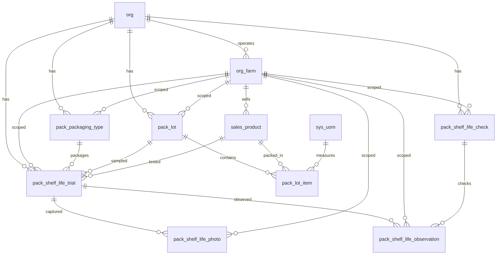

# Pack Schema

Tables for tracking production lots of packed products and shelf life trials. A lot header captures the lot number and pack date, while line items record each product packed within that lot with its best-by date and quantity. Lot numbers are system-generated from the pack date and shared across all products packed on the same day.

Shelf life trials test how long a product remains viable. Each trial links to a product and optionally a lot and packaging type. Observations are recorded per check per date, with typed responses and automatic termination criteria.

> **Standard audit fields:** Every table includes `created_at` (TIMESTAMPTZ, default now), `created_by` (TEXT), `updated_at` (TIMESTAMPTZ, default now), `updated_by` (TEXT), and `is_deleted` (BOOLEAN, default false). These are omitted from the column listings below for brevity.

## Entity Relationship Diagram

---

## Table Overview

| Table | Purpose |
|-------|---------|
| pack_lot | Production lot header. One row per lot. Lot numbers are system-generated from the pack date but can be overridden by the user. |
| pack_lot_item | Individual products packed within a lot. One row per product per lot. |
| pack_packaging_type | Org-defined packaging type lookup (e.g. clamshell, bag, sleeve, tray wrap). Referenced by both sales_product and pack_shelf_life_trial. |
| pack_shelf_life_check | Defines what gets checked during a shelf life trial observation (e.g. color, texture, moisture, physical damage). |
| pack_shelf_life_trial | Shelf life trial header. Tracks the product, lot, packaging type, target shelf life, and trial outcome. |
| pack_shelf_life_observation | Individual observation responses for a shelf life trial. One row per check per observation date per trial. |
| pack_shelf_life_photo | Photos taken during a shelf life trial observation. Multiple photos per observation date per trial. |

---

## pack_lot

Production lot header. One row per lot. Lot numbers are system-generated from the pack date but can be overridden by the user. The same lot number is shared across all products packed on the same day.

| Column | Type | Constraints | Description |
|--------|------|-------------|-------------|
| id | UUID | PK, auto-generated | Unique identifier for the pack lot |
| org_id | TEXT | NOT NULL, FK → org(id) | Owning organization for RLS filtering |
| farm_id | TEXT | NOT NULL, FK → org_farm(id) | Farm (crop line) this pack lot belongs to |
| lot_number | TEXT | NOT NULL | Lot identifier, system-generated from pack date but editable by the user; unique per org |
| harvest_date | DATE | nullable | Date the product in this lot was harvested; null if not applicable or unknown |
| pack_date | DATE | NOT NULL | Date the products in this lot were packed |

Unique constraint on `(org_id, lot_number)` — one lot per lot number per org.

---

## pack_lot_item

Individual products packed within a lot. One row per product per lot.

| Column | Type | Constraints | Description |
|--------|------|-------------|-------------|
| id | UUID | PK, auto-generated | Unique identifier for the pack lot item |
| org_id | TEXT | NOT NULL, FK → org(id) | Owning organization for RLS filtering |
| farm_id | TEXT | NOT NULL, FK → org_farm(id) | Farm (crop line) this pack lot item belongs to; inherited from parent pack_lot |
| pack_lot_id | UUID | NOT NULL, FK → pack_lot(id) | Parent lot this item belongs to |
| sales_product_id | TEXT | NOT NULL, FK → sales_product(id) | Product that was packed in this lot |
| best_by_date | DATE | NOT NULL | Best-by date for this product, derived from the lot pack date plus the product shelf life |
| uom | TEXT | NOT NULL, FK → sys_uom(code) | |
| pack_quantity | NUMERIC | NOT NULL | |

Unique constraint on `(pack_lot_id, sales_product_id)` — one product per lot.

---

## pack_packaging_type

Org-defined packaging type lookup (e.g. clamshell, bag, sleeve, tray wrap). Referenced by both `sales_product` and `pack_shelf_life_trial`.

| Column | Type | Constraints | Description |
|--------|------|-------------|-------------|
| id | TEXT | PK | Human-readable identifier derived from name (trimmed lowercase) |
| org_id | TEXT | NOT NULL, FK → org(id) | Owning organization for RLS filtering |
| farm_id | TEXT | FK → org_farm(id), nullable | Optional farm scope; null if the packaging type applies to all farms |
| name | TEXT | NOT NULL | |
| description | TEXT | nullable | |
| display_order | INTEGER | NOT NULL, default 0 | Sort position for ordering packaging types in the UI |

Partial unique indexes on `(org_id, name)` where `farm_id IS NULL` and `(org_id, farm_id, name)` where `farm_id IS NOT NULL`.

---

## pack_shelf_life_check

Defines what gets checked during a shelf life trial observation (e.g. color, texture, moisture, physical damage). Each check specifies a response type and optional termination criteria.

| Column | Type | Constraints | Description |
|--------|------|-------------|-------------|
| id | TEXT | PK | Human-readable identifier derived from name (trimmed lowercase) |
| org_id | TEXT | NOT NULL, FK → org(id) | Owning organization for RLS filtering |
| farm_id | TEXT | FK → org_farm(id), nullable | Optional farm scope; null if the check applies to all farms |
| name | TEXT | NOT NULL | |
| description | TEXT | nullable | |
| response_type | TEXT | NOT NULL, CHECK | Expected response type: boolean, numeric, enum, or text |
| enum_options | JSONB | nullable | JSON array of allowed enum values when response_type is enum (e.g. ["green", "yellow", "brown"]) |
| display_order | INTEGER | NOT NULL, default 0 | Sort position for ordering checks in the observation form |
| termination_boolean | BOOLEAN | nullable | Boolean value that triggers trial termination when matched; null if not applicable |
| termination_enum_values | JSONB | nullable | JSON array of enum values that trigger trial termination when matched; null if not applicable |
| termination_numeric_minimum | NUMERIC | nullable | Numeric value below which the response triggers trial termination; null if not applicable |
| termination_numeric_maximum | NUMERIC | nullable | Numeric value above which the response triggers trial termination; null if not applicable |

Partial unique indexes on `(org_id, name)` where `farm_id IS NULL` and `(org_id, farm_id, name)` where `farm_id IS NOT NULL`.

---

## pack_shelf_life_trial

Shelf life trial header. One row per trial. Tracks the product, lot, packaging type, target shelf life, and trial outcome.

| Column | Type | Constraints | Description |
|--------|------|-------------|-------------|
| id | UUID | PK, auto-generated | Unique identifier for the shelf life trial |
| org_id | TEXT | NOT NULL, FK → org(id) | Owning organization for RLS filtering |
| farm_id | TEXT | FK → org_farm(id), nullable | Optional farm scope; null if the trial applies to all farms |
| pack_lot_id | UUID | FK → pack_lot(id), nullable | Null if the trial is not tied to a specific lot |
| sales_product_id | TEXT | NOT NULL, FK → sales_product(id) | Product being tested in this trial |
| pack_packaging_type_id | TEXT | FK → pack_packaging_type(id), nullable | Null if same as the product default |
| trial_number | INTEGER | nullable | Sequential trial number for tracking and reference |
| trial_purpose | TEXT | nullable | Reason for conducting this trial (e.g. new product validation, packaging change, seasonal check) |
| target_shelf_life_days | INTEGER | nullable | Expected number of shelf life days this trial is testing against |
| final_shelf_life_days | INTEGER | nullable | Actual shelf life days determined at the end of the trial |
| sample_location | TEXT | nullable | Where the sample is stored during the trial (e.g. cold room, retail display) |
| notes | TEXT | nullable | |
| status | TEXT | NOT NULL, default active, CHECK | Trial status: active (in progress) or terminated (ended early or completed) |
| termination_reason | TEXT | nullable | Reason the trial was terminated; null while trial is active |

---

## pack_shelf_life_observation

Individual observation responses for a shelf life trial. One row per check per observation date per trial.

| Column | Type | Constraints | Description |
|--------|------|-------------|-------------|
| id | UUID | PK, auto-generated | Unique identifier for the observation |
| org_id | TEXT | NOT NULL, FK → org(id) | Owning organization for RLS filtering |
| farm_id | TEXT | FK → org_farm(id), nullable | Optional farm scope; inherited from parent pack_shelf_life_trial |
| pack_shelf_life_trial_id | UUID | NOT NULL, FK → pack_shelf_life_trial(id) | Trial this observation belongs to |
| pack_shelf_life_check_id | TEXT | NOT NULL, FK → pack_shelf_life_check(id) | Check being recorded in this observation |
| observation_date | DATE | NOT NULL | Date the observation was made |
| shelf_life_day | INTEGER | NOT NULL | Number of days since the pack date (e.g. day 0, day 1, day 7) |
| response_boolean | BOOLEAN | nullable | Used when check response_type is boolean |
| response_numeric | NUMERIC | nullable | Used when check response_type is numeric |
| response_enum | TEXT | nullable | Used when check response_type is enum |
| response_text | TEXT | nullable | Used when check response_type is text |
| notes | TEXT | nullable | |

Unique constraint on `(pack_shelf_life_trial_id, pack_shelf_life_check_id, observation_date)` — one response per check per date per trial.

---

## pack_shelf_life_photo

Photos taken during a shelf life trial observation. Multiple photos per observation date per trial.

| Column | Type | Constraints | Description |
|--------|------|-------------|-------------|
| id | UUID | PK, auto-generated | Unique identifier for the photo |
| org_id | TEXT | NOT NULL, FK → org(id) | Owning organization for RLS filtering |
| farm_id | TEXT | FK → org_farm(id), nullable | Optional farm scope; inherited from parent pack_shelf_life_trial |
| pack_shelf_life_trial_id | UUID | NOT NULL, FK → pack_shelf_life_trial(id) | Trial this photo belongs to |
| observation_date | DATE | NOT NULL | Date the photo was taken |
| shelf_life_day | INTEGER | NOT NULL | Number of days since the pack date (e.g. day 0, day 1, day 7) |
| photo_url | TEXT | NOT NULL | URL or path to the photo |
| caption | TEXT | nullable | |
