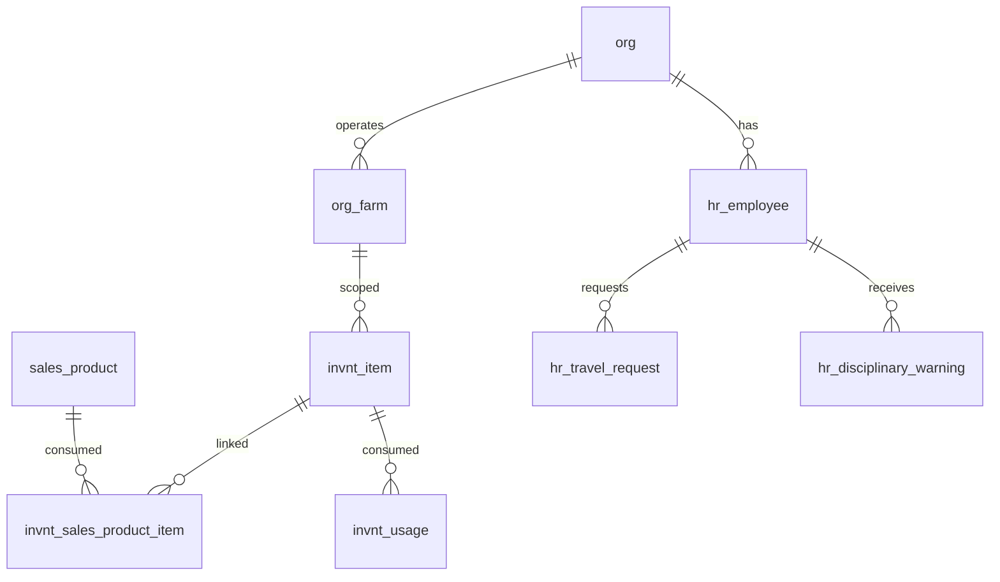

# Future Improvements

Planned tables and features that are designed but deferred from the MVP. Migration files are staged in `supabase/migrations_future/` and will be promoted to `supabase/migrations/` when ready to implement.

> **Standard audit fields:** Every table includes `created_at` (TIMESTAMPTZ, default now), `created_by` (TEXT), `updated_at` (TIMESTAMPTZ, default now), `updated_by` (TEXT), and `is_deleted` (BOOLEAN, default false). These are omitted from the column listings below for brevity.

## Entity Relationship Diagram

---

## Table Overview

| Table | Purpose |
|-------|---------|
| invnt_sales_product_item | Junction table linking sales products to inventory items at pack or sale packaging levels. |
| invnt_usage | Tracks inventory consumption linked back to the source module that triggered it. |
| hr_travel_request | Employee travel requests with a simple approval workflow. |
| hr_disciplinary_warning | Employee disciplinary warning records with acknowledgment and review workflow. |

---

## Inventory — Deferred Tables

### invnt_sales_product_item

Junction table linking sales products to inventory items at pack or sale packaging levels. When a product is packed or sold, this mapping determines which inventory items are consumed and in what quantity.

Migration: `supabase/migrations_future/20260316_001_invnt_sales_product_item.sql`

| Column               | Type         | Constraints                           | Description                              |
|---------------------|--------------|---------------------------------------|------------------------------------------|
| id                  | UUID         | PK, auto-generated                    | Unique identifier for the link record    |
| org_id              | TEXT         | NOT NULL, FK → org(id)                | Owning organization for RLS filtering    |
| farm_id             | TEXT         | FK → org_farm(id), nullable               | Optional farm scope                      |
| product_id          | TEXT         | NOT NULL, FK → sales_product(id)      | |
| invnt_item_id       | TEXT         | NOT NULL, FK → invnt_item(id)         | |
| packaging_level     | TEXT         | NOT NULL, CHECK                       | pack, sale |
| sale_uom            | TEXT         | FK → sys_uom(code), nullable         | |
| quantity_per_sale_uom | NUMERIC    | nullable                              | |

Unique constraint on `(product_id, invnt_item_id, packaging_level)` — one link per item per packaging level per product.

---

### invnt_usage

Tracks inventory consumption linked back to the source module that triggered it. The `reference_table` and `reference_id` columns provide a generic FK to any table (e.g. grow_fertigation_schedule, harvest_batch) so usage can be traced to its origin.

Migration: `supabase/migrations_future/20260316_002_invnt_usage.sql`

| Column          | Type         | Constraints                   | Description                              |
|----------------|--------------|-------------------------------|------------------------------------------|
| id             | UUID         | PK, auto-generated            | Unique identifier for the usage record   |
| org_id         | TEXT         | NOT NULL, FK → org(id)        | Owning organization for RLS filtering    |
| farm_id        | TEXT         | FK → org_farm(id), nullable       | Optional farm scope                      |
| invnt_item_id  | TEXT         | NOT NULL, FK → invnt_item(id) | |
| reference_table| TEXT         | nullable                      | |
| reference_id   | UUID         | nullable                      | |
| usage_date     | DATE         | NOT NULL                      | |
| burn_uom       | TEXT         | FK → sys_uom(code), nullable | |
| quantity_burn  | NUMERIC      | NOT NULL                      | |

---

## HR — Deferred Tables

### hr_travel_request

Employee travel requests with a simple approval workflow. Captures trip details, purpose, and dates alongside a pending → approved/denied status flow.
Migration: `supabase/migrations_future/20260316_003_hr_travel_request.sql`

| Column             | Type         | Constraints                       | Description                              |
|-------------------|--------------|-----------------------------------|------------------------------------------|
| id                | UUID         | PK, auto-generated                | Unique identifier for the travel request |
| org_id            | TEXT         | NOT NULL, FK → org(id)            | Owning organization for RLS filtering    |
| employee_id       | TEXT         | NOT NULL, FK → hr_employee(id)    | |
| request_type      | TEXT         | nullable                          | |
| travel_purpose    | TEXT         | nullable                          | |
| travel_from       | TEXT         | nullable                          | |
| travel_to         | TEXT         | nullable                          | |
| travel_start_date | DATE         | nullable                          | |
| travel_return_date| DATE         | nullable                          | |
| denial_reason     | TEXT         | nullable                          | |
| notes             | TEXT         | nullable                          | |
| status            | TEXT         | NOT NULL, default pending, CHECK  | pending, approved, denied |
| requested_at      | TIMESTAMPTZ  | NOT NULL, default now             | |
| requested_by      | TEXT         | NOT NULL, FK → hr_employee(id)    | |
| reviewed_at       | TIMESTAMPTZ  | nullable                          | |
| reviewed_by       | TEXT         | FK → hr_employee(id), nullable    | |

---

### hr_disciplinary_warning

Employee disciplinary warning records. Tracks the offense, action plan, and employee acknowledgment alongside a pending → reviewed workflow.
Migration: `supabase/migrations_future/20260316_004_hr_disciplinary_warning.sql`

| Column                          | Type         | Constraints                       | Description                              |
|--------------------------------|--------------|-----------------------------------|------------------------------------------|
| id                             | UUID         | PK, auto-generated                | Unique identifier for the disciplinary warning |
| org_id                         | TEXT         | NOT NULL, FK → org(id)            | Owning organization for RLS filtering    |
| employee_id                    | TEXT         | NOT NULL, FK → hr_employee(id)    | |
| warning_date                   | DATE         | nullable                          | |
| warning_type                   | TEXT         | CHECK                             | verbal_warning, written_warning, final_warning, suspension, termination |
| offense_type                   | TEXT         | nullable                          | |
| offense_description            | TEXT         | nullable                          | |
| plan_for_improvement           | TEXT         | nullable                          | |
| further_infraction_consequences| TEXT         | nullable                          | |
| notes                          | TEXT         | nullable                          | |
| is_acknowledged                | BOOLEAN      | NOT NULL, default false           | |
| acknowledged_at                | TIMESTAMPTZ  | nullable                          | |
| employee_signature_url         | TEXT         | nullable                          | |
| status                         | TEXT         | NOT NULL, default pending, CHECK  | pending, reviewed |
| reported_at                    | TIMESTAMPTZ  | NOT NULL, default now             | |
| reported_by                    | TEXT         | FK → hr_employee(id), nullable    | |
| reviewed_at                    | TIMESTAMPTZ  | nullable                          | |
| reviewed_by                    | TEXT         | FK → hr_employee(id), nullable    | |

---

## Inventory — Deferred Features

### Estimated usage adjustment on receipt

When an order receipt is logged, the system should automatically create an adjusted on-hand record before the receipt record to account for estimated consumption since the last on-hand snapshot. The calculation:

1. Get the latest on-hand record for the item (by `onhand_date DESC, created_at DESC`)
2. Calculate weeks elapsed: `(receipt_date - last_onhand_date) / 7`
3. Get `burn_per_week` from `invnt_item`
4. Estimated burn since last on-hand: `burn_per_week * weeks_elapsed`
5. Convert to on-hand units: `estimated_burn / burn_per_onhand_uom`
6. Create an adjusted `invnt_onhand` record with `onhand_quantity = last_onhand - estimated_onhand_usage`
7. Create the receipt `invnt_onhand` record with `onhand_quantity = adjusted_onhand + received_quantity_in_onhand_units`

This keeps the estimated usage visible as an explicit record in the history rather than silently adjusting the on-hand during receipt. Can be implemented as a Supabase database function or in the application layer.

---

