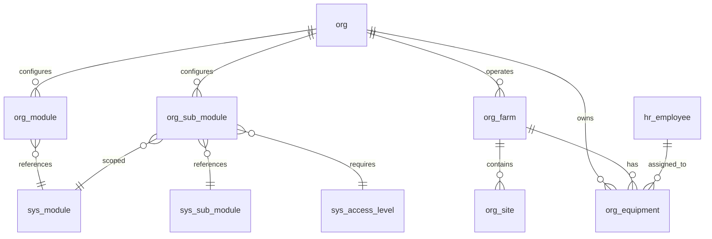

# Organization Schema

Organization-level tables that define the structure of each org — identity, module configuration, farms, sites, equipment, and crop definitions.

> **Standard audit fields:** Every table includes `created_at` (TIMESTAMPTZ, default now), `created_by` (TEXT), `updated_at` (TIMESTAMPTZ, default now), `updated_by` (TEXT), and `is_deleted` (BOOLEAN, default false). These are omitted from the column listings below for brevity.

## Entity Relationship Diagram

---

## Table Overview

| Table | Purpose |
|-------|---------|
| org | Root entity for multi-org support. Every org-scoped record traces back to this table. |
| org_module | Org-scoped copy of system modules. Admins toggle is_enabled and customize display names and ordering. |
| org_sub_module | Org-scoped copy of system sub-modules. Admins toggle is_enabled and adjust access levels per org. |
| org_farm | Crop/product lines within an org (e.g. Cuke Farm, Lettuce Farm) with weighing and growing UOM defaults. |
| org_site | Unified site register for all physical locations and assets (growing, packaging, storage, maintenance). |
| org_equipment | Equipment register for physical assets. Farm-level or shared (farm_id null). |

---

## org

Root entity for multi-org support. Every org-scoped table references this. Stores org-level settings such as default currency.

| Column | Type | Constraints | Description |
|--------|------|-------------|-------------|
| id | TEXT | PK | Human-readable identifier derived from org name (lowercase, spaces replaced with underscores) |
| name | TEXT | NOT NULL, UNIQUE | |
| address | TEXT | nullable | |
| currency | TEXT | nullable | |

---

## org_module

Org-scoped copy of system modules. Seeded by a provisioning script when a new org is created. Org admins toggle `is_enabled` to control which modules are available to their users.

| Column | Type | Constraints | Description |
|--------|------|-------------|-------------|
| id | TEXT | PK | |
| org_id | TEXT | NOT NULL, FK → org(id) | |
| sys_module_id | TEXT | NOT NULL, FK → sys_module(id) | Sourced from sys_module; identifies which system module this org copy represents |
| display_name | TEXT | NOT NULL | Pre-filled from sys_module.name at seeding time; editable by org admins |
| display_order | INTEGER | NOT NULL, default 0 | |
| is_enabled | BOOLEAN | NOT NULL, default true | Auto-set to true when seeded; toggled by org admins to enable/disable the module |

Unique constraint on `(org_id, sys_module_id)`.

---

## org_sub_module

Org-scoped copy of system sub-modules. Seeded by a provisioning script when a new org is created. Org admins toggle `is_enabled` and can adjust the access level per sub-module.

| Column | Type | Constraints | Description |
|--------|------|-------------|-------------|
| id | TEXT | PK | |
| org_id | TEXT | NOT NULL, FK → org(id) | |
| sys_module_id | TEXT | NOT NULL, FK → sys_module(id) | Sourced from sys_sub_module.sys_module_id at seeding time |
| sys_sub_module_id | TEXT | NOT NULL, FK → sys_sub_module(id) | Sourced from sys_sub_module; identifies which system sub-module this org copy represents |
| sys_access_level_id | TEXT | NOT NULL, FK → sys_access_level(id) | Pre-filled from sys_sub_module.sys_access_level_id at seeding time; editable by org admins |
| display_name | TEXT | NOT NULL | Pre-filled from sys_sub_module.name at seeding time; editable by org admins |
| display_order | INTEGER | NOT NULL, default 0 | |
| is_enabled | BOOLEAN | NOT NULL, default true | Auto-set to true when seeded; toggled by org admins to enable/disable the sub-module |

Unique constraint on `(org_id, sys_module_id, sys_sub_module_id)`.

---

## org_farm

Represents a crop or product line within an organization (e.g. Cuke Farm, Lettuce Farm). Each farm has its own sites, varieties, grades, and products. Farm-level defaults reference units of measure for weighing and growing operations.

| Column | Type | Constraints | Description |
|--------|------|-------------|-------------|
| id | TEXT | PK | Human-readable identifier derived from farm name (lowercase trimmed string) |
| org_id | TEXT | NOT NULL, FK → org(id) | |
| name | TEXT | NOT NULL | |
| weighing_uom | TEXT | FK → sys_uom(code), nullable | |
| growing_uom | TEXT | FK → sys_uom(code), nullable | |
| volume_uom | TEXT | FK → sys_uom(code), nullable | |

Unique constraint on `(org_id, name)`.

---

## org_site

Unified site register for all physical locations and assets across the organization. The `category` and `subcategory` fields drive which additional fields are relevant in the UI. Sites can be scoped to a specific farm or shared org-wide.

Categories and subcategories: growing (greenhouse, nursery), packaging (packroom, cold_storage), storage (warehouse, chemical_storage), maintenance (equipment, vehicle, infrastructure).

| Column | Type | Constraints | Description |
|--------|------|-------------|-------------|
| id | TEXT | PK | |
| org_id | TEXT | NOT NULL, FK → org(id) | |
| farm_id | TEXT | FK → org_farm(id), nullable | Inherited from parent org_farm when site is farm-scoped; null for org-wide sites |
| name | TEXT | NOT NULL | |
| category | TEXT | NOT NULL | |
| subcategory | TEXT | nullable | |
| acres | NUMERIC | nullable | |
| total_rows | INTEGER | nullable | |
| avg_units_per_row | NUMERIC | nullable | |
| notes | TEXT | nullable | |
| photos | JSONB | NOT NULL, default [] | |
| monitoring_stations | JSONB | NOT NULL, default [] | |
| metadata | JSONB | NOT NULL, default {} | |
| is_food_contact_surface | BOOLEAN | NOT NULL, default false | |
| zone | TEXT | nullable, CHECK | zone_1, zone_2, zone_3, zone_4 |

Unique constraint on `(org_id, farm_id, name)`.

---

## org_equipment

Equipment register for all physical assets across the organization. Farm-level or shared (farm_id null). Tracks current and previous assignment to employees.

| Column | Type | Constraints | Description |
|--------|------|-------------|-------------|
| id | TEXT | PK | |
| org_id | TEXT | NOT NULL, FK → org(id) | |
| farm_id | TEXT | FK → org_farm(id), nullable | Inherited from parent org_farm when equipment is farm-scoped; null for org-wide equipment |
| type | TEXT | nullable, CHECK | vehicle, tool, machine, ppe |
| name | TEXT | NOT NULL | |
| code | TEXT | nullable | |
| description | TEXT | nullable | |
| manufacturer | TEXT | nullable | |
| model | TEXT | nullable | |
| serial_number | TEXT | nullable | |
| purchase_date | DATE | nullable | |
| manual_url | TEXT | nullable | |
| assigned_to | TEXT | FK → hr_employee(id), nullable | |
| assigned_on | DATE | nullable | |
| previously_assigned_to | TEXT | FK → hr_employee(id), nullable | Auto-set by system when assigned_to changes; stores the prior assignee |
| document_url | TEXT | nullable | |

