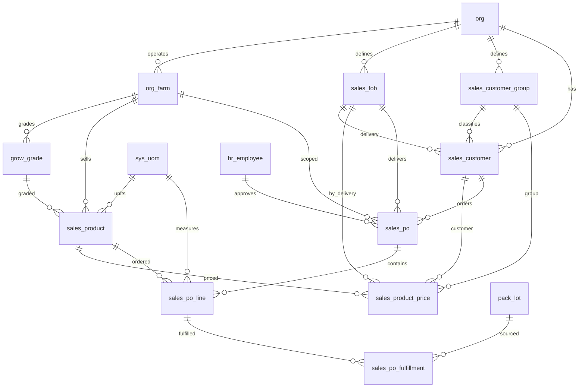

# Sales Schema

Tables for the product catalog, tiered pricing, customer orders, and order fulfillment against pack lots. Orders follow a workflow from draft through approval to fulfillment, with snapshot pricing captured at time of order. Standing orders support automatic recurrence.

> **Standard audit fields:** Every table includes `created_at` (TIMESTAMPTZ, default now), `created_by` (TEXT), `updated_at` (TIMESTAMPTZ, default now), `updated_by` (TEXT), and `is_deleted` (BOOLEAN, default false). These are omitted from the column listings below for brevity.

## Entity Relationship Diagram

---

## Table Overview

| Table | Purpose |
|-------|---------|
| sales_fob | Defines each organization's available delivery methods (e.g. Farm Pick-up, Local Delivery, Distributor). |
| sales_customer_group | Allows each organization to classify customers into groups for reporting and group-based pricing. |
| sales_customer | Stores an organization's customers with group classification, preferred delivery method, and billing address. |
| sales_product | The sellable products from each farm with full packaging hierarchy and product specifications. |
| sales_product_price | Manages product pricing with three tiers of specificity and date ranges to track price changes over time. |
| sales_po | Customer order header with approval workflow and optional recurring frequency for standing orders. |
| sales_po_line | Individual products within an order with snapshot pricing at time of order. |
| sales_po_fulfillment | Fulfillment records linking order lines to pack lots, supporting partial fulfillment across multiple lots. |

---

## sales_product

The sellable products from each farm. Combines a grade with a full packaging hierarchy (item → pack → sale → shipping) that drives inventory calculations. Columns are grouped by logical sections: identity, packaging quantities, weights, dimensions, storage, shipping, flags, and identification. All net weight values share `weight_uom`, all dimensions share `dimension_uom`, and all temperatures share `temperature_uom`.

| Column                      | Type         | Constraints                        | Description                              |
|-----------------------------|--------------|------------------------------------|------------------------------------------|
| id                          | TEXT         | PK                                 | Human-readable identifier derived from product name (lowercase trimmed) |
| org_id                      | TEXT         | NOT NULL, FK → org(id)             | Owning organization for RLS filtering    |
| farm_id                     | TEXT         | NOT NULL, FK → org_farm(id)            | Farm (crop line) this product belongs to |
| grow_grade_id                    | TEXT         | FK → grow_grade(id), nullable      | |
| code                        | TEXT         | NOT NULL                           | |
| name                        | TEXT         | NOT NULL                           | |
| segment                     | TEXT         | CHECK                              | wholesale, retail, food_service |
| description                 | TEXT         | nullable                           | |
| invnt_item_id      | TEXT         | FK → invnt_item(id), nullable          | |
| item_uom                    | TEXT         | FK → sys_uom(code), nullable      | |
| pack_uom                    | TEXT         | FK → sys_uom(code), nullable      | |
| item_per_pack           | NUMERIC      | nullable                           | |
| pack_per_case               | NUMERIC      | nullable                           | |
| maximum_case_per_pallet         | NUMERIC      | nullable                           | |
| pack_net_weight             | NUMERIC      | nullable                           | |
| case_net_weight             | NUMERIC      | nullable                           | |
| pallet_net_weight         | NUMERIC      | nullable                           | |
| weight_uom                  | TEXT         | FK → sys_uom(code), nullable      | |
| case_length                 | NUMERIC      | nullable                           | |
| case_width                  | NUMERIC      | nullable                           | |
| case_height                 | NUMERIC      | nullable                           | |
| dimension_uom               | TEXT         | FK → sys_uom(code), nullable      | |
| manufacturer_storage_method  | TEXT         | nullable                           | |
| minimum_storage_temperature | NUMERIC      | nullable                           | |
| maximum_storage_temperature | NUMERIC      | nullable                           | |
| temperature_uom             | TEXT         | FK → sys_uom(code), nullable      | |
| shelf_life_days             | INT          | nullable                           | |
| pallet_ti                 | NUMERIC      | nullable                           | |
| pallet_hi                 | NUMERIC      | nullable                           | |
| shipping_requirements       | TEXT         | nullable                           | |
| is_catch_weight             | BOOLEAN      | NOT NULL, default false            | |
| is_hazardous                | BOOLEAN      | NOT NULL, default false            | |
| is_fsma_traceable           | BOOLEAN      | NOT NULL, default false            | |
| gtin                        | TEXT         | nullable                           | |
| upc                         | TEXT         | nullable                           | |
| photos                      | JSONB        | NOT NULL, default []               | |
| display_order               | INT          | NOT NULL, default 0                | |

Unique constraints on `(farm_id, code)` and `(farm_id, name)`.

---

## sales_product_price

Manages product pricing with three tiers of specificity and date ranges to track price changes over time. When a price changes, the current row gets an effective_to date and a new row is created. Currency always uses the org default from org.currency.

| Column            | Type        | Constraints                         | Description                              |
|-------------------|-------------|-------------------------------------|------------------------------------------|
| id                | UUID        | PK, auto-generated                  | Unique identifier for the price record   |
| org_id            | TEXT        | NOT NULL, FK → org(id)              | Owning organization for RLS filtering    |
| sales_product_id  | TEXT        | NOT NULL, FK → sales_product(id)    | Product this price applies to            |
| sales_fob_id      | TEXT        | NOT NULL, FK → sales_fob(id)        | FOB delivery point this price applies to |
| sales_customer_group_id | TEXT  | FK → sales_customer_group(id), nullable | |
| sales_customer_id | TEXT        | FK → sales_customer(id), nullable   | |
| price             | NUMERIC     | NOT NULL                            | |
| effective_from    | DATE        | NOT NULL                            | |
| effective_to      | DATE        | nullable                            | |

Pricing lookup priority: customer price (tier 1) → group price (tier 2) → default price (tier 3), filtered by `effective_from <= today AND (effective_to IS NULL OR effective_to > today)`.

---

## sales_fob

Defines each organization's available delivery methods (e.g. Farm Pick-up, Local Delivery, Distributor). Used in customer setup to set a preferred delivery and in pricing to set delivery-specific prices.

| Column | Type | Constraints | Description |
|--------|------|-------------|-------------|
| id | TEXT | PK | Human-readable identifier derived from FOB name (lowercase trimmed) |
| org_id | TEXT | NOT NULL, FK → org(id) | Owning organization for RLS filtering |
| name | TEXT | NOT NULL | |

Unique constraint on `(org_id, name)` — no duplicate delivery methods within an org.

---

## sales_customer_group

Allows each organization to classify customers into groups for reporting and group-based pricing (e.g. Wholesale, Retail, Restaurant).

| Column | Type | Constraints | Description |
|--------|------|-------------|-------------|
| id | TEXT | PK | Human-readable identifier derived from group name (lowercase trimmed) |
| org_id | TEXT | NOT NULL, FK → org(id) | Owning organization for RLS filtering |
| name | TEXT | NOT NULL | |

Unique constraint on `(org_id, name)` — no duplicate group names within an org.

---

## sales_customer

Stores an organization's customers with their group classification, preferred delivery method, billing address, and a link to external accounting software via qb_account. Additional contact emails are stored in cc_emails.

| Column | Type | Constraints | Description |
|--------|------|-------------|-------------|
| id | TEXT | PK | Human-readable identifier derived from customer name (lowercase trimmed) |
| org_id | TEXT | NOT NULL, FK → org(id) | Owning organization for RLS filtering |
| sales_customer_group_id | TEXT | FK → sales_customer_group(id), nullable | |
| sales_fob_id | TEXT | FK → sales_fob(id), nullable | |
| qb_account | TEXT | nullable | |
| name | TEXT | NOT NULL | |
| email | TEXT | nullable | |
| cc_emails | JSONB | NOT NULL, default [] | |
| billing_address | TEXT | nullable | |

Unique constraint on `(org_id, name)` — no duplicate customer names within an org.

---

## sales_po

Customer order header. One row per order. Tracks customer, FOB, dates, approval workflow, and optional recurring frequency for standing orders.

| Column | Type | Constraints | Description |
|--------|------|-------------|-------------|
| id | UUID | PK, auto-generated | |
| org_id | TEXT | NOT NULL, FK → org(id) | |
| farm_id | TEXT | NOT NULL, FK → org_farm(id) | |
| sales_customer_group_id | TEXT | FK → sales_customer_group(id), nullable | Pre-filled from sales_customer.sales_customer_group_id; editable |
| sales_customer_id | TEXT | NOT NULL, FK → sales_customer(id) | |
| sales_fob_id | TEXT | FK → sales_fob(id), nullable | Pre-filled from sales_customer.sales_fob_id; editable |
| po_number | TEXT | nullable | |
| order_date | DATE | NOT NULL | |
| invoice_date | DATE | nullable | |
| recurring_frequency | TEXT | nullable, CHECK | weekly, biweekly, monthly |
| notes | TEXT | nullable | |
| status | TEXT | NOT NULL, default draft, CHECK | draft, approved, fulfilled, past_due |
| approved_at | TIMESTAMPTZ | nullable | |
| approved_by | TEXT | FK → hr_employee(id), nullable | |
| uploaded_at | TIMESTAMPTZ | nullable | |
| uploaded_by | TEXT | FK → hr_employee(id), nullable | |

---

## sales_po_line

Individual products within an order. One row per product per order with snapshot pricing at time of order.

| Column | Type | Constraints | Description |
|--------|------|-------------|-------------|
| id | UUID | PK, auto-generated | |
| org_id | TEXT | NOT NULL, FK → org(id) | |
| farm_id | TEXT | NOT NULL, FK → org_farm(id) | |
| sales_po_id | UUID | NOT NULL, FK → sales_po(id) | |
| sales_product_id | TEXT | NOT NULL, FK → sales_product(id) | |
| order_quantity | NUMERIC | NOT NULL | |
| price_per_unit | NUMERIC | NOT NULL | Snapshot from sales_product_price at time of order creation |
| notes | TEXT | nullable | |

Unique constraint on `(sales_po_id, sales_product_id)` — one product per order.

---

## sales_po_fulfillment

Fulfillment records linking order lines to pack lots. One row per lot per order line, supporting partial fulfillment across multiple lots.

| Column | Type | Constraints | Description |
|--------|------|-------------|-------------|
| id | UUID | PK, auto-generated | |
| org_id | TEXT | NOT NULL, FK → org(id) | |
| farm_id | TEXT | NOT NULL, FK → org_farm(id) | |
| sales_po_id | UUID | NOT NULL, FK → sales_po(id) | |
| sales_po_line_id | UUID | NOT NULL, FK → sales_po_line(id) | |
| pack_lot_id | UUID | FK → pack_lot(id), nullable | Sourced from pack_lot; links fulfilled quantity to a specific production lot |
| fulfilled_quantity | NUMERIC | NOT NULL | |
| notes | TEXT | nullable | |
