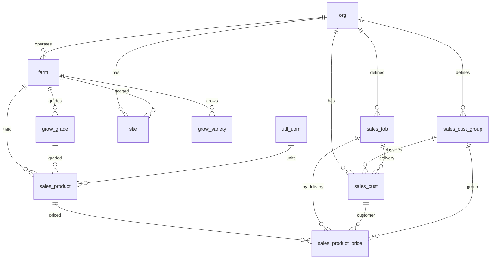

# Core Schema

Core tables that form the foundation of the Aloha ERP system. These include global reference tables shared across all organizations, identity and access management, customer management, farm structure, product catalog, and pricing.

> **Standard audit fields:** Every table includes `created_at` (TIMESTAMPTZ, default now), `created_by` (TEXT, user email), `updated_at` (TIMESTAMPTZ, default now), and `updated_by` (TEXT, user email). These are omitted from the column listings below for brevity.

## Entity Relationship Diagram

---

## Table Overview

| Table | Purpose |
|-------|---------|
| util_uom | Standardized measurement units (kg, L, °C, etc.) shared across all organizations for consistent data entry and calculations. |
| org | Root entity for multi-org support. Every org-scoped record traces back to this table. Stores org-level settings like default currency. |
| sales_cust_group | Allows each organization to classify customers into groups (e.g. Wholesale, Retail, Restaurant) for reporting and group-based pricing. |
| sales_fob | Defines each organization's available delivery methods (e.g. Farm Pick-up, Local Delivery, Distributor). Used in customer setup and pricing. |
| sales_cust | Stores an organization's customers with their preferred delivery method, group classification, billing address, and a link to external accounting software. |
| farm | Represents a crop or product line within an organization (e.g. Cuke Farm, Lettuce Farm). Each farm has its own sites, varieties, grades, and products. |
| site | Physical locations within a farm where operations happen — nurseries for seedlings, growing sites for production, packing sites, and storage facilities. |
| grow_variety | Crop varieties grown on a specific farm, each with a short code for quick reference during data entry (e.g. "K" for Keiki). |
| grow_grade | Harvest quality grades used by a specific farm, each with a short code (e.g. "A" for Grade A). Applied during harvest and carried through to sales. |
| sales_product | The sellable products from each farm, combining grade and packaging configuration. Contains the full packaging hierarchy (content → pack → sale → shipping), product identification (GTIN, UPC), and shipping requirements. |
| sales_product_price | Manages product pricing with three tiers of specificity (default, group, customer) and date ranges to track price changes over time. Currency uses the org default. |

---

## util_uom

Standardized measurement units shared across all organizations for consistent data entry and calculations throughout the system.

| Column  | Type        | Constraints          | Description                          |
|---------|-------------|----------------------|--------------------------------------|
| code    | TEXT | PK                   | Short form, e.g. "kg"               |
| name    | TEXT | NOT NULL, UNIQUE     | Full name, e.g. "Kilogram"           |
| category| TEXT | NOT NULL             | Grouping: weight, volume, length, etc.|

## org

Root entity for multi-org support. Every org-scoped table references this. Stores org-level settings such as default currency.

| Column     | Type         | Constraints          | Description                          |
|------------|--------------|----------------------|--------------------------------------|
| id         | TEXT         | PK                   | Human-readable identifier derived from org name (lowercase, underscores) |
| name       | TEXT | NOT NULL, UNIQUE     | Organization name                    |
| slug       | TEXT | NOT NULL, UNIQUE     | Short initials derived from org name (e.g. HF for Hawaii Farming) |
| address    | TEXT         | nullable             | Physical address                     |
| currency   | TEXT  | nullable             | Default currency for org             |
| is_active  | BOOLEAN      | NOT NULL, default true| Soft-disable without deleting        |

## sales_cust_group

Allows each organization to classify customers into groups for reporting and group-based pricing (e.g. Wholesale, Retail, Restaurant).

| Column     | Type        | Constraints                  | Description                |
|------------|-------------|------------------------------|----------------------------|
| id         | TEXT        | PK                           | Human-readable identifier derived from group name |
| org_id     | TEXT        | NOT NULL, FK → org(id)       | The organization           |
| name       | TEXT | NOT NULL                     | Group name                 |

Unique constraint on `(org_id, name)` — no duplicate group names within an org.

## sales_fob

Defines each organization's available delivery methods (e.g. Farm Pick-up, Local Delivery, Distributor). Used in customer setup to set a preferred delivery and in pricing to set delivery-specific prices.

| Column     | Type        | Constraints                  | Description                |
|------------|-------------|------------------------------|----------------------------|
| id         | TEXT        | PK                           | Human-readable identifier derived from FOB name |
| org_id     | TEXT        | NOT NULL, FK → org(id)       | The organization           |
| name       | TEXT | NOT NULL                     | Delivery method name       |

Unique constraint on `(org_id, name)` — no duplicate delivery methods within an org.

## sales_cust

Stores an organization's customers with their group classification, preferred delivery method, billing address, and a link to external accounting software via external_id. Additional contact emails are stored in cc_emails.

| Column       | Type         | Constraints                        | Description                              |
|--------------|--------------------------------------|------------------------------------|------------------------------------------|
| id           | TEXT         | PK                                 | Human-readable identifier derived from customer name |
| org_id       | TEXT         | NOT NULL, FK → org(id)             | The organization                         |
| cust_group_id| TEXT         | FK → sales_cust_group(id), nullable| Customer classification for reporting    |
| fob_id       | TEXT         | FK → sales_fob(id), nullable             | Preferred delivery method                |
| accounting_id| TEXT  | nullable                           | Identifier used to link this customer to the accounting system |
| name         | TEXT | NOT NULL                           | Customer/business name                   |
| email        | TEXT | nullable                           | Primary email                            |
| cc_emails    | JSONB        | NOT NULL, default '[]'             | Additional contact emails                |
| billing_address | TEXT      | nullable                           | Billing address                          |
| is_active    | BOOLEAN      | NOT NULL, default true             | Soft-disable without deleting            |

Unique constraint on `(org_id, name)` — no duplicate customer names within an org.

## farm

Represents a crop or product line within an organization (e.g. Cuke Farm, Lettuce Farm). Each farm has its own sites, varieties, grades, and products. Farm-level defaults reference units of measure for weighing and growing operations.

| Column           | Type         | Constraints                     | Description                                  |
|------------------|--------------|--------------------------------|----------------------------------------------|
| id               | TEXT         | PK                              | Human-readable identifier derived from farm name (lowercase trimmed) |
| org_id           | TEXT         | NOT NULL, FK → org(id)          | The organization                             |
| name             | TEXT | NOT NULL                        | Farm name, e.g. "Cuke Farm"                  |
| weighing_uom  | TEXT  | FK → util_uom(code), nullable | Default unit for weighing operations      |
| growing_uom   | TEXT  | FK → util_uom(code), nullable | Default unit for growing operations        |
| is_active        | BOOLEAN      | NOT NULL, default true          | Soft-disable without deleting                |

Unique constraint on `(org_id, name)` — no duplicate farm names within an org.

## site

Unified site register for all physical locations and assets across the organization. The `category` and `subcategory` fields drive which additional fields are relevant in the UI. Sites can be scoped to a specific farm or shared org-wide.

Categories and subcategories: growing (greenhouse, nursery), packaging (packroom, cold_storage), storage (warehouse, chemical_storage), maintenance (equipment, vehicle, infrastructure).

| Column         | Type         | Constraints                      | Description                    |
|----------------|--------------|----------------------------------|--------------------------------|
| id             | TEXT         | PK                               | Human-readable identifier derived from site name (trimmed lowercase) |
| org_id         | TEXT         | NOT NULL, FK → org(id)           | The organization               |
| farm_id        | TEXT         | FK → farm(id), nullable          | Optional farm scope (null = org-wide) |
| name           | TEXT | NOT NULL                         | Site name, e.g. "Greenhouse A" |
| category       | TEXT         | NOT NULL                         | Top-level classification from dropdown (e.g. growing, packaging, storage, maintenance) |
| subcategory    | TEXT         | nullable                         | Second-level classification within category (e.g. greenhouse, nursery, equipment) |
| acres          | NUMERIC      | nullable                         | Acreage of the growing site    |
| total_rows     | INT          | nullable                         | Total number of growing rows in the site |
| avg_units_per_row | NUMERIC   | nullable                         | Average number of growing units (plants/pots) per row |
| code           | TEXT  | nullable                         | Short identifier for equipment/assets (e.g. PUMP-01) |
| manufacturer   | TEXT | nullable                         | Manufacturer or brand name for equipment/assets |
| model          | TEXT | nullable                         | Model name or number for equipment/assets |
| serial_number  | TEXT | nullable                         | Manufacturer serial number for equipment/assets |
| purchase_date  | DATE         | nullable                         | Date the equipment/asset was acquired |
| manual_url     | TEXT         | nullable                         | URL or path to equipment manual or site documentation |
| notes          | TEXT         | nullable                         | General notes about the site or asset |
| photos         | JSONB        | NOT NULL, default []             | JSON array of photo URLs       |
| metadata       | JSONB        | NOT NULL, default {}             | Flexible JSON for display-only details (dimensions, capacity, environmental settings) |
| is_active      | BOOLEAN      | NOT NULL, default true           | Soft-disable without deleting  |

Unique constraint on `(org_id, farm_id, name)` — no duplicate site names within an org+farm combination.

## grow_variety

Crop varieties grown on a specific farm, each with a short code for quick reference during data entry. Used across seeding, growing, and harvest modules.

| Column     | Type        | Constraints                      | Description                   |
|------------|-------------|----------------------------------|-------------------------------|
| id         | TEXT        | PK                               | Human-readable identifier derived from variety name |
| org_id     | TEXT        | NOT NULL, FK → org(id)           | The organization              |
| farm_id    | TEXT        | NOT NULL, FK → farm(id)          | The farm this variety belongs to |
| code       | TEXT | NOT NULL                         | Short code, e.g. "K"         |
| name       | TEXT | NOT NULL                         | Full name, e.g. "Keiki"      |
| description| TEXT        | nullable                         | Optional notes about the variety |
| is_active  | BOOLEAN     | NOT NULL, default true           | Soft-disable without deleting|

Unique constraints on `(farm_id, code)` and `(farm_id, name)`.

## grow_grade

Harvest quality grades for a specific farm, each with a short code. Applied during harvest logging and carried through to product definition, packing, and sales.

| Column     | Type        | Constraints                      | Description                   |
|------------|-------------|----------------------------------|-------------------------------|
| id         | TEXT        | PK                               | Human-readable identifier derived from grade name |
| org_id     | TEXT        | NOT NULL, FK → org(id)           | The organization              |
| farm_id    | TEXT        | NOT NULL, FK → farm(id)          | The farm this grade belongs to |
| code       | TEXT | NOT NULL                         | Short code, e.g. "A"         |
| name       | TEXT | NOT NULL                         | Full name, e.g. "Grade A"    |
| is_active  | BOOLEAN     | NOT NULL, default true           | Soft-disable without deleting|

Unique constraints on `(farm_id, code)` and `(farm_id, name)`.

## sales_product

The sellable products from each farm. Combines a grade with a full packaging hierarchy (item → pack → sale → shipping) that drives inventory calculations. Columns are grouped by logical sections: identity, packaging quantities, weights, dimensions, storage, shipping, flags, and identification. All net weight values share `weight_uom`, all dimensions share `dimension_uom`, and all temperatures share `temperature_uom`.

| Column                      | Type         | Constraints                        | Description                              |
|-----------------------------|--------------|------------------------------------|------------------------------------------|
| id                          | TEXT         | PK                                 | Human-readable identifier derived from product name |
| org_id                      | TEXT         | NOT NULL, FK → org(id)             | The organization                         |
| farm_id                     | TEXT         | NOT NULL, FK → farm(id)            | The farm this product belongs to         |
| grade_id                    | TEXT         | FK → grow_grade(id), nullable      | Product grade                            |
| code                        | TEXT  | NOT NULL                           | Product code/abbreviation                |
| name                        | TEXT | NOT NULL                           | Product name                             |
| segment                     | TEXT         | CHECK                              | Market segment: wholesale, retail, or food_service |
| description                 | TEXT         | nullable                           | Product description for catalogs and labels |
| packaging                   | TEXT  | nullable                           | Packaging format (e.g. clamshell, bag, sleeve, tray wrap) |
| item_uom                    | TEXT  | FK → util_uom(code), nullable      | Unit for the individual product item (e.g. each, head) |
| pack_uom                    | TEXT  | FK → util_uom(code), nullable      | Unit for the consumer pack (e.g. bag, clamshell) |
| item_per_pack_uom          | NUMERIC      | nullable                           | Number of items per pack                 |
| sale_uom                    | TEXT  | FK → util_uom(code), nullable      | Unit for the sale level (e.g. case, box) |
| pack_per_sale_uom          | NUMERIC      | nullable                           | Number of packs per sale unit            |
| shipping_uom                | TEXT  | FK → util_uom(code), nullable      | Unit for the shipping level (e.g. pallet) |
| max_sale_per_shipping_uom      | NUMERIC      | nullable                           | Max sale units the shipping unit can physically hold beyond TI x HI |
| pack_net_weight             | NUMERIC      | nullable                           | Net weight of one pack in weight_uom     |
| sale_net_weight             | NUMERIC      | nullable                           | Net weight of one sale unit in weight_uom |
| shipping_net_weight         | NUMERIC      | nullable                           | Net weight of one full shipping unit in weight_uom |
| weight_uom                  | TEXT  | FK → util_uom(code), nullable      | Unit for all net weight values (e.g. lb, kg) |
| sale_uom_length             | NUMERIC      | nullable                           | Length of the sale unit in dimension_uom  |
| sale_uom_width              | NUMERIC      | nullable                           | Width of the sale unit in dimension_uom   |
| sale_uom_height             | NUMERIC      | nullable                           | Height of the sale unit in dimension_uom  |
| dimension_uom               | TEXT  | FK → util_uom(code), nullable      | Unit for all dimension values (e.g. in, cm) |
| manufacture_storage_method  | TEXT  | nullable                           | How the product should be stored (e.g. refrigerated, frozen, ambient) |
| minimum_storage_temperature | NUMERIC      | nullable                           | Minimum storage temperature in temperature_uom |
| maximum_storage_temperature | NUMERIC      | nullable                           | Maximum storage temperature in temperature_uom |
| temperature_uom             | TEXT  | FK → util_uom(code), nullable      | Unit for storage temperature values (e.g. F, C) |
| shelf_life_days             | INT          | nullable                           | Product shelf life in days from manufacture |
| shipping_ti                 | NUMERIC      | nullable                           | TI — sale units per layer on the shipping unit |
| shipping_hi                 | NUMERIC      | nullable                           | HI — layers stacked on the shipping unit |
| shipping_requirements       | TEXT         | nullable                           | Special shipping instructions (e.g. temperature range) |
| is_catch_weight             | BOOLEAN      | NOT NULL, default false            | Whether product is sold by actual weight |
| is_hazardous                | BOOLEAN      | NOT NULL, default false            | Whether product is classified as hazardous material |
| is_fsma_traceable           | BOOLEAN      | NOT NULL, default false            | Whether product is on the FDA FSMA 204 Food Traceability List |
| gtin                        | TEXT  | nullable                           | Global Trade Item Number (up to 14 digits) |
| upc                         | TEXT  | nullable                           | Universal Product Code (up to 12 digits) |
| photos                      | JSONB        | NOT NULL, default []               | JSON array of photo URLs                 |
| display_order               | INT          | nullable                           | Sort order for display                   |
| is_active                   | BOOLEAN      | NOT NULL, default true             | Soft-disable without deleting            |

Unique constraints on `(farm_id, code)` and `(farm_id, name)`.

## sales_product_price

Manages product pricing with three tiers of specificity and date ranges to track price changes over time. When a price changes, the current row gets an effective_to date and a new row is created. Currency always uses the org default from org.currency.

| Column            | Type        | Constraints                         | Description                              |
|-------------------|-------------|-------------------------------------|------------------------------------------|
| id                | UUID        | PK, auto-generated                  | Unique identifier                        |
| org_id            | TEXT        | NOT NULL, FK → org(id)              | The organization                         |
| product_id        | TEXT        | NOT NULL, FK → sales_product(id)    | The product being priced                 |
| fob_id            | TEXT        | NOT NULL, FK → sales_fob(id)              | Delivery method this price applies to    |
| cust_group_id     | TEXT        | FK → sales_cust_group(id), nullable | Group-specific price (tier 2)            |
| cust_id           | TEXT        | FK → sales_cust(id), nullable       | Customer-specific price (tier 1)         |
| price             | NUMERIC     | NOT NULL                            | The price amount                         |
| effective_from    | DATE        | NOT NULL                            | When this price starts                   |
| effective_to      | DATE        | nullable                            | When this price ends (null = current)    |
| is_active         | BOOLEAN     | NOT NULL, default true              | Soft-disable without deleting            |

Pricing lookup priority: customer price (tier 1) → group price (tier 2) → default price (tier 3), filtered by `effective_from <= today AND (effective_to IS NULL OR effective_to > today)`.
