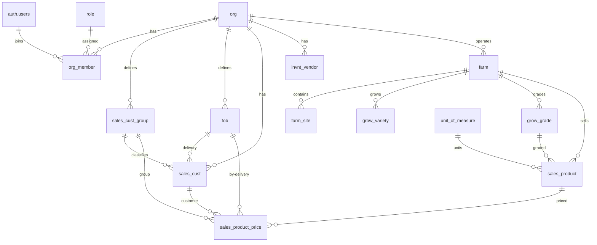

# Core Schema

Core tables that form the foundation of the Aloha ERP system. These include global reference tables shared across all organizations, identity and access management, customer management, farm structure, product catalog, and pricing.

## Entity Relationship Diagram

---

## Table Overview

| Table | Purpose |
|-------|---------|
| unit_of_measure | Standardized measurement units (kg, L, °C, etc.) shared across all organizations for consistent data entry and calculations. |
| role | Defines the five access levels (Owner, Admin, Manager, Verifier, Worker) used to control what users can see and do within an organization. |
| org | Root entity for multi-org support. Every org-scoped record traces back to this table. Stores org-level settings like default currency. |
| org_member | Links users to organizations with a specific role. Enables a single user to belong to multiple organizations with different access levels in each. |
| sales_cust_group | Allows each organization to classify customers into groups (e.g. Wholesale, Retail, Restaurant) for reporting and group-based pricing. |
| fob | Defines each organization's available delivery methods (e.g. Farm Pick-up, Local Delivery, Distributor). Used in customer setup and pricing. |
| sales_cust | Stores an organization's customers with their preferred delivery method, group classification, billing address, and a link to external accounting software. |
| invnt_vendor | Organization-level suppliers for procurement. Referenced by inventory items across all farms. |
| farm | Represents a crop or product line within an organization (e.g. Cuke Farm, Lettuce Farm). Each farm has its own sites, varieties, grades, and products. |
| farm_site | Physical locations within a farm where operations happen — nurseries for seedlings, growing sites for production, packing sites, and storage facilities. |
| grow_variety | Crop varieties grown on a specific farm, each with a short code for quick reference during data entry (e.g. "K" for Keiki). |
| grow_grade | Harvest quality grades used by a specific farm, each with a short code (e.g. "A" for Grade A). Applied during harvest and carried through to sales. |
| sales_product | The sellable products from each farm, combining grade and packaging configuration. Contains the full packaging hierarchy (content → pack → sale → shipping) used for inventory math. |
| sales_product_price | Manages product pricing with three tiers of specificity (default, group, customer) and date ranges to track price changes over time. Currency uses the org default. |

---

## unit_of_measure

Standardized measurement units shared across all organizations for consistent data entry and calculations throughout the system.

| Column  | Type        | Constraints          | Description                          |
|---------|-------------|----------------------|--------------------------------------|
| code    | VARCHAR(10) | PK                   | Short form, e.g. "kg"               |
| name    | VARCHAR(50) | NOT NULL, UNIQUE     | Full name, e.g. "Kilogram"           |
| category| VARCHAR(30) | NOT NULL             | Grouping: weight, volume, length, etc.|

## role

Defines the access levels used to control what users can see and do within an organization. Shared across all organizations.

| Column      | Type        | Constraints          | Description                              |
|-------------|-------------|----------------------|------------------------------------------|
| id          | UUID        | PK, auto-generated   | Unique identifier                        |
| name        | VARCHAR(30) | NOT NULL, UNIQUE     | Role name: Owner, Admin, Manager, etc.   |
| level       | INT         | NOT NULL, UNIQUE     | Numeric access level (lower = more access) |
| description | TEXT        | nullable             | What this role can do                    |

Defined roles: Owner (1), Admin (2), Manager (3), Verifier (4), Worker (5). Lowest levels inherit permissions of higher levels.

## org

Root entity for multi-org support. Every org-scoped table references this. Stores org-level settings such as default currency.

| Column     | Type         | Constraints          | Description                          |
|------------|--------------|----------------------|--------------------------------------|
| id         | UUID         | PK, auto-generated   | Unique identifier                    |
| name       | VARCHAR(100) | NOT NULL, UNIQUE     | Organization name                    |
| slug       | VARCHAR(100) | NOT NULL, UNIQUE     | URL-friendly identifier              |
| address    | TEXT         | nullable             | Physical address                     |
| currency   | VARCHAR(10)  | nullable             | Default currency for org             |
| is_active  | BOOLEAN      | NOT NULL, default true| Soft-disable without deleting        |
| created_at | TIMESTAMPTZ  | NOT NULL, default now | When the record was created          |
| created_by | UUID         | FK → auth.users(id), nullable | Who created the record          |
| updated_at | TIMESTAMPTZ  | NOT NULL, default now | When the record was last updated     |
| updated_by | UUID         | FK → auth.users(id), nullable | Who last updated the record     |

## org_member

Links users to organizations with a specific role. Enables a single user to belong to multiple organizations with different access levels in each.

| Column     | Type        | Constraints                      | Description                          |
|------------|-------------|----------------------------------|--------------------------------------|
| id         | UUID        | PK, auto-generated               | Unique identifier                    |
| org_id     | UUID        | NOT NULL, FK → org(id)           | The organization                     |
| user_id    | UUID        | NOT NULL, FK → auth.users(id)    | The user                             |
| role_id    | UUID        | NOT NULL, FK → role(id)          | Their role in this organization      |
| is_active  | BOOLEAN     | NOT NULL, default true           | Soft-disable membership              |
| created_at | TIMESTAMPTZ | NOT NULL, default now            | When the record was created          |
| created_by | UUID        | FK → auth.users(id), nullable    | Who created the record               |
| updated_at | TIMESTAMPTZ | NOT NULL, default now            | When the record was last updated     |
| updated_by | UUID        | FK → auth.users(id), nullable    | Who last updated the record          |

Unique constraint on `(org_id, user_id)` — a user can only have one role per organization.

## sales_cust_group

Allows each organization to classify customers into groups for reporting and group-based pricing (e.g. Wholesale, Retail, Restaurant).

| Column     | Type        | Constraints                  | Description                |
|------------|-------------|------------------------------|----------------------------|
| id         | UUID        | PK, auto-generated           | Unique identifier          |
| org_id     | UUID        | NOT NULL, FK → org(id)       | The organization           |
| name       | VARCHAR(50) | NOT NULL                     | Group name                 |
| created_at | TIMESTAMPTZ | NOT NULL, default now        | When the record was created|
| created_by | UUID        | FK → auth.users(id), nullable| Who created the record     |
| updated_at | TIMESTAMPTZ | NOT NULL, default now        | When the record was last updated |
| updated_by | UUID        | FK → auth.users(id), nullable| Who last updated the record|

Unique constraint on `(org_id, name)` — no duplicate group names within an org.

## fob

Defines each organization's available delivery methods (e.g. Farm Pick-up, Local Delivery, Distributor). Used in customer setup to set a preferred delivery and in pricing to set delivery-specific prices.

| Column     | Type        | Constraints                  | Description                |
|------------|-------------|------------------------------|----------------------------|
| id         | UUID        | PK, auto-generated           | Unique identifier          |
| org_id     | UUID        | NOT NULL, FK → org(id)       | The organization           |
| name       | VARCHAR(50) | NOT NULL                     | Delivery method name       |
| created_at | TIMESTAMPTZ | NOT NULL, default now        | When the record was created|
| created_by | UUID        | FK → auth.users(id), nullable| Who created the record     |
| updated_at | TIMESTAMPTZ | NOT NULL, default now        | When the record was last updated |
| updated_by | UUID        | FK → auth.users(id), nullable| Who last updated the record|

Unique constraint on `(org_id, name)` — no duplicate delivery methods within an org.

## invnt_vendor

Organization-level suppliers used for procurement across all farms. Stores contact details and additional fields like address, payment terms, and lead times.

| Column          | Type         | Constraints                  | Description                        |
|-----------------|--------------|------------------------------|------------------------------------|
| id              | UUID         | PK, auto-generated           | Unique identifier                  |
| org_id          | UUID         | NOT NULL, FK → org(id)       | The organization                   |
| name            | VARCHAR(100) | NOT NULL                     | Supplier/company name              |
| contact_person  | VARCHAR(100) | nullable                     | Primary contact                    |
| email           | VARCHAR(100) | nullable                     | Contact email                      |
| phone           | VARCHAR(20)  | nullable                     | Contact phone                      |
| address         | TEXT         | nullable                     | Supplier address                   |
| payment_terms   | VARCHAR(50)  | nullable                     | Payment terms (e.g., Net 30)      |
| lead_time       | NUMERIC      | nullable                     | Lead time in days                  |
| is_active       | BOOLEAN      | NOT NULL, default true       | Soft-disable without deleting      |
| created_at      | TIMESTAMPTZ  | NOT NULL, default now        | When the record was created        |
| created_by      | UUID         | FK → auth.users(id), nullable| Who created the record             |
| updated_at      | TIMESTAMPTZ  | NOT NULL, default now        | When the record was last updated   |
| updated_by      | UUID         | FK → auth.users(id), nullable| Who last updated the record        |

Unique constraint on `(org_id, name)` — no duplicate supplier names within an org.

## sales_cust

Stores an organization's customers with their group classification, preferred delivery method, billing address, and a link to external accounting software via external_id. Additional contact emails are stored in cc_emails.

| Column       | Type         | Constraints                        | Description                              |
|--------------|--------------------------------------|------------------------------------|------------------------------------------|
| id           | UUID         | PK, auto-generated                 | Unique identifier                        |
| org_id       | UUID         | NOT NULL, FK → org(id)             | The organization                         |
| cust_group_id| UUID         | FK → sales_cust_group(id), nullable| Customer classification for reporting    |
| fob_id       | UUID         | FK → fob(id), nullable             | Preferred delivery method                |
| external_id  | VARCHAR(50)  | nullable                           | Links to accounts management software    |
| name         | VARCHAR(100) | NOT NULL                           | Customer/business name                   |
| email        | VARCHAR(100) | nullable                           | Primary email                            |
| cc_emails    | JSONB        | NOT NULL, default '[]'             | Additional contact emails                |
| billing_address | TEXT      | nullable                           | Billing address                          |
| is_active    | BOOLEAN      | NOT NULL, default true             | Soft-disable without deleting            |
| created_at   | TIMESTAMPTZ  | NOT NULL, default now              | When the record was created              |
| created_by   | UUID         | FK → auth.users(id), nullable      | Who created the record                   |
| updated_at   | TIMESTAMPTZ  | NOT NULL, default now              | When the record was last updated         |
| updated_by   | UUID         | FK → auth.users(id), nullable      | Who last updated the record              |

Unique constraint on `(org_id, name)` — no duplicate customer names within an org.

## farm

Represents a crop or product line within an organization (e.g. Cuke Farm, Lettuce Farm). Each farm has its own sites, varieties, grades, and products. Farm-level defaults reference units of measure for weighing and growing operations.

| Column           | Type         | Constraints                     | Description                                  |
|------------------|--------------|--------------------------------|----------------------------------------------|
| id               | UUID         | PK, auto-generated              | Unique identifier                            |
| org_id           | UUID         | NOT NULL, FK → org(id)          | The organization                             |
| name             | VARCHAR(100) | NOT NULL                        | Farm name, e.g. "Cuke Farm"                  |
| weighing_uom_id  | VARCHAR(10)  | FK → unit_of_measure(code), nullable | Default unit for weighing operations      |
| growing_uom_id   | VARCHAR(10)  | FK → unit_of_measure(code), nullable | Default unit for growing operations        |
| is_active        | BOOLEAN      | NOT NULL, default true          | Soft-disable without deleting                |
| created_at       | TIMESTAMPTZ  | NOT NULL, default now           | When the record was created                  |
| created_by       | UUID         | FK → auth.users(id), nullable   | Who created the record                       |
| updated_at       | TIMESTAMPTZ  | NOT NULL, default now           | When the record was last updated             |
| updated_by       | UUID         | FK → auth.users(id), nullable   | Who last updated the record                  |

Unique constraint on `(org_id, name)` — no duplicate farm names within an org.

## farm_site

Physical locations within a farm where operations happen. Each site has a type (nursery, growing, packing, storage) and type-specific data such as acres, total rows, and monitoring stations for growing sites.

| Column     | Type         | Constraints                      | Description                    |
|------------|--------------|----------------------------------|--------------------------------|
| id         | UUID         | PK, auto-generated               | Unique identifier              |
| org_id     | UUID         | NOT NULL, FK → org(id)           | The organization               |
| farm_id    | UUID         | NOT NULL, FK → farm(id)          | The farm this site belongs to  |
| name       | VARCHAR(100) | NOT NULL                         | Site name, e.g. "Greenhouse A" |
| type       | VARCHAR(20)  | NOT NULL, CHECK                  | One of: nursery, growing, packing, storage |
| metadata   | JSONB        | NOT NULL, default {}             | Type-specific data (acres, rows, monitoring stations, etc.) |
| is_active  | BOOLEAN      | NOT NULL, default true           | Soft-disable without deleting  |
| created_at | TIMESTAMPTZ  | NOT NULL, default now            | When the record was created    |
| created_by | UUID         | FK → auth.users(id), nullable    | Who created the record         |
| updated_at | TIMESTAMPTZ  | NOT NULL, default now            | When the record was last updated |
| updated_by | UUID         | FK → auth.users(id), nullable    | Who last updated the record    |

Unique constraint on `(farm_id, name)` — no duplicate site names within a farm.

## grow_variety

Crop varieties grown on a specific farm, each with a short code for quick reference during data entry. Used across seeding, growing, and harvest modules.

| Column     | Type        | Constraints                      | Description                   |
|------------|-------------|----------------------------------|-------------------------------|
| id         | UUID        | PK, auto-generated               | Unique identifier             |
| org_id     | UUID        | NOT NULL, FK → org(id)           | The organization              |
| farm_id    | UUID        | NOT NULL, FK → farm(id)          | The farm this variety belongs to |
| code       | VARCHAR(10) | NOT NULL                         | Short code, e.g. "K"         |
| name       | VARCHAR(50) | NOT NULL                         | Full name, e.g. "Keiki"      |
| is_active  | BOOLEAN     | NOT NULL, default true           | Soft-disable without deleting|
| created_at | TIMESTAMPTZ | NOT NULL, default now            | When the record was created  |
| created_by | UUID        | FK → auth.users(id), nullable    | Who created the record    |
| updated_at | TIMESTAMPTZ | NOT NULL, default now            | When the record was last updated |
| updated_by | UUID        | FK → auth.users(id), nullable    | Who last updated the record |

Unique constraints on `(farm_id, code)` and `(farm_id, name)`.

## grow_grade

Harvest quality grades for a specific farm, each with a short code. Applied during harvest logging and carried through to product definition, packing, and sales.

| Column     | Type        | Constraints                      | Description                   |
|------------|-------------|----------------------------------|-------------------------------|
| id         | UUID        | PK, auto-generated               | Unique identifier             |
| org_id     | UUID        | NOT NULL, FK → org(id)           | The organization              |
| farm_id    | UUID        | NOT NULL, FK → farm(id)          | The farm this grade belongs to |
| code       | VARCHAR(10) | NOT NULL                         | Short code, e.g. "A"         |
| name       | VARCHAR(50) | NOT NULL                         | Full name, e.g. "Grade A"    |
| is_active  | BOOLEAN     | NOT NULL, default true           | Soft-disable without deleting|
| created_at | TIMESTAMPTZ | NOT NULL, default now            | When the record was created  |
| created_by | UUID        | FK → auth.users(id), nullable    | Who created the record    |
| updated_at | TIMESTAMPTZ | NOT NULL, default now            | When the record was last updated |
| updated_by | UUID        | FK → auth.users(id), nullable    | Who last updated the record |

Unique constraints on `(farm_id, code)` and `(farm_id, name)`.

## sales_product

The sellable products from each farm. Combines a grade with a full packaging hierarchy (content → pack → sale → shipping) that drives inventory calculations. Display-only fields like description, manufacturer, GTIN, UPC, dimensions, photos, and spec sheet data are stored in metadata.

| Column                      | Type         | Constraints                              | Description                              |
|-----------------------------|--------------|-----------------------------------------|------------------------------------------|
| id                          | UUID         | PK, auto-generated                      | Unique identifier                        |
| org_id                      | UUID         | NOT NULL, FK → org(id)                  | The organization                         |
| farm_id                     | UUID         | NOT NULL, FK → farm(id)                 | The farm this product belongs to         |
| grade_id                    | UUID         | FK → grow_grade(id), nullable           | Product grade                            |
| code                        | VARCHAR(20)  | NOT NULL                                | Product code/abbreviation                |
| name                        | VARCHAR(100) | NOT NULL                                | Product name                             |
| weight_unit_id              | VARCHAR(10)  | FK → unit_of_measure(code), nullable    | Weight unit for content                  |
| product_item_unit_id        | VARCHAR(10)  | FK → unit_of_measure(code), nullable    | Item unit for content                    |
| pack_unit_id                | VARCHAR(10)  | FK → unit_of_measure(code), nullable    | Consumer pack unit                       |
| product_item_per_pack_unit  | NUMERIC      | nullable                                | Items per pack                           |
| pack_unit_net_weight        | NUMERIC      | nullable                                | Net weight per pack                      |
| sale_unit_id                | VARCHAR(10)  | FK → unit_of_measure(code), nullable    | Primary selling unit                     |
| pack_per_sale_unit          | NUMERIC      | nullable                                | Packs per sale unit                      |
| sale_unit_net_weight        | NUMERIC      | nullable                                | Net weight per sale unit                 |
| minimum_order_quantity      | NUMERIC      | nullable                                | Minimum order quantity                   |
| is_catch_weight             | BOOLEAN      | NOT NULL, default false                 | Whether product is sold by catch weight  |
| shipping_unit_id            | VARCHAR(10)  | FK → unit_of_measure(code), nullable    | Shipping unit                            |
| sale_per_shipping_unit_max  | NUMERIC      | nullable                                | Max sale units per shipping unit         |
| shipping_unit_net_weight    | NUMERIC      | nullable                                | Net weight per shipping unit             |
| shipping_unit_ti            | NUMERIC      | nullable                                | Pallet TI (layers per tier)              |
| shipping_unit_hi            | NUMERIC      | nullable                                | Pallet HI (tiers high)                   |
| metadata                    | JSONB        | NOT NULL, default {}                    | Description, segment, manufacturer, gtin, upc, packaging_type, dimensions, photos, spec sheet, shipping requirements |
| display_order               | INT          | nullable                                | Sort order for display                   |
| is_active                   | BOOLEAN      | NOT NULL, default true                  | Soft-disable without deleting            |
| created_at                  | TIMESTAMPTZ  | NOT NULL, default now                   | When the record was created              |
| created_by                  | UUID         | FK → auth.users(id), nullable           | Who created the record                   |
| updated_at                  | TIMESTAMPTZ  | NOT NULL, default now                   | When the record was last updated         |
| updated_by                  | UUID         | FK → auth.users(id), nullable           | Who last updated the record              |

Unique constraints on `(farm_id, code)` and `(farm_id, name)`.

## sales_product_price

Manages product pricing with three tiers of specificity and date ranges to track price changes over time. When a price changes, the current row gets an effective_to date and a new row is created. Currency always uses the org default from org.currency.

| Column            | Type        | Constraints                         | Description                              |
|-------------------|-------------|-------------------------------------|------------------------------------------|
| id                | UUID        | PK, auto-generated                  | Unique identifier                        |
| org_id            | UUID        | NOT NULL, FK → org(id)              | The organization                         |
| product_id        | UUID        | NOT NULL, FK → sales_product(id)    | The product being priced                 |
| fob_id            | UUID        | NOT NULL, FK → fob(id)              | Delivery method this price applies to    |
| cust_id           | UUID        | FK → sales_cust(id), nullable       | Customer-specific price (tier 1)         |
| cust_group_id     | UUID        | FK → sales_cust_group(id), nullable | Group-specific price (tier 2)            |
| price             | NUMERIC     | NOT NULL                            | The price amount                         |
| effective_from    | DATE        | NOT NULL                            | When this price starts                   |
| effective_to      | DATE        | nullable                            | When this price ends (null = current)    |
| is_active         | BOOLEAN     | NOT NULL, default true              | Soft-disable without deleting            |
| created_at        | TIMESTAMPTZ | NOT NULL, default now               | When the record was created              |
| created_by        | UUID        | FK → auth.users(id), nullable       | Who created the record                   |
| updated_at        | TIMESTAMPTZ | NOT NULL, default now               | When the record was last updated         |
| updated_by        | UUID        | FK → auth.users(id), nullable       | Who last updated the record              |

Pricing lookup priority: customer price (tier 1) → group price (tier 2) → default price (tier 3), filtered by `effective_from <= today AND (effective_to IS NULL OR effective_to > today)`.
