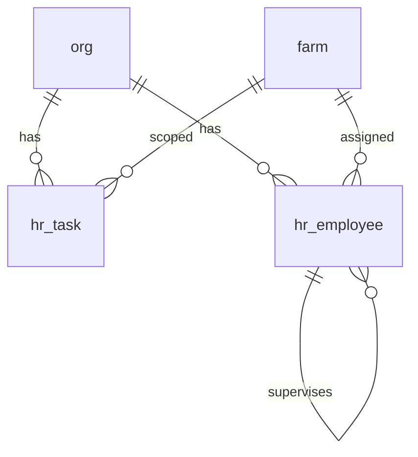

# HR Schema

Tables for managing employees, task definitions, and task tracking across the organization.

## Entity Relationship Diagram

---

## Table Overview

| Table | Purpose |
|-------|---------|
| hr_task | Flat task catalog for labor tracking. Defines all tasks employees can perform at the org or farm level. |
| hr_employee | Employee register tracking active and inactive employees with employment status, management level, visa/work authorization, pay structure, and reporting hierarchy. Links optionally to auth.users for app access. |

---

## hr_task

Flat task catalog for labor tracking. Tasks can be org-wide or scoped to a specific farm.

| Column      | Type         | Constraints                     | Description                              |
|------------|--------------|--------------------------------|------------------------------------------|
| id         | TEXT         | PK                             | Human-readable identifier derived from task code |
| org_id     | TEXT         | NOT NULL, FK → org(id)         | The organization                         |
| farm_id    | TEXT         | FK → farm(id), nullable        | Optional farm scope (null = org-wide)    |
| code       | VARCHAR(10)  | NOT NULL                       | Short code for quick reference           |
| description| TEXT         | nullable                       | Description of the task                  |
| external_id| VARCHAR(50)  | nullable                       | Links to external payroll/HR system      |
| is_active  | BOOLEAN      | NOT NULL, default true         | Soft-disable without deleting            |
| created_at | TIMESTAMPTZ  | NOT NULL, default now          | When the record was created              |
| created_by | UUID         | FK → auth.users(id), nullable  | Who created the record                   |
| updated_at | TIMESTAMPTZ  | NOT NULL, default now          | When the record was last updated         |
| updated_by | UUID         | FK → auth.users(id), nullable  | Who last updated the record              |

Unique constraint on `(org_id, code)`.

## hr_employee

Employee register for the organization. Tracks employment status, management level, visa/work authorization, pay structure, overtime thresholds, and reporting hierarchy. Not all employees are app users — `user_id` optionally links to auth.users for those who log into the system.

| Column                       | Type         | Constraints                     | Description                              |
|-----------------------------|--------------|--------------------------------|------------------------------------------|
| id                          | UUID         | PK, auto-generated             | Unique identifier                        |
| org_id                      | TEXT         | NOT NULL, FK → org(id)         | The organization                         |
| farm_id                     | TEXT         | FK → farm(id), nullable        | Primary farm assignment (null = org-wide)|
| user_id                     | UUID         | FK → auth.users(id), nullable  | Links to app user account if they have one |
| external_id                 | VARCHAR(50)  | nullable                       | Links to external payroll/HR system      |
| code                        | VARCHAR(10)  | NOT NULL                       | Employee code                            |
| first_name                  | VARCHAR(50)  | NOT NULL                       | First name                               |
| last_name                   | VARCHAR(50)  | NOT NULL                       | Last name                                |
| preferred_name              | VARCHAR(50)  | nullable                       | Preferred or nickname used day-to-day    |
| title                       | VARCHAR(100) | nullable                       | Job title or position                    |
| department                  | VARCHAR(50)  | nullable                       | Primary department                       |
| gender                      | VARCHAR(20)  | nullable                       | Gender                                   |
| date_of_birth               | DATE         | nullable                       | Date of birth                            |
| is_minority                 | BOOLEAN      | NOT NULL, default false        | Minority status                          |
| employment_status           | VARCHAR(20)  | NOT NULL, default active, CHECK| One of: active, terminated, on_leave, suspended |
| management_level            | VARCHAR(20)  | CHECK                          | One of: owner, manager, supervisor, employee |
| status                      | VARCHAR(10)  | nullable                       | Visa/work authorization: H2A, H1B, WFE, LOCAL |
| pay_structure               | VARCHAR(30)  | nullable                       | Pay structure type                       |
| bi_weekly_overtime_threshold| NUMERIC      | nullable                       | Overtime threshold for bi-weekly period  |
| compensation_code           | VARCHAR(30)  | nullable                       | Workers compensation code                |
| compensation_funding_source | VARCHAR(100) | nullable                       | Funding source for compensation          |
| payslip_delivery_method     | VARCHAR(50)  | nullable                       | How pay stubs are delivered (e.g. email, print, portal) |
| housing_unit_id             | UUID         | nullable                       | Housing assignment (FK when housing table is built) |
| start_date                  | DATE         | nullable                       | Employment start date                    |
| end_date                    | DATE         | nullable                       | Employment end date                      |
| direct_supervisor_id        | UUID         | FK → hr_employee(id), nullable | Direct supervisor (self-referencing)     |
| compensation_manager_id     | UUID         | FK → hr_employee(id), nullable | Compensation manager (self-referencing)  |
| primary_phone               | VARCHAR(20)  | nullable                       | Contact phone                            |
| primary_email               | VARCHAR(100) | nullable                       | Contact email                            |
| company_email               | VARCHAR(100) | nullable                       | Company-issued email address             |
| profile_photo_url           | TEXT         | nullable                       | URL to employee profile photo            |
| created_at                  | TIMESTAMPTZ  | NOT NULL, default now          | When the record was created              |
| created_by                  | UUID         | FK → auth.users(id), nullable  | Who created the record                   |
| updated_at                  | TIMESTAMPTZ  | NOT NULL, default now          | When the record was last updated         |
| updated_by                  | UUID         | FK → auth.users(id), nullable  | Who last updated the record              |

Unique constraint on `(org_id, code)` — no duplicate employee codes within an org.

## Planned Tables

### hr_task_tracker

Header table for tasks performed. Captures the task, farm/site context, start and stop times, and status.

### hr_task_roster

Child table linking employees to a specific task tracker entry. Records who was assigned and their individual contribution.
