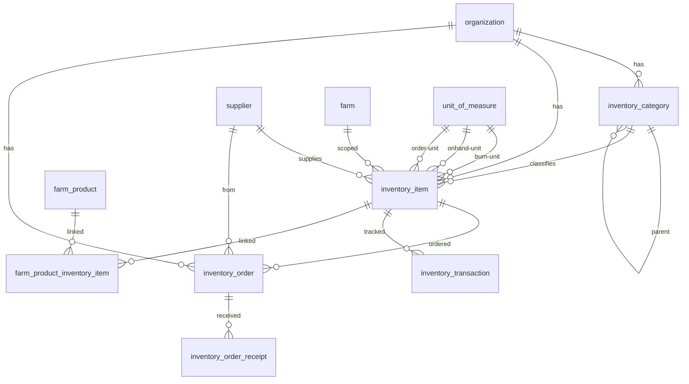

# Inventory Schema

Tables for managing inventory items, categories, and procurement across all farms within an organization. Covers seeds, chemicals, packaging materials, parts, and general supplies.

## Entity Relationship Diagram

---

## Table Overview

| Table | Purpose |
|-------|---------|
| inventory_category | Hierarchical categories for organizing inventory items (e.g. Seeds > Cucumber Seeds, Chemicals > Fertilizer). Self-referencing parent allows unlimited nesting depth. |
| inventory_item | The main inventory record for each item. Tracks units and conversions, burn rates for forecasting, reorder settings, and costing. Type-specific fields (variety, seed maker, part number, etc.) are stored in metadata. Cached totals like on-hand and on-order quantities are computed from transaction data, not stored here. |
| inventory_order | Tracks order requests through a workflow: requested → approved/rejected → ordered → partial/received. Snapshots item name, units, and cost at order time. Supports both catalog items and general/ad-hoc purchases. |
| inventory_order_receipt | Individual deliveries received against an order. Captures quantity, lot number, expiry date, and acceptance details. Multiple receipts per order enable partial delivery tracking. |
| inventory_transaction | Records every stock change (receipt, count, usage). Snapshots on-hand quantity and burn units at each transaction. Source of truth for computed totals like current stock, burn-per-week, and weeks-on-hand. Uses reference_table/reference_id to link back to the source (order receipt, grow schedule, etc.). |
| farm_product_inventory_item | Junction table linking farm products to inventory items at pack and sale packaging levels. Enables inventory tracking when products are packed or sold. |

---

## inventory_category

Hierarchical categories for organizing inventory items. Uses a self-referencing parent_id for unlimited nesting (e.g. Seeds > Cucumber Seeds > Organic Cucumber Seeds). The level column tracks depth for display and query purposes.

| Column     | Type         | Constraints                     | Description                              |
|-----------|--------------|--------------------------------|------------------------------------------|
| id        | UUID         | PK, auto-generated             | Unique identifier                        |
| org_id    | UUID         | NOT NULL, FK → organization(id)| The organization                         |
| parent_id | UUID         | FK → inventory_category(id), nullable | Parent category (null = top level) |
| name      | VARCHAR(100) | NOT NULL                       | Category name                            |
| level     | INT          | NOT NULL, default 0            | Nesting depth (0 = root)                 |
| is_active | BOOLEAN      | NOT NULL, default true         | Soft-disable without deleting            |
| created_at| TIMESTAMPTZ  | NOT NULL, default now          | When the record was created              |
| created_by| UUID         | FK → profile(id), nullable     | Who created the record                   |
| updated_at| TIMESTAMPTZ  | NOT NULL, default now          | When the record was last updated         |
| updated_by| UUID         | FK → profile(id), nullable     | Who last updated the record              |

Unique constraint on `(org_id, parent_id, name)` — no duplicate category names under the same parent within an org.

## inventory_item

The main inventory record. Each item has a type (seed, chemical, part) that determines which metadata fields are relevant. Items belong to an organization and optionally to a specific farm.

| Column                | Type         | Constraints                           | Description                              |
|----------------------|--------------|---------------------------------------|------------------------------------------|
| id                   | UUID         | PK, auto-generated                    | Unique identifier                        |
| org_id               | UUID         | NOT NULL, FK → organization(id)       | The organization                         |
| farm_id              | UUID         | FK → farm(id), nullable               | Optional farm scope (null = org-wide)    |
| category_id          | UUID         | FK → inventory_category(id), nullable | Item category                            |
| supplier_id          | UUID         | FK → supplier(id), nullable           | Primary supplier                         |
| external_id          | VARCHAR(50)  | nullable                              | Links to external accounting/inventory system |
| name                 | VARCHAR(150) | NOT NULL                              | Item name                                |
| type                 | VARCHAR(20)  | NOT NULL, CHECK                       | One of: seed, chemical, part             |
| burn_unit_id         | UUID         | FK → unit_of_measure(id), nullable    | Smallest usage unit (e.g. seeds, ml)     |
| onhand_unit_id       | UUID         | FK → unit_of_measure(id), nullable    | Stock counting unit (e.g. pack of 1000)  |
| order_unit_id        | UUID         | FK → unit_of_measure(id), nullable    | Purchase unit (e.g. case of 10 packs)    |
| burn_per_onhand_unit | NUMERIC      | nullable                              | How many burn units in one on-hand unit  |
| burn_per_order_unit  | NUMERIC      | nullable                              | How many burn units in one order unit    |
| order_per_pallet     | NUMERIC      | nullable                              | Order units per pallet                   |
| pallets_per_truckload| NUMERIC      | nullable                              | Pallets per truckload                    |
| is_frequently_used   | BOOLEAN      | NOT NULL, default false               | Whether this item is used regularly      |
| burn_per_week        | NUMERIC      | nullable                              | Average weekly usage in burn units       |
| burn_per_year        | NUMERIC      | nullable                              | Average yearly usage in burn units       |
| cushion_weeks        | NUMERIC      | nullable                              | Safety stock buffer in weeks (includes lead time) |
| auto_order_enabled   | BOOLEAN      | NOT NULL, default false               | Whether automatic reorder is on          |
| reorder_point_burn   | NUMERIC      | nullable                              | Reorder trigger level in burn units      |
| reorder_quantity_burn| NUMERIC      | nullable                              | How much to reorder in burn units        |
| requires_lot_tracking| BOOLEAN      | NOT NULL, default false               | Whether lot numbers must be recorded     |
| requires_expiry_date | BOOLEAN      | NOT NULL, default false               | Whether expiry dates must be tracked     |
| metadata             | JSONB        | NOT NULL, default {}                  | Type-specific fields: variety_id, is_pelleted, seed_maker, part_type, part_number, model, serial_number, manufacturer, description, storage_location, is_palletized, photos |
| is_active            | BOOLEAN      | NOT NULL, default true                | Soft-disable without deleting            |
| created_at           | TIMESTAMPTZ  | NOT NULL, default now                 | When the record was created              |
| created_by           | UUID         | FK → profile(id), nullable            | Who created the record                   |
| updated_at           | TIMESTAMPTZ  | NOT NULL, default now                 | When the record was last updated         |
| updated_by           | UUID         | FK → profile(id), nullable            | Who last updated the record              |

Unique constraint on `(org_id, name)` — no duplicate item names within an org.

## inventory_order

Tracks order requests through a workflow from request to receipt. Each order snapshots the item name, units, and cost at order time so the record stays accurate even if the item changes later. When `item_id` is null, it's a general/ad-hoc purchase — `item_name` is always populated either way.

| Column                | Type         | Constraints                           | Description                              |
|----------------------|--------------|---------------------------------------|------------------------------------------|
| id                   | UUID         | PK, auto-generated                    | Unique identifier                        |
| org_id               | UUID         | NOT NULL, FK → organization(id)       | The organization                         |
| farm_id              | UUID         | FK → farm(id), nullable               | Optional farm scope                      |
| item_id              | UUID         | FK → inventory_item(id), nullable     | Catalog item (null = general/ad-hoc)     |
| supplier_id          | UUID         | FK → supplier(id), nullable           | Supplier for this order                  |
| external_id          | VARCHAR(50)  | nullable                              | Links to external system                 |
| item_name            | VARCHAR(150) | NOT NULL                              | Snapshot of item name or manual entry for general items |
| status               | VARCHAR(20)  | NOT NULL, default requested, CHECK    | One of: requested, approved, rejected, ordered, partial, received, cancelled |
| quantity_order       | NUMERIC      | NOT NULL                              | How much was ordered                     |
| order_unit_id        | UUID         | FK → unit_of_measure(id), nullable    | Snapshot of order unit                   |
| quantity_burn        | NUMERIC      | nullable                              | Order quantity in burn units             |
| burn_unit_id         | UUID         | FK → unit_of_measure(id), nullable    | Snapshot of burn unit                    |
| burn_per_order_unit  | NUMERIC      | nullable                              | Snapshot of conversion at order time     |
| total_cost           | NUMERIC      | nullable                              | Total order cost                         |
| burn_unit_cost       | NUMERIC      | nullable                              | Cost per burn unit at order time         |
| requested_by         | UUID         | NOT NULL, FK → profile(id)            | Who requested the order                  |
| requested_at         | TIMESTAMPTZ  | NOT NULL, default now                 | When it was requested                    |
| reviewed_by          | UUID         | FK → profile(id), nullable            | Who approved or rejected                 |
| reviewed_at          | TIMESTAMPTZ  | nullable                              | When it was reviewed                     |
| order_placed_by      | UUID         | FK → profile(id), nullable            | Who placed the order with the supplier   |
| order_placed_at      | TIMESTAMPTZ  | nullable                              | When the order was placed                |
| delivery_expected_date| DATE        | nullable                              | Expected delivery date                   |
| metadata             | JSONB        | NOT NULL, default {}                  | urgency_level, operations_module, request_type, tracking_number, cost_includes_freight, order_notes, rejected_reason, request_photos |
| is_active            | BOOLEAN      | NOT NULL, default true                | Soft-disable without deleting            |
| created_at           | TIMESTAMPTZ  | NOT NULL, default now                 | When the record was created              |
| created_by           | UUID         | FK → profile(id), nullable            | Who created the record                   |
| updated_at           | TIMESTAMPTZ  | NOT NULL, default now                 | When the record was last updated         |
| updated_by           | UUID         | FK → profile(id), nullable            | Who last updated the record              |

## inventory_order_receipt

Individual deliveries received against an order. One order can have multiple receipts to handle partial deliveries. Each receipt captures its own lot number, expiry date, quantity, and acceptance details.

| Column                | Type         | Constraints                           | Description                              |
|----------------------|--------------|---------------------------------------|------------------------------------------|
| id                   | UUID         | PK, auto-generated                    | Unique identifier                        |
| org_id               | UUID         | NOT NULL, FK → organization(id)       | The organization                         |
| order_id             | UUID         | NOT NULL, FK → inventory_order(id)    | The order this receipt belongs to        |
| received_by          | UUID         | NOT NULL, FK → profile(id)            | Who received the delivery                |
| received_at          | TIMESTAMPTZ  | NOT NULL, default now                 | When it was logged                       |
| received_date        | DATE         | NOT NULL                              | Actual delivery date                     |
| quantity_received    | NUMERIC      | NOT NULL                              | How much was received                    |
| received_unit_id     | UUID         | FK → unit_of_measure(id), nullable    | Unit of the received quantity            |
| burn_per_received_unit| NUMERIC     | nullable                              | Conversion for this receipt              |
| lot_number           | VARCHAR(50)  | nullable                              | Lot code from supplier                   |
| lot_expiry_date      | DATE         | nullable                              | Expiry date for this lot                 |
| metadata             | JSONB        | NOT NULL, default {}                  | delivery_truck_clean, delivery_acceptable, receipt_notes, receipt_photos |
| is_active            | BOOLEAN      | NOT NULL, default true                | Soft-disable without deleting            |
| created_at           | TIMESTAMPTZ  | NOT NULL, default now                 | When the record was created              |
| created_by           | UUID         | FK → profile(id), nullable            | Who created the record                   |
| updated_at           | TIMESTAMPTZ  | NOT NULL, default now                 | When the record was last updated         |
| updated_by           | UUID         | FK → profile(id), nullable            | Who last updated the record              |

## inventory_transaction

Records every stock change for an item. Each transaction snapshots the on-hand quantity and burn units at that point in time. The `reference_table` and `reference_id` columns link back to whatever triggered the transaction — an order receipt, a grow schedule usage, a manual count, etc.

| Column                | Type         | Constraints                           | Description                              |
|----------------------|--------------|---------------------------------------|------------------------------------------|
| id                   | UUID         | PK, auto-generated                    | Unique identifier                        |
| org_id               | UUID         | NOT NULL, FK → organization(id)       | The organization                         |
| farm_id              | UUID         | FK → farm(id), nullable               | Optional farm scope                      |
| item_id              | UUID         | NOT NULL, FK → inventory_item(id)     | The item this transaction is for         |
| type                 | VARCHAR(20)  | NOT NULL, CHECK                       | One of: receipt, count, usage            |
| transaction_date     | DATE         | NOT NULL                              | When the transaction occurred            |
| quantity_onhand      | NUMERIC      | NOT NULL                              | On-hand quantity after this transaction (in on-hand units) |
| onhand_unit_id       | UUID         | FK → unit_of_measure(id), nullable    | Snapshot of on-hand unit                 |
| quantity_burn        | NUMERIC      | NOT NULL                              | The change amount in burn units          |
| burn_unit_id         | UUID         | FK → unit_of_measure(id), nullable    | Snapshot of burn unit                    |
| burn_per_onhand_unit | NUMERIC      | nullable                              | Snapshot of conversion                   |
| lot_number           | VARCHAR(50)  | nullable                              | Lot code                                 |
| lot_expiry_date      | DATE         | nullable                              | Expiry date for this lot                 |
| reference_table      | VARCHAR(50)  | nullable                              | Source table (e.g. inventory_order_receipt, grow_fertigation_schedule) |
| reference_id         | UUID         | nullable                              | Source record ID                         |
| metadata             | JSONB        | NOT NULL, default {}                  | additional_notes, photos                 |
| is_active            | BOOLEAN      | NOT NULL, default true                | Soft-disable without deleting            |
| created_at           | TIMESTAMPTZ  | NOT NULL, default now                 | When the record was created              |
| created_by           | UUID         | FK → profile(id), nullable            | Who created the record                   |
| updated_at           | TIMESTAMPTZ  | NOT NULL, default now                 | When the record was last updated         |
| updated_by           | UUID         | FK → profile(id), nullable            | Who last updated the record              |

## farm_product_inventory_item

Junction table linking farm products to inventory items at pack and sale packaging levels. When a product is packed or sold, this mapping determines which inventory items are consumed and in what quantity.

| Column                | Type         | Constraints                           | Description                              |
|----------------------|--------------|---------------------------------------|------------------------------------------|
| id                   | UUID         | PK, auto-generated                    | Unique identifier                        |
| org_id               | UUID         | NOT NULL, FK → organization(id)       | The organization                         |
| product_id           | UUID         | NOT NULL, FK → farm_product(id)       | The farm product                         |
| item_id              | UUID         | NOT NULL, FK → inventory_item(id)     | The inventory item consumed              |
| packaging_level      | VARCHAR(10)  | NOT NULL, CHECK                       | One of: pack, sale                       |
| quantity_per_unit    | NUMERIC      | nullable                              | How much of this item is used per unit at this packaging level |
| is_active            | BOOLEAN      | NOT NULL, default true                | Soft-disable without deleting            |
| created_at           | TIMESTAMPTZ  | NOT NULL, default now                 | When the record was created              |
| created_by           | UUID         | FK → profile(id), nullable            | Who created the record                   |
| updated_at           | TIMESTAMPTZ  | NOT NULL, default now                 | When the record was last updated         |
| updated_by           | UUID         | FK → profile(id), nullable            | Who last updated the record              |

Unique constraint on `(product_id, item_id, packaging_level)` — one link per item per packaging level per product.

---

## Views

### View Overview

| View | Purpose |
|------|---------|
| inventory_item_summary | Provides a complete picture of each active inventory item with computed on-hand quantities, on-order totals, weeks-on-hand, days since last transaction, and next order date. Primary query target for dashboards and reorder alerts. |
| inventory_lot_summary | Shows current on-hand quantity per lot for each item. Only includes lots with positive stock. Used for lot traceability, expiry tracking, and FIFO usage decisions. |

---

### inventory_item_summary

Computed view that provides a complete picture of each active inventory item by joining the latest transaction data with open order quantities. Intended as the primary query target for inventory dashboards and reorder alerts.

| Column                       | Source                              | Description                              |
|------------------------------|-------------------------------------|------------------------------------------|
| item_id                      | inventory_item.id                   | The item                                 |
| org_id                       | inventory_item.org_id               | The organization                         |
| farm_id                      | inventory_item.farm_id              | Optional farm scope                      |
| name                         | inventory_item.name                 | Item name                                |
| type                         | inventory_item.type                 | Item type                                |
| category_id                  | inventory_item.category_id          | Item category                            |
| supplier_id                  | inventory_item.supplier_id          | Primary supplier                         |
| is_frequently_used           | inventory_item                      | Whether item is used regularly            |
| auto_order_enabled           | inventory_item                      | Whether auto-reorder is on               |
| burn_per_week                | inventory_item                      | Configured weekly burn rate              |
| cushion_weeks                | inventory_item                      | Safety stock buffer in weeks             |
| reorder_point_burn           | inventory_item                      | Reorder trigger level                    |
| reorder_quantity_burn        | inventory_item                      | Reorder quantity                         |
| current_onhand_units         | Latest transaction                  | Current on-hand in on-hand units         |
| current_onhand_burn          | Latest transaction (computed)       | Current on-hand in burn units            |
| last_transaction_date        | Latest transaction                  | Date of most recent transaction          |
| days_since_last_transaction  | Computed                            | Days since last transaction              |
| on_order_burn                | inventory_order (aggregated)        | Total burn units on open orders (approved, ordered, partial) |
| weeks_on_hand                | Computed                            | Current stock / burn_per_week            |
| next_order_date              | Computed                            | Estimated date to place next order based on burn rate and cushion weeks |

### inventory_lot_summary

Computed view that shows the current on-hand quantity per lot for each item. Only includes lots that still have positive stock. Useful for lot traceability, expiry tracking, and FIFO usage.

| Column                  | Source                        | Description                              |
|------------------------|-------------------------------|------------------------------------------|
| item_id                | inventory_transaction.item_id | The item                                 |
| org_id                 | inventory_transaction.org_id  | The organization                         |
| lot_number             | inventory_transaction         | Lot code from supplier                   |
| lot_expiry_date        | inventory_transaction         | Expiry date for this lot                 |
| burn_unit_id           | inventory_transaction         | Burn unit for the quantity               |
| lot_onhand_burn        | Computed                      | Current lot quantity in burn units (receipts - usage) |
| first_transaction_date | Computed                      | When this lot first appeared             |
| last_transaction_date  | Computed                      | Most recent transaction for this lot     |
| item_name              | inventory_item.name           | Item name for display                    |
| item_type              | inventory_item.type           | Item type for filtering                  |

---

## Planned Features

### Estimated usage transaction on receipt

When an order receipt is logged, the system should automatically create a `usage` transaction before the `receipt` transaction to account for estimated consumption since the last transaction. The calculation:

1. Get the last transaction for the item (by `transaction_date DESC, created_at DESC`)
2. Calculate weeks elapsed: `(receipt_date - last_transaction_date) / 7`
3. Get `burn_per_week` from `inventory_item`
4. Estimated burn since last transaction: `burn_per_week * weeks_elapsed`
5. Convert to on-hand units: `estimated_burn / burn_per_onhand_unit`
6. Create a `usage` transaction with `quantity_onhand = last_onhand - estimated_onhand_usage` and `reference_table = 'inventory_order_receipt'`
7. Create the `receipt` transaction with `quantity_onhand = adjusted_onhand + received_quantity_in_onhand_units`

This keeps the estimated usage visible as an explicit transaction in the history rather than silently adjusting the on-hand during receipt. Can be implemented as a Supabase database function or in the application layer.

